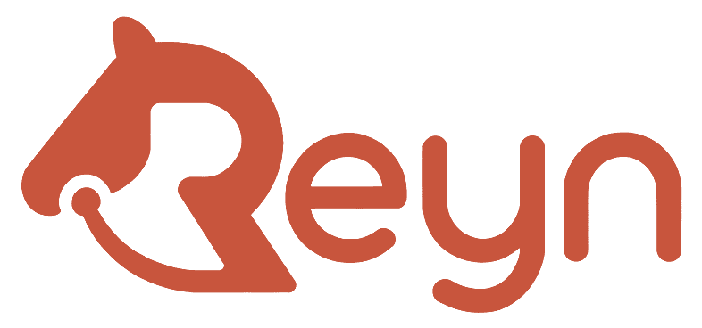
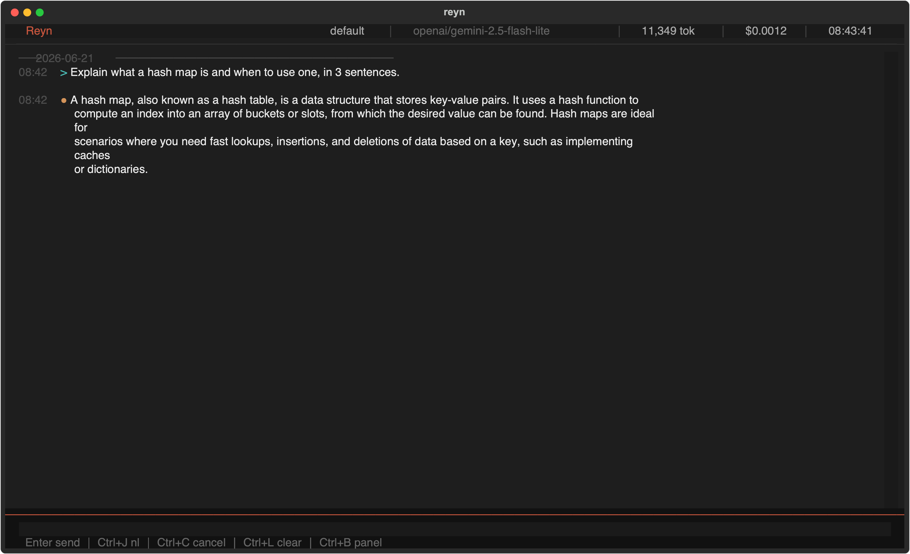
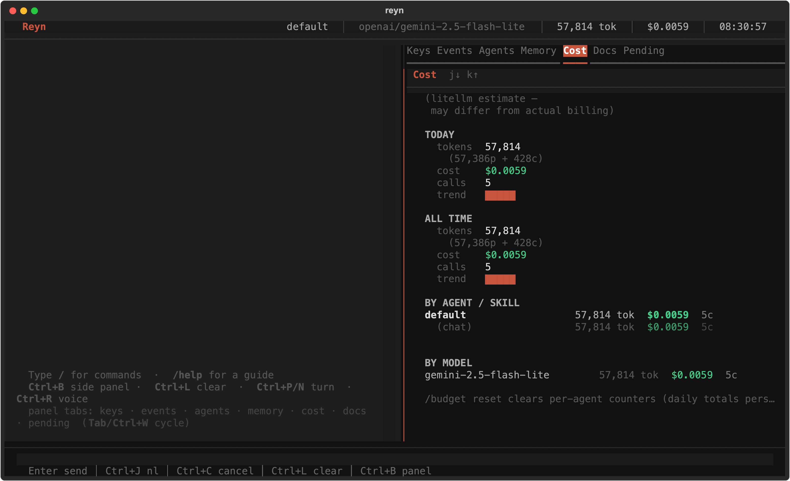
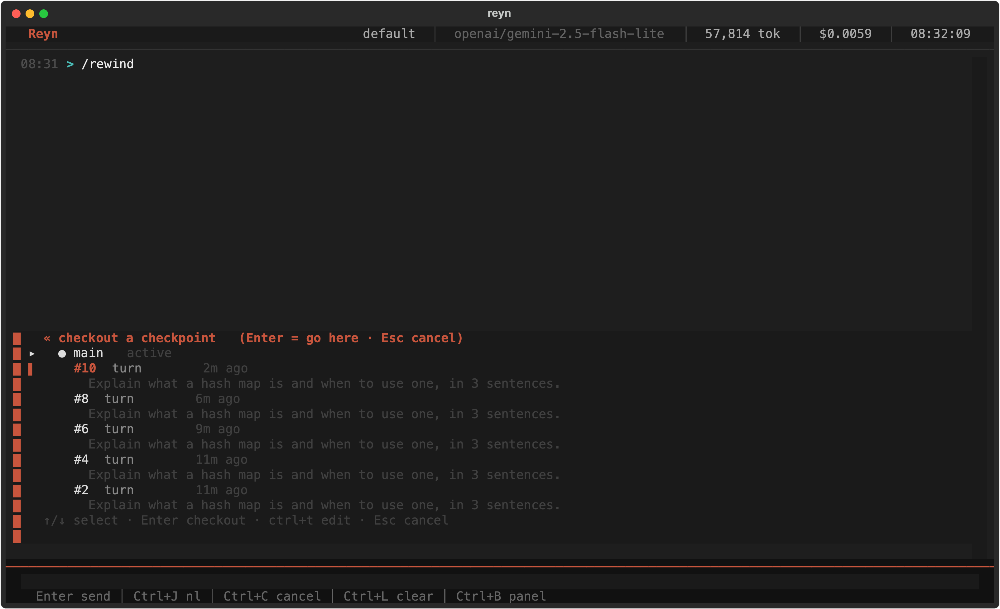
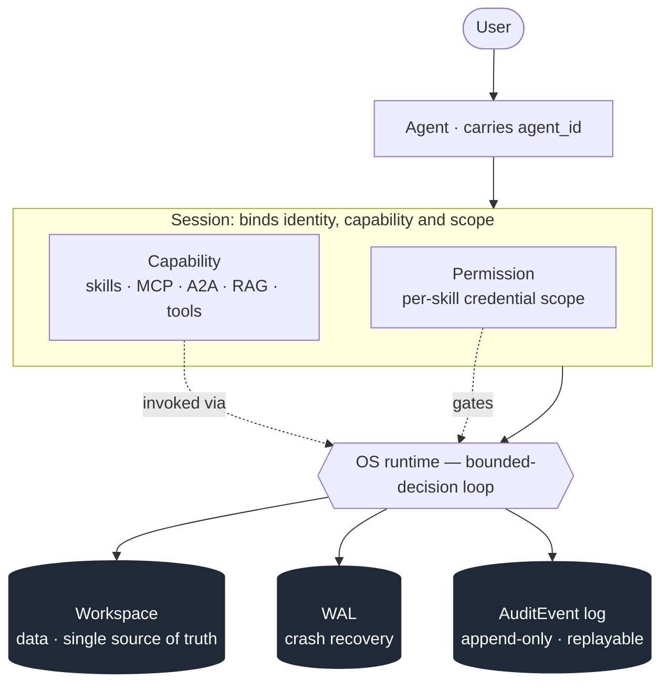

<div align="center">

<picture>
  <source media="(prefers-color-scheme: dark)" srcset="website/assets/reyn-wordmark-white.png">
  
</picture>

**Self-hosted general agent — every decision constrained, auditable, replayable.**

[](https://github.com/tya5/reyn/actions/workflows/test.yml)
[](LICENSE)
[](https://www.python.org/)
[](https://tya5.github.io/reyn/)

Reyn is a self-hosted agent runtime whose **entire decision loop is an OS-enforced contract** — so every run is predictable, auditable, and replayable. It speaks the standard agent protocols (MCP, A2A), but bets on the loop itself being yours to verify rather than on integration breadth.

</div>

```bash
git clone https://github.com/tya5/reyn.git
cd reyn && pip install -e ".[dev]"
reyn init
reyn chat          # talk to the agent — persistent memory, RAG recall, MCP + A2A built in
```

---

## What it guarantees

Most agent frameworks optimize for reach. Reyn optimizes for the **integrity of the loop itself** — what the runtime promises about every decision the model makes.

| Guarantee | What it means |
|---|---|
| **Bounded decisions** | The model only picks from options the OS hands it (next step + a typed result). It can't invent a step, jump somewhere unlisted, or skip validation — a bad or hallucinated output is rejected before any side effect happens. |
| **Everything on disk, replayable** | Data lives in one workspace; every state change is appended to a log. Crash recovery and full run-replay come from those files — never from in-memory state. |
| **Spending you can cap** | Token and dollar limits per agent / chain / model. A run refuses to continue *before* it overspends, so there are no surprise bills from runaway loops. |
| **Isolated & auditable** | Each skill sees only its own credentials (it can't reach another skill's secrets), and every logged event carries an agent identity — ready for SOC 2 / ISO 27001 / audit trails. |
| **Weak models stay viable** | Because the OS absorbs capability gaps structurally, low-cost models run agent workflows reliably without prompt-level workarounds. |

The trade-off is explicit: **predictability and auditability over maximum autonomy.** If you want the densest integration ecosystem and maximum LLM latitude, a connectivity-first agent or a workflow framework will feel less restrictive.

> These guarantees are formalized as the OS's eight design principles — see [principles](docs/concepts/architecture/principles.md).

---

## See it

<!--
  Demo slot. Interim: placeholder images render inline below.
  TODO(tui-coder): drop real PNGs at docs/assets/screenshots/{tui-chat,tui-right-panel,tui-rewind}.png
  TODO(vhs, later): replace the hero placeholder with docs/assets/demo/reyn-chat.gif (vhs .tape script tracked separately)
-->

<div align="center">

<!-- hero: static chat shot for now; replace with docs/assets/demo/reyn-chat.gif once the vhs tape is recorded -->


<sub><code>reyn chat</code> — ask, get a streamed reply. (Animated walkthrough via vhs coming.)</sub>

| Cost &amp; token transparency (`Ctrl+B`) | Time-travel (`/rewind`) |
|---|---|
|  |  |

</div>

---

## Quick Start

**Requirements:** Python 3.11+, a [LiteLLM](https://github.com/BerriAI/litellm)-compatible model endpoint.

```bash
pip install -e .               # local install; web UI: pip install -e ".[web]"
export OPENAI_API_KEY=sk-...   # or the key for your LiteLLM proxy
reyn init                      # creates reyn.yaml + .reyn/config.yaml
reyn chat
> What can you do?
```

`reyn chat` opens a session with persistent per-agent history, tool-calling (file ops, web, MCP), and automatic `recall` over any indexed source.

> **A note on the default model.** Reyn's default `models.standard` points at a low-cost LLM; occasional empty replies on tool-heavy queries and router-vocabulary leakage in non-English answers are normal at the weak tier and dissolve on stronger models. Point `models.standard` at a stronger model if it matters — details in the [Quick Start guide](docs/guide/getting-started/02-chat-mode.md).

Index your own docs for retrieval, or write a reusable typed workflow (a *skill*):

```bash
reyn run index_docs '{"type":"index_docs_input","data":{"source":"my_docs","path":"docs/**/*.md","description":"Project documentation"}}'
reyn run my_skill "Summarize AI trends in education."
```

Walkthroughs: [chat mode](docs/guide/getting-started/02-chat-mode.md) · [your first skill](docs/guide/getting-started/03-your-first-skill.md) · [RAG](docs/concepts/data-retrieval/rag.md).

---

## Architecture

A request flows through a small set of durable parts; the OS sits in the middle and writes everything it does to three stores of record.



- **Actors** — the *User* talks to an *Agent* (which carries an audit identity), inside a *Session* that binds what the agent can do and is allowed to do.
- **Capability** — what the agent can do: skills, MCP/A2A peers, RAG recall, tools. A *skill* is just one kind of capability, not the centre of gravity.
- **Governance** — *Permission* gates every action; cost caps and the sandbox bound it.
- **State of record** — the *Workspace* holds data, the *WAL* drives crash recovery, the *AuditEvent log* drives replay and audit. These are separate logs on purpose.

Details: [architecture](docs/concepts/architecture/architecture.md) · [principles](docs/concepts/architecture/principles.md).

---

## How it compares

Reyn overlaps with three families of agent tooling but makes a different bet — **the loop itself as an OS-enforced contract**, not connectivity reach or programmable flexibility. Each peer below is described by what it's *great at*, not by what it lacks.

**General & coding agents** — the closest peers:

| Tool | Category | Primary bet — what it's great at |
|---|---|---|
| **OpenClaw** | Self-hosted general agent | Multi-channel reach — answers you on the channels you already use (WhatsApp / Telegram / Slack …), on your own devices |
| **Hermes** | Self-hosted general agent | A built-in self-improving loop — creates and refines skills from experience, curates its own memory (Nous Research) |
| **Claude Code** | Terminal coding agent | Autonomous multi-file coding that lives in your terminal |
| **Codex** | Terminal coding agent (OpenAI) | A local coding agent with IDE / desktop / cloud variants |
| **Reyn** | Self-hosted agent **OS** | The loop as an OS-enforced contract — bounded decisions, a replayable audit log, and per-agent cost caps |

Reyn connects too (MCP + A2A) and runs open-ended tasks, but optimizes for **integrity of the loop** rather than connectivity breadth or a turnkey coding workflow.

**Workflow frameworks** — if you'd rather wire the loop yourself:

| Framework | Loop enforcement | State & replay | Strength |
|---|---|---|---|
| **LangGraph** | Code-defined graph; LLM can pick arbitrary transitions via `Command()` | Checkpointer (SQLite/Postgres); time-travel | Expressiveness; LangChain ecosystem |
| **CrewAI** | Role-driven; no OS-level candidate constraint | `@persist`; task replay (last run) | Role-orchestration ergonomics |
| **AutoGen** | Conversational; LLM selects next speaker freely | App-managed state; OTel spans (no replay) | Multi-agent dialog patterns |
| **Semantic Kernel** | Function-calling loop; autonomous plugin selection | In-memory history; OTel spans (no replay) | Azure-native; C#/Python/Java parity |
| **Reyn** | **OS-enforced: validated transitions, closed candidate set** | **Workspace + WAL; append-only replayable events** | **Predictability; audit trail; weak-model viability; cost caps** |

**Reyn fits** when every LLM decision must be replayable and auditable, when you want weak models to be reliable, or when you need hard cost caps. **Reyn doesn't fit** quick max-flexibility prototyping, single-shot stateless calls, or a turnkey RAG/UI product — those live downstream (see [care boundary](docs/concepts/architecture/care-boundary.md)).

---

## Documentation

📖 **[Read the docs](https://tya5.github.io/reyn/docs/)** · 🏠 **[Project site](https://tya5.github.io/reyn/)** — MkDocs Material, English + Japanese (in progress).

| Section | What's covered |
|---|---|
| [Getting started](docs/guide/getting-started/) | Install, chat mode, your first skill, evals |
| [For users](docs/guide/for-users/) | Day-to-day usage: permissions, sandbox, cost caps, scheduling, memory |
| [For skill authors](docs/guide/for-skill-authors/) | Phases, composition, MCP, validation, operations |
| [Reference](docs/reference/) | CLI, config (`reyn.yaml`), Control IR, events |
| [Concepts](docs/concepts/) | Architecture, principles, the act-sense-react loop |
| [Feature inventory](docs/feature-map.md) | Every implemented feature, grouped by subsystem |

```bash
make docs-install && make docs-serve   # http://127.0.0.1:8000
```

---

## Integrations

Reyn both consumes external tools and exposes itself to other systems over standard protocols — no extra process or port; the same gateway backs the web UI.

- **MCP** — talk to a Reyn agent from any MCP client (Claude Desktop, Claude Code, Cursor, …) via `reyn web` (SSE) or `reyn mcp serve` (stdio). See [`reyn mcp` reference](docs/reference/cli/mcp.md).
- **A2A** — expose Reyn agents as addressable A2A peers for other agents to discover and converse with, including async tasks and mid-run `ask_user`. See [A2A concepts](docs/concepts/multi-agent/a2a.md).
- **Self-reading** — the agent can browse its own repository (`reyn_src_list` / `reyn_src_read`) to answer "how does Reyn work?" from source.

---

## Project Status

**1.0 OSS launch ready.** The framework foundation is green and dogfood discipline is operational: stable DSL, CLI, and event-log surfaces; an authentication stack (MCP bearer headers, OAuth refresh, per-skill credential scoping, agent-id propagation); and a RAG framework foundation.

Deliberate maturity gaps live downstream — vector stores beyond SQLite, advanced retrieval (rerank / HyDE), a RAG eval framework, IDE integration, and sensitive-data redaction. The "framework foundation" framing is honest, not a hedge; see [Project Status in the docs](https://tya5.github.io/reyn/docs/) and [CLAUDE.md](CLAUDE.md) for the full list and architectural constraints.

---

## License

MIT — see [LICENSE](LICENSE).

## Acknowledgements — powered by AI

Reyn is powered by AI both at runtime (every skill execution delegates decisions to an LLM via LiteLLM) and in its development (substantial portions of the code, stdlib skills, docs, and website were drafted with AI tooling — primarily Claude Code, with human review and the final architectural calls held by the maintainer). This disclosure is mandatory rather than promotional: for provenance, start with `git log --grep="Co-Authored-By: Claude"` and the design prompts under `website/_design/`.
