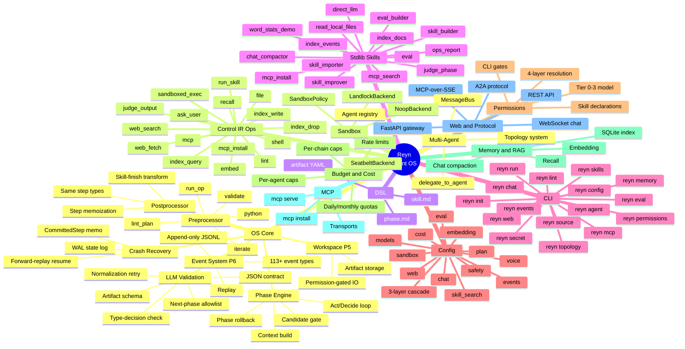

# Reyn Feature Map

Full feature inventory of the Reyn Agent OS, extracted from implementation. Each entry links to its reference or concept documentation.

## Visual overview

---

## Feature index

### OS Core

#### Phase Engine
| Feature | Description | Documentation |
|---------|-------------|---------------|
| Act/Decide loop | LLM↔op volleys until the LLM emits a transition/finish/abort decision | [LLM Output Contract](reference/runtime/llm-output-contract.md) · [Principles P3/P4](concepts/principles.md) |
| Context build | Constructs LLM input from phase instructions, current artifact, candidates, and available ops | [Context Frame](reference/runtime/context-frame.md) |
| Candidate gate | LLM picks next phase only from OS-provided candidates (P4) | [LLM as Decision Engine](concepts/llm-as-decision-engine.md) |
| Phase rollback | Revert to predecessor phase when downstream output is rejected | [Principles P1/P2](concepts/principles.md) |

#### LLM Validation
| Feature | Description | Documentation |
|---------|-------------|---------------|
| JSON contract | Enforce `control` / `artifact` / `control_ir` envelope structure | [LLM Output Contract](reference/runtime/llm-output-contract.md) |
| Type-decision consistency | `finish` type requires `decision=finish`, `next_phase=null`, etc. | [LLM Output Contract](reference/runtime/llm-output-contract.md) |
| Next-phase allowlist | Transition target must appear in the skill graph candidates | [LLM Output Contract](reference/runtime/llm-output-contract.md) · [Graph](reference/dsl/graph.md) |
| Artifact schema validation | `data` validated against the target phase's `input_schema` | [Artifact YAML](reference/dsl/artifact-yaml.md) |
| Normalization retry | Minor JSON errors healed before rejecting, up to `llm_max_retries` | [LLM Output Contract](reference/runtime/llm-output-contract.md) |

#### Preprocessor
| Feature | Description | Documentation |
|---------|-------------|---------------|
| `run_op` step | Invoke any Control IR op deterministically before the LLM call | [Preprocessor DSL](reference/dsl/preprocessor.md) |
| `iterate` step | Fan-out `run_op` over array field elements | [Preprocessor DSL](reference/dsl/preprocessor.md) |
| `validate` step | JSON Schema check on artifact data | [Preprocessor DSL](reference/dsl/preprocessor.md) |
| `lint_plan` step | Structural check on plan-shaped artifacts | [Preprocessor DSL](reference/dsl/preprocessor.md) |
| `python` step | User function in sandboxed subprocess (safe/unsafe mode) | [Preprocessor DSL](reference/dsl/preprocessor.md) |

#### Postprocessor
| Feature | Description | Documentation |
|---------|-------------|---------------|
| Skill-finish transform | Convert LLM `final_output` to caller artifact schema | [Postprocessor DSL](reference/dsl/postprocessor.md) · [Concepts: Postprocessor](concepts/postprocessor.md) |
| Same step types | `run_op` / `iterate` / `validate` / `lint_plan` / `python` | [Postprocessor DSL](reference/dsl/postprocessor.md) |
| Step memoization | Skip re-execution on crash resume if step already committed | [Postprocessor DSL](reference/dsl/postprocessor.md) · [Skill Resume](concepts/skill-resume.md) |

#### Workspace (P5)
| Feature | Description | Documentation |
|---------|-------------|---------------|
| Artifact storage | Phase artifacts persisted to `.reyn/artifacts/` | [Concepts: Workspace](concepts/workspace.md) |
| Permission-gated IO | Paths outside CWD require `file.read` / `file.write` declaration | [Concepts: Workspace](concepts/workspace.md) · [Permissions](reference/config/permissions.md) |

#### Crash Recovery
| Feature | Description | Documentation |
|---------|-------------|---------------|
| WAL state log | `step_started` / `step_completed` / `step_failed` written to JSONL | [Skill Resume](concepts/skill-resume.md) |
| Forward-replay resume | `SkillResumeAnalyzer` reconstructs run state from state log | [Skill Resume](concepts/skill-resume.md) |
| `CommittedStep` memo | Replay recorded op results on resume without re-invoking | [Skill Resume](concepts/skill-resume.md) |
| World-op bypass | Transient ops (web_search, web_fetch) re-execute fresh on resume | [Skill Resume](concepts/skill-resume.md) |

#### Event System (P6)
| Feature | Description | Documentation |
|---------|-------------|---------------|
| 113+ event types | Complete taxonomy: workflow / phase / LLM / tool / budget / permission / etc. | [Events reference](reference/runtime/events.md) · [Concepts: Events](concepts/events.md) |
| Append-only JSONL | `.reyn/events/` per-run files with size/age-based rotation | [Events reference](reference/runtime/events.md) |
| Replay | `reyn events <path>` streams events for audit and debug | [reyn events CLI](reference/cli/events.md) |

---

### Control IR Ops

All ops are documented in the single reference page: **[Control IR](reference/runtime/control-ir.md)**

| Op | Description |
|----|-------------|
| `file` | `read` / `write` / `edit` / `delete` / `glob` / `grep` / `regenerate_index` |
| `ask_user` | Pause phase, collect user answer, re-run same phase |
| `run_skill` | Invoke sub-skill and return `final_output` artifact |
| `shell` | Raw shell exec — deprecated, use `sandboxed_exec` |
| `sandboxed_exec` | `argv` under `SandboxPolicy` via platform-selected backend |
| `web_search` | DuckDuckGo search — Tier 1, default-allow |
| `web_fetch` | URL fetch + text extract — Tier 1, default-allow |
| `mcp` | Call a configured MCP server tool by name |
| `mcp_install` | Install MCP server from registry with permission gate |
| `lint` | Run DSL linter on a skill directory |
| `embed` | Chunk text via LiteLLM embedding model |
| `index_write` | Write embedded chunks to SQLite backend |
| `index_query` | Vector similarity search over one indexed source |
| `recall` | Macro: embed → `index_query` per source → merge top-K |
| `index_drop` | Destructive source removal — requires approval |
| `judge_output` | LLM scorer with rubric + threshold + `on_fail` policy |

---

### DSL

| Feature | Description | Documentation |
|---------|-------------|---------------|
| `skill.md` frontmatter | `name` / `entry` / `graph` / `final_output` / `permissions` / `postprocessor` / `search_hints` | [Skill frontmatter](reference/dsl/skill-md.md) |
| `phase.md` frontmatter | `input_schema` / `instructions` / `preprocessor` / `allowed_ops` / `model_class` | [Phase frontmatter](reference/dsl/phase-md.md) |
| Artifact YAML | 45 built-in types, JSON Schema Draft 7 | [Artifact YAML](reference/dsl/artifact-yaml.md) |
| Graph semantics | Phase transition adjacency list and `end` terminal | [Graph](reference/dsl/graph.md) |
| Postprocessor block | Deterministic skill-finish transform declared in `skill.md` | [Postprocessor](reference/dsl/postprocessor.md) |
| Preprocessor block | Deterministic phase-entry enrichment declared in `phase.md` | [Preprocessor](reference/dsl/preprocessor.md) |
| Topology YAML | Multi-agent topology definition | [Topology YAML](reference/dsl/topology-yaml.md) |
| Profile YAML | Agent role profile definition | [Profile YAML](reference/dsl/profile-yaml.md) |

---

### Stdlib Skills

| Skill | Description | Documentation |
|-------|-------------|---------------|
| `chat_compactor` | Fold chat history into a rolling summary within token budget | [Reference](reference/stdlib/chat_compactor.md) |
| `direct_llm` | Single-shot LLM fallback for catalogue gaps | [Reference](reference/stdlib/direct_llm.md) |
| `eval` | Evaluate a skill against test cases via `judge_phase` as judge | [Reference](reference/stdlib/eval.md) |
| `eval_builder` | Generate an eval spec with test cases and rubric | [Reference](reference/stdlib/eval_builder.md) |
| `index_docs` | Chunk / embed / index pipeline over file globs | [Reference](reference/stdlib/index_docs.md) |
| `index_events` | Index P6 event log with incremental cursor tracking | [Reference](reference/stdlib/index_events.md) |
| `judge_phase` | Score one phase artifact against quality criteria | [Reference](reference/stdlib/judge_phase.md) |
| `mcp_install` | Guided MCP server install from registry | [Reference](reference/stdlib/mcp_install.md) |
| `mcp_search` | Natural-language search over MCP registry | [Reference](reference/stdlib/mcp_search.md) |
| `ops_report` | Execution summary from indexed events for a period | [Reference](reference/stdlib/ops_report.md) |
| `read_local_files` | Read project files via MCP and synthesise answers | [Reference](reference/stdlib/read_local_files.md) |
| `skill_builder` | Scaffold a new skill from a natural-language description | [Reference](reference/stdlib/skill_builder.md) |
| `skill_importer` | Find and import an external skill with DSL conversion | [Reference](reference/stdlib/skill_importer.md) |
| `skill_improver` | Iterative skill improvement via eval-plan-apply loop | [Reference](reference/stdlib/skill_improver.md) |
| `word_stats_demo` | Demo of the `python` preprocessor step pattern | [Reference](reference/stdlib/word_stats_demo.md) |

---

### CLI

| Command | Description | Documentation |
|---------|-------------|---------------|
| `reyn run` | Execute a skill non-interactively | [Reference](reference/cli/run.md) |
| `reyn chat` | Interactive multi-turn chat with a named agent | [Reference](reference/cli/chat.md) |
| `reyn eval` | Golden dataset eval, result reports, version regression compare | [Reference](reference/cli/eval.md) |
| `reyn skills` | List skills, show details, validate op/permission consistency | [Reference](reference/cli/skills.md) |
| `reyn lint` | DSL linter for a skill directory | [Reference](reference/cli/lint.md) |
| `reyn agent` | Create and manage named persistent agents | [Reference](reference/cli/agent.md) |
| `reyn topology` | Create and manage communication topologies | [Reference](reference/cli/topology.md) |
| `reyn memory` | CRUD + search + export/import for agent memories | [Reference](reference/cli/memory.md) |
| `reyn permissions` | Inspect and revoke saved approval entries | [Reference](reference/cli/permissions.md) |
| `reyn events` | Replay event JSONL files or purge old files by date | [Reference](reference/cli/events.md) |
| `reyn mcp` | Serve, search, install, and manage MCP servers | [Reference](reference/cli/mcp.md) |
| `reyn secret` | Set / list / clear secrets in `~/.reyn/secrets.env` | [Reference](reference/cli/secret.md) |
| `reyn source` | List, describe, and remove indexed RAG sources | [Reference](reference/cli/source.md) |
| `reyn config` | Show, query, and set effective configuration | [Reference](reference/cli/config.md) |
| `reyn web` | Start FastAPI + WebSocket gateway server | [Reference](reference/cli/web.md) |
| `reyn init` | Scaffold `reyn.yaml` and `.reyn/` in current directory | [Reference](reference/cli/init.md) |

---

### Config

Main reference: **[`reyn.yaml`](reference/config/reyn-yaml.md)**

| Block | Description | Documentation |
|-------|-------------|---------------|
| 3-layer cascade | user-global / project / project-local + CLI flags | [reyn-yaml](reference/config/reyn-yaml.md) |
| `${VAR}` interpolation | Env var expansion in all string fields via `secrets.env` | [reyn-yaml § interpolation](reference/config/reyn-yaml.md#var-interpolation) |
| `safety` | Loop caps / timeout caps / on-limit policy | [reyn-yaml § safety](reference/config/reyn-yaml.md#safety-block) |
| `cost` | Per-agent / per-chain / daily / monthly token+USD caps | [Budget config](reference/config/budget.md) |
| `sandbox` | Backend selection (auto/seatbelt/landlock/noop) + `on_unsupported` | [reyn-yaml § sandbox](reference/config/reyn-yaml.md#sandbox-block) |
| `web` | `web.fetch` SSL `verify_ssl` and `ca_bundle` override | [reyn-yaml § web](reference/config/reyn-yaml.md#web-block) |
| `eval` | Trace exporters: file / langfuse / otlp / ietf_audit | [reyn-yaml § eval](reference/config/reyn-yaml.md#eval-block) |
| `plan` | `step_max_iterations` / `retry_limit` per plan step | [reyn-yaml § plan](reference/config/reyn-yaml.md#plan-block) |
| `chat` | Compaction trigger / head+tail retention / section token caps | [Chat Compaction](concepts/chat-compaction.md) |
| `embedding` | Model classes / batch_size / cost_warn_threshold | [RAG concepts](concepts/rag.md) |
| `voice` | Whisper model / language / device — optional `reyn[voice]` | [Voice concepts](concepts/voice.md) |
| `events` | Rotation size/age + cleanup_period_days | [Events reference](reference/runtime/events.md) |
| `skill_search` | BM25 threshold / top_k for skill catalogue routing | [Skill frontmatter](reference/dsl/skill-md.md) |
| `models` | Class → LiteLLM model string with `extends` chain | [reyn-yaml § models](reference/config/reyn-yaml.md#models-block) |
| `permissions` | Project-wide default capability policy | [Permissions config](reference/config/permissions.md) |
| `multi-agent` | Agent and topology defaults | [Multi-agent config](reference/config/multi-agent.md) |
| `state_dir` | Runtime state directory (default `.reyn/`) | [State dir](reference/config/state-dir.md) |

---

### Permissions

| Feature | Description | Documentation |
|---------|-------------|---------------|
| Tier 0 — always allowed | `run_skill` / `ask_user` / `lint` — no gate | [Permission model](concepts/permission-model.md) |
| Tier 1 — default-allow | `web_search` / `web_fetch` — deny-only gate | [Permission model](concepts/permission-model.md) · [Permissions config](reference/config/permissions.md) |
| Tier 2/3 — declaration + 4-layer approval | `shell` / `mcp` / `file` (out-of-zone) / `python` | [Permission model](concepts/permission-model.md) |
| Layer 1: config pre-approval | `reyn.yaml` hard `allow` / `deny` | [Permissions config](reference/config/permissions.md) |
| Layer 2: saved approvals | `.reyn/approvals.yaml` — persisted per path/server | [reyn permissions CLI](reference/cli/permissions.md) |
| Layer 3: session approvals | In-memory for current invocation only | [Permission model](concepts/permission-model.md) |
| Layer 4: interactive prompt | Ask user with persist choices (yes / always / just-this-path) | [Permission model](concepts/permission-model.md) |
| Skill-level declarations | `shell` / `file.read+write` / `mcp` / `python` / `mcp_install` / `index_drop` | [Skill frontmatter](reference/dsl/skill-md.md) |
| CLI gates | `--allow-shell` / `--allow-unsafe-python` required at invocation | [Common flags](reference/cli/common-flags.md) |

---

### Budget & Cost

| Feature | Description | Documentation |
|---------|-------------|---------------|
| Per-agent caps | Token + USD hard limits with `warn_ratio` | [Budget config](reference/config/budget.md) |
| Per-chain caps | Skill spawn count + token total per chain | [Budget config](reference/config/budget.md) |
| Rate limits | Per-model calls-per-minute sliding window | [Budget config](reference/config/budget.md) |
| Daily quotas | Persistent JSONL ledger, resets at local midnight | [Budget config](reference/config/budget.md) |
| Monthly quotas | Persistent JSONL ledger, resets at month boundary | [Budget config](reference/config/budget.md) |
| `ask_on_exceed` | User-approval extension flow on hard cap hit | [Budget config](reference/config/budget.md) |

---

### Memory & RAG

| Feature | Description | Documentation |
|---------|-------------|---------------|
| LiteLLM embedding backend | Any provider via named model class config | [RAG concepts](concepts/rag.md) |
| Batch embed | Configurable `batch_size` with concurrency semaphore | [RAG concepts](concepts/rag.md) |
| Dimension table | Static lookup for OpenAI / Voyage / Cohere | [RAG concepts](concepts/rag.md) |
| SQLite index per source | `.reyn/index/<source>/index.db` with WAL mode | [RAG concepts](concepts/rag.md) |
| Chunk dedup | `content_hash` upsert prevents re-indexing | [RAG concepts](concepts/rag.md) |
| `recall` op | embed → `index_query` per source → merge top-K globally | [Control IR](reference/runtime/control-ir.md) |
| Memory CRUD | `list` / `read` / `remember_shared` / `remember_agent` / `forget` | [Memory concepts](concepts/memory.md) · [reyn memory CLI](reference/cli/memory.md) |
| Chat compaction | head+tail preservation + rolling LLM summary within token budget | [Chat Compaction](concepts/chat-compaction.md) · [`chat_compactor`](reference/stdlib/chat_compactor.md) |

---

### MCP

| Feature | Description | Documentation |
|---------|-------------|---------------|
| stdio transport | Subprocess `StdioServerParameters` — implemented | [Concepts: MCP](concepts/mcp.md) |
| HTTP transport | Streamable HTTP with request headers — implemented | [Concepts: MCP](concepts/mcp.md) |
| SSE transport | Reserved — raises `NotImplementedError` | [Concepts: MCP](concepts/mcp.md) |
| `mcp serve` | Expose Reyn agents as an MCP server over stdio JSON-RPC 2.0 | [reyn mcp CLI](reference/cli/mcp.md) |
| `mcp install` | Fetch from registry, gate permissions, write config, store secrets | [mcp_install stdlib](reference/stdlib/mcp_install.md) · [reyn mcp CLI](reference/cli/mcp.md) |
| Secret management | Per-server env vars in `~/.reyn/secrets.env` | [reyn secret CLI](reference/cli/secret.md) |
| Tool dispatch | Lazy-load and cache `MCPClient` per server connection | [Concepts: MCP](concepts/mcp.md) |

---

### Web & Protocol

| Feature | Description | Documentation |
|---------|-------------|---------------|
| FastAPI gateway | REST + WebSocket server on `localhost:8080` | [reyn web CLI](reference/cli/web.md) |
| WebSocket chat | `/ws/chat` for interactive browser sessions | [reyn web CLI](reference/cli/web.md) |
| A2A Agent Card | Per-agent `/.well-known/agent-card.json` capability declaration | [reyn web CLI](reference/cli/web.md) |
| A2A `message/send` | Synchronous JSON-RPC 2.0 single-turn endpoint per agent | [reyn web CLI](reference/cli/web.md) |
| A2A agent discovery | `GET /a2a/agents` server-level listing | [reyn web CLI](reference/cli/web.md) |
| MCP-over-SSE | `/mcp/sse` + `/mcp/messages` for MCP client connections | [reyn web CLI](reference/cli/web.md) · [reyn mcp CLI](reference/cli/mcp.md) |
| REST API | `/api/*` for agents / skills / runs / topologies / budget / permissions | [reyn web CLI](reference/cli/web.md) |

---

### Multi-Agent

| Feature | Description | Documentation |
|---------|-------------|---------------|
| Agent registry | Named agents with role profiles + `history.jsonl` | [reyn agent CLI](reference/cli/agent.md) |
| `network` topology | Full mesh — any member to any member | [Topology YAML](reference/dsl/topology-yaml.md) · [reyn topology CLI](reference/cli/topology.md) |
| `team` topology | Star around leader — member-to-member forbidden | [Topology YAML](reference/dsl/topology-yaml.md) |
| `pipeline` topology | Ordered — each member sends only to next | [Topology YAML](reference/dsl/topology-yaml.md) |
| `_default` topology | Auto-synthesized full mesh for unassigned agents | [Multi-agent config](reference/config/multi-agent.md) |
| MessageBus | Quiescence-based coordination with `reply_to` correlation | [Multi-agent config](reference/config/multi-agent.md) |
| `delegate_to_agent` | Async-dispatch to peer with topology permission gate | [Concepts: principles P4](concepts/principles.md) |
| Agent hops cap | Max delegation depth via `safety.loop.max_agent_hops` | [reyn-yaml § safety](reference/config/reyn-yaml.md#safety-block) |
| `chain_id` propagation | Trace multi-hop chains in P6 events | [Events reference](reference/runtime/events.md) |

---

### Sandbox

| Feature | Description | Documentation |
|---------|-------------|---------------|
| `SeatbeltBackend` | macOS `sandbox-exec` SBPL profile generation | [Concepts: Sandbox](concepts/sandbox.md) |
| `LandlockBackend` | Linux 5.13+ Landlock LSM + seccomp-BPF stacking | [Concepts: Sandbox](concepts/sandbox.md) |
| `NoopBackend` | Fallback audit-only with one-time WARN log | [Concepts: Sandbox](concepts/sandbox.md) |
| `SandboxPolicy` | `network` / `read_paths` / `write_paths` / `subprocess` / `env_passthrough` / `timeout` | [Control IR — sandboxed_exec](reference/runtime/control-ir.md) |
| Auto-selection | Platform detection + `on_unsupported: warn\|error\|ignore` | [reyn-yaml § sandbox](reference/config/reyn-yaml.md#sandbox-block) · [Concepts: Sandbox](concepts/sandbox.md) |
