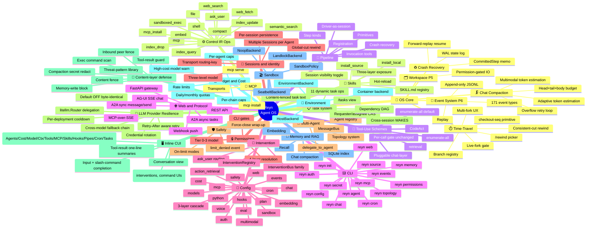

# Reyn Feature Map

Full feature inventory of the Reyn Agent OS, extracted from implementation. Each entry links to its reference or concept documentation.

Per-group **Differentiation vs general agents** callouts position each capability against self-hosted general agents (OpenClaw / Hermes) — Skill is one feature among many, not the headline. Maturity marks: entries are production unless tagged **⚗ experimental / MVP** or noted as an **optional dependency**.

## Visual overview

---

## Feature index

### OS Core

#### Workspace (P5)
| Feature | Description | Documentation |
|---------|-------------|---------------|
| Permission-gated IO | Paths outside CWD require `file.read` / `file.write` declaration | [Concepts: Workspace](concepts/runtime/workspace.md) · [Permissions](reference/config/permissions.md) |

#### Crash Recovery
| Feature | Description | Documentation |
|---------|-------------|---------------|
| `.reyn/` layout + recovery-core classification | Which `.reyn/` subtrees are recovery-core (`state/` + `config/`) vs persist / audit / cache / outside; the recovery-core write-gate (mutate config via dedicated ops, never raw `file.write`) | [.reyn/ directory layout](reference/runtime/reyn-dir-layout.md) |
| Config recovery (config-as-snapshot) | Config registries (`.reyn/config/`: mcp/cron/hooks/index) reconstruct from truncation-surviving config **generations** (full-state snapshots written by the durability worker, seq-keyed) — replacing the former `config_changed`-WAL-event replay, which a WAL truncation below the floor could silently drop (#2259 PR-1). The `.yaml` IS the durable snapshot, not a derived projection | [.reyn/ directory layout](reference/runtime/reyn-dir-layout.md) |
| WAL state log | `step_started` / `step_completed` / `step_failed` written to `.reyn/state/wal.jsonl` (`StateLog`); fsync'd off the event loop via the shared `DurabilityWorker`. #2259: durable-RECORD writes (snapshots / config / identity) are async fire-and-forget — the task loop never blocks on durability; `step_started` BLOCKS by design (durable-before-side-effect, so a crash-mid-op is detected as ambiguous for non-idempotent ops — #2275). Truncatable after snapshot. **Not** the audit trail — see Event System (P6). | Skill Resume |
| Async-decoupled durability (recover-to-last-durable) | In-memory state mutates immediately on the task loop; the seq-keyed durable record is submitted fire-and-forget to the serial `DurabilityWorker` (the seq is assigned IN the worker). Recovery restores to the last durable record — a consistent prefix; the un-durable tail at crash is lost (relaxed durability). A persistent (§4-exhausted) durable-write failure latches `durability_failed` → the session fail-stops (`DurabilityHaltError` on new ops + run-loop halt) so in-memory cannot race a dead disk (#2259) | [.reyn/ directory layout](reference/runtime/reyn-dir-layout.md) |
| Forward-replay resume | `SkillResumeAnalyzer` reconstructs run state from state log | Skill Resume |
| `CommittedStep` memo | Replay recorded op results on resume without re-invoking | Skill Resume |
| World-op bypass | Transient ops (web_search, web_fetch) re-execute fresh on resume | Skill Resume |

#### Time-Travel / Rewind (Resume)

User-facing point-in-time rewind with branching. Phase 1 and Phase 2 (2a/2b/2c/2d) are production. Concurrent-live-fork (parallel live branches) is owner-rejected out-of-scope. Full design: [ADR-0038](deep-dives/decisions/0038-user-facing-time-travel-rewind.md).

| Feature | Description | Documentation |
|---------|-------------|---------------|
| `/rewind` picker | Interactive checkpoint timeline (seq / timestamp / kind columns); Esc-Esc double-tap shortcut | [How-to: rewind](guide/for-users/time-travel.md) |
| Per-checkpoint anchor preview | Each picker row shows a rendered scroll-hint anchor | [How-to: rewind](guide/for-users/time-travel.md) |
| PITR reconstruct | Point-in-time snapshot + WAL-diff reconstruction to target seq | [Time-Travel concepts](concepts/runtime/time-travel.md) · Crash Recovery |
| Consistent-cut rewind | Both substrates (runtime state + workspace shadow-git `as-of-N`) rewound atomically | [Time-Travel concepts](concepts/runtime/time-travel.md) |
| Append-only reset-record | Undo appends a reset-record at seq R; history before R is preserved on the current branch (no destructive rewrite) | [Time-Travel concepts](concepts/runtime/time-travel.md) |
| Retention window + GC | Configurable checkpoint retention window; stale snapshots GC'd automatically | [How-to: rewind](guide/for-users/time-travel.md) |
| Branch registry | Abandoned-interval lineage: each fork receives a registry entry with origin seq | [Time-Travel concepts](concepts/runtime/time-travel.md) |
| `checkout(seq)` unified primitive | Active-branch seq → undo; inactive-branch seq → fork-switch. One primitive for both directions | [Time-Travel concepts](concepts/runtime/time-travel.md) |
| Multi-fork tree UX | Always-tree picker with per-branch anchor labels | [How-to: rewind](guide/for-users/time-travel.md) |
| Act-turn runtime-only rewind | Ghost-Replay memo truncate for rewind within an in-flight turn (no substrate round-trip) | [Time-Travel concepts](concepts/runtime/time-travel.md) |
| Container-mode shadow-git | Shadow-git `as-of-N` rewind supported inside the container environment backend | [How-to: rewind](guide/for-users/time-travel.md) |
| Deterministic CI rewind gate | `test_live_rewind_gate.py` — Phase-1 rewind deterministic gate | — |
| Deterministic CI live-fork gate | `test_live_fork_gate.py` — Phase-2 fork / checkout deterministic gate | — |
| tmux live e2e | P1 undo + P2 fork-switch verified on real terminal | — |
| Phase 2c: fork-then-edit | New branch on edit via `ctrl+t` | [How-to: rewind](guide/for-users/time-travel.md) |
| Phase 2d: web surface | `/rewind` picker over AG-UI SSE / A2A; web edit via `AskUserMessage` UX (original message presented for edit + submit) | [How-to: rewind](guide/for-users/time-travel.md) |
| Agent archive-delete (`reyn agent rm`) | Archive by default (soft-delete): data preserved — PITR generations + topology membership kept (agent dormant, not destroyed). `--purge` permanently hard-deletes (topology cascade fires immediately; no rewind possible). WAL-window GC auto-purges archived agents once archival seq leaves the retention window. | [CLI: reyn agent](reference/cli/agent.md) |

#### Event System (P6)
| Feature | Description | Documentation |
|---------|-------------|---------------|
| 171 event types | Complete taxonomy: workflow / phase / LLM / tool / budget / permission / etc. | [Events reference](reference/runtime/events.md) · [Concepts: Events](concepts/runtime/events.md) |
| Append-only JSONL | `.reyn/events/<run_id>.jsonl` per-run (`EventStore`); audit trail — append-only, rotation-based (not per-append fsync). Separate log and lifecycle from the recovery WAL (`.reyn/state/wal.jsonl`). | [Events reference](reference/runtime/events.md) |
| Replay | `reyn events <path>` streams events for audit and debug | [reyn events CLI](reference/cli/events.md) |

> **Differentiation vs general agents:** the agent loop is an OS-enforced contract — every side effect the LLM emits is a schema-validated, typed Control IR op (never a free-form string), every op routes through the same exclude → permission → dispatch gate regardless of which tool-use scheme is active, every value the agent produces lives in the workspace (P5), and every state change emits an append-only, replayable event (P6). Constrained and auditable by construction, not by developer discipline.

---

### Chat Engine

#### Chat Compaction

| Feature | Description | Documentation |
|---------|-------------|---------------|
| Head+tail+body budget | Keeps the most-recent turns (tail) and earliest context (head) within per-component token budgets; turns between them are replaced by an LLM-generated summary | [Chat Compaction](concepts/data-retrieval/chat-compaction.md) |
| Overflow retry loop | When the compacted context still exceeds the model limit, budgets for head / tail / summary shrink monotonically per iteration until the prompt fits; fails fast with a structured error when no further reduction is possible | [Chat Compaction](concepts/data-retrieval/chat-compaction.md) |
| Adaptive token estimation | Learns a per-model token-count multiplier over time, reducing estimation drift across sessions | [Chat Compaction](concepts/data-retrieval/chat-compaction.md) |
| Multimodal token estimation | Estimates tokens for text and image content; image parts use a fixed per-part cost | [Chat Compaction](concepts/data-retrieval/chat-compaction.md) |
| Compaction lock | Async mutex prevents concurrent turn appends from racing with an in-flight compaction call | [Chat Compaction](concepts/data-retrieval/chat-compaction.md) |

> **Differentiation vs general agents:** instead of naive truncation or an unbounded growing memory, Reyn budgets context as head + tail + LLM summary with a monotonic overflow-shrink retry, adaptive per-model token estimation, and multimodal estimation — predictable context management under a hard model limit.

#### Router system prompt

| Feature | Description | Documentation |
|---------|-------------|---------------|
| Static / dynamic SP split | The router system prompt separates a stable, cache-prefix-friendly head from per-turn dynamic sections | [LLM invocation surfaces](concepts/architecture/llm-invocation-surfaces.md) |
| Task-completion guidance | Anti-fabrication guidance steering the model to finish and verify rather than claim completion prematurely | [SP-improvements study](deep-dives/research/competitive/sp-improvements-measured-1791.md) |
| Model-family-gated steering | A coarse model-family classifier gates non-Claude operational-steering hygiene — added only when the router model is non-Claude, kept off the Claude path | [SP-improvements study](deep-dives/research/competitive/sp-improvements-measured-1791.md) |
| Memory-quality guidance (gated) | Guidance on what makes a good memory entry, rendered only when memory is in scope | [SP-improvements study](deep-dives/research/competitive/sp-improvements-measured-1791.md) |

> **Differentiation vs general agents:** these SP improvements are adopted by **design-judgment** (sound + low-cost + non-harmful), not gated on a limited-environment A/B — a measured null on one environment cannot prove a universal negative, so structurally-sound guidance is adopted while genuinely measurable wins are verified separately.

#### LLM router resilience

Config-gated `litellm.Router` slot-in for provider-resilience. Default OFF (`llm.router.use: false`) — the direct `litellm.acompletion` path is byte-identical. When enabled the Router owns infra retry, Retry-After handling, cooldown, and cross-model fallback; Reyn does not re-implement any of these.

| Feature | Description | Documentation |
|---------|-------------|---------------|
| litellm.Router delegation | When `llm.router.use: true`, LLM calls route through a `litellm.Router`; Reyn delegates infra-exception retry / Retry-After / cooldown / fallback entirely to the Router | [Config: llm block](reference/config/reyn-yaml.md#llm-block) · [Reliability](concepts/agent-engineering/reliability-engineering.md) |
| Default OFF — byte-identical | `use: false` (default) keeps the direct `litellm.acompletion` path with no routing overhead; the on/off switch is the only code-path change | [Config: llm block](reference/config/reyn-yaml.md#llm-block) |
| Cross-model fallback chain | `llm.router.fallbacks` maps primary deployments to an ordered fallback list; on primary failure the Router tries each fallback model in order | [Config: llm block](reference/config/reyn-yaml.md#llm-block) |
| Retry-After aware retry | `llm.router.num_retries` caps infra retries; the Router natively honours provider `Retry-After` headers (fold of retry-engineering gap) | [Reliability](concepts/agent-engineering/reliability-engineering.md) |
| Per-deployment cooldown | `llm.router.cooldown_time` + `allowed_fails` cools a deployment after repeated failures; subsequent calls route to the fallback chain until recovery | [Config: llm block](reference/config/reyn-yaml.md#llm-block) |
| Accurate cost on fallback | On fallback the actual responding model is recorded from `response.model` so cost attribution reflects which deployment served the call | [Budget config](reference/config/budget.md) |
| Config-fingerprint Router cache | Router is cached per event-loop with a `(model, config-fingerprint)` key; a changed `llm.router.*` rebuilds the Router rather than silently reusing a stale instance | [Config: llm block](reference/config/reyn-yaml.md#llm-block) |
| `llm.router.credentials` rotation | Per-model list of API-key env-var names; the Router cycles through active keys; a declared model with zero resolvable keys fails loudly — never a silent keyless deployment | [Config: llm block](reference/config/reyn-yaml.md#llm-block) |

> **Differentiation vs general agents:** provider-resilience is delegated entirely to litellm.Router (Retry-After, jitter, cooldown, cross-model fallback chain, credential rotation) rather than re-implemented — the on/off gate keeps the direct path byte-identical, so replay and cost-recording work unchanged whether or not the Router is active.

---

### Control IR Ops

All ops are documented in the single reference page: **[Control IR](reference/runtime/control-ir.md)**

The op kinds below mirror `OP_KIND_MODEL_MAP` in `schemas/models.py`.

| Op | Description |
|----|-------------|
| `file` | `read` / `write` / `edit` / `delete` / `glob` / `grep` / `regenerate_index` (six fine-grained registry kinds) |
| `ask_user` | Pause the run, collect the user's answer via the intervention bus |
| `present` | Route bulk data + a declarative display template to the user surface without the data passing through LLM output tokens (Tier 0, fire-and-continue) |
| `sandboxed_exec` | `argv` under `SandboxPolicy` via platform-selected backend |
| `shell` | Raw shell exec — deprecated; prefer `sandboxed_exec` |
| `web_search` | DuckDuckGo search — Tier 1, default-allow |
| `web_fetch` | URL fetch + text extract — Tier 1, default-allow |
| `mcp` | Call a configured MCP server tool by name |
| `mcp_read_resource` | Read one MCP resource by URI (permission-gated, same axis as `mcp`) |
| `mcp_subscribe_resource` / `mcp_unsubscribe_resource` | Subscribe/unsubscribe to server-pushed `resources/updated` for one URI (requires a persistent connection; push lands as an `mcp_resource_updated` hook-event) |
| `mcp_get_prompt` | Fetch one rendered MCP prompt's messages by name (permission-gated, same axis as `mcp`) |
| `mcp_install` | Install / register an MCP server (registry / package / local source) |
| `embed` | Raw embedding primitive: batch texts → vectors (FP-0057 Phase 1). User-facing (compose with an external MCP vector-DB via pipeline) AND the shared logic internal RAG ops call; default-allow; PRE-embed redaction-egress seam | [Control IR § embed](reference/runtime/control-ir.md#embed) |
| `index_query` | Vector similarity search over one indexed source |
| `semantic_search` | Macro (FP-0057 Phase 2a; renamed from `recall` — clean-break, fixes the recall/search_actions/memory naming collision): per-source-model embed query → `index_query` per source → merge top-K. Multi-model correct: each source's model is auto-adopted from its own recorded index (never caller-supplied); cross-model scores are never directly compared | [Control IR § semantic_search](reference/runtime/control-ir.md#semantic_search) |
| `index_drop` | Destructive source removal — requires approval |
| `index_update` | Incremental/delta-reconcile ingestion into a source's index (FP-0057 Phase 2a): add/update/remove/skip against `content_hash`, source-model-bound, cost-warn surfacing; no full-rebuild mode | [Control IR § index_update](reference/runtime/control-ir.md#index_update) |
| `compact` | Summarise / compact conversation history within budget |

> `index_write` remains removed. FP-0057 Phase 2b: `semantic_search`'s query embed and `index_update`'s ingestion embed BOTH now dispatch through the shared `embed` op (`execute_op(EmbedIROp(...))`, not provider-direct) — the PRE-embed redaction-egress seam applies to both paths symmetrically. The CodeAct-only ingestion entry `reyn.api.safe.embed_index.embed_and_index` is **retired clean-break** (deleted, no shim) — safe-mode python steps now call `reyn.api.safe.index_update()`, a thin dispatch onto the `index_update` op. See [Control IR](reference/runtime/control-ir.md).

---

### Present layer

Show bulk data to the user **without the data passing through LLM output tokens** — the agent routes a data ref + a declarative display template to the user surface directly. The LLM sees the data's shape (schema + preview) and binds paths; the renderer joins the template against the full data the LLM never ingested. Declarative + non-executable by construction (a vetted component catalog + JSON-Pointer bindings, no code) — safety from the primitive's shape, not layered policy.

| Feature | Description | Documentation |
|---------|-------------|---------------|
| `present` op | Tier 0 (`ask_user`'s sibling), fire-and-continue; `data_ref` XOR `data_inline`, `template` XOR `blueprint`. `data_ref` read authority == `file.read` | [Present reference](reference/runtime/present.md) · [Concepts: Present layer](concepts/runtime/present.md) |
| v1 component catalog | Display-only read-only components: `text` / `markdown` / `code` / `diff` / `keyvalue` / `table` / `list` / `image`; `$bind` JSON-Pointer (RFC 6901) bindings, row-relative for `table`/`list` | [Present reference § catalog](reference/runtime/present.md) |
| Presentation-guard + renderer discipline | Surface-universal guard strips ESC/control sequences at one seam (every leaf, incl. never-ingested data); Rich-markup safety is structural in the renderer (markup-inert sinks, no escaping) | [Concepts: Present layer § guard vs renderer](concepts/runtime/present.md) |
| 4-stage fallback | Registered template → inline blueprint → default viewer (from data shape) → generic (always renders); degrade-never-fail, drops audited in the ack | [Present reference § fallback](reference/runtime/present.md) |
| `presentations.yaml` registry | Operator-registered named templates (`presentations.entries`), hot-reloaded at the turn boundary; the LLM authors inline blueprints only | [reyn.yaml § presentations](reference/config/reyn-yaml.md#presentations-block) |
| `presented` event (P6) + replay-as-cache | Audit event carries refs + stats, never content bytes; replay/rewind re-renders best-effort from the ref, or an expiry placeholder when it is gone (display-only, no reconstructed state) | [Present reference § replay](reference/runtime/present.md) |

> **Differentiation vs general agents:** general agents reproduce bulk tool data as LLM output tokens (expensive, and lossy when the model summarizes to fit). reyn's present layer routes the data's *handle* + a declarative template to the surface directly — display costs ~0 output tokens, the user sees full fidelity, and blind presentation is *audited* (an OS-computed `ingested` annotation) rather than forbidden. Non-executable by construction sidesteps the UI-spoofing class that sandboxed-iframe UI protocols spend their complexity on.

---

### Tool-Use Schemes

How tools are presented to the LLM and how its calls are dispatched is a **pluggable scheme**, selectable for the chat layer (`tool_use.chat` in `reyn.yaml`). The `chat` layer defaults to `enumerate-all`. Non-default schemes are opt-in. All schemes route every tool call through the same OS gate (exclude → permission → dispatch), so the security and validation pipeline is unchanged whichever scheme is active.

| Feature | Description | Documentation |
|---------|-------------|---------------|
| Pluggable scheme protocol | `ToolUseScheme` seam — tool presentation + interpretation + dispatch + feedback behind one interface; schemes are swapped by config, no OS change | [Tool-Use Schemes](concepts/tools-integrations/tool-use-schemes.md) |
| Per-layer selection | Independent scheme per layer — chat / step — via `tool_use` config | [Tool-Use Schemes](concepts/tools-integrations/tool-use-schemes.md) · [`reyn.yaml` § tool_use](reference/config/reyn-yaml.md#tool_use-block) |
| `universal-category` (step default) | The universal action catalog — 4 wrappers over every category, qualified-name discover + dispatch | [Tool-Use Schemes](concepts/tools-integrations/tool-use-schemes.md) · [Universal catalog](concepts/tools-integrations/universal-catalog.md) |
| `enumerate-all` (chat default) | Flat-native-JSON baseline — every usable tool presented flatly, dispatched by name. Best for small tool sets where determinism matters | [Tool-Use Schemes](concepts/tools-integrations/tool-use-schemes.md) |
| `retrieval` | RAG-over-tools — present a search tool, the LLM searches, the OS re-presents matched tools as callable. Supported opt-in for very large tool sets where full-catalog token cost is prohibitive; requires a configured embedding provider (`action_retrieval.embedding_class`) | [Tool-Use Schemes](concepts/tools-integrations/tool-use-schemes.md) |
| `CodeAct` | Code-as-tools — the LLM writes a Python snippet whose in-code `tool()` calls run in a sandboxed subprocess under the same permission gate as a JSON call. Strongest for weak models | [Tool-Use Schemes](concepts/tools-integrations/tool-use-schemes.md) |

> **Differentiation vs general agents:** the tool-use strategy is a swappable scheme — `enumerate-all` / `retrieval` / `CodeAct` / the default catalog — chosen per layer by config, *without* changing the OS. Because every scheme dispatches through the same exclude → permission → `dispatch_tool` gate, swapping the LLM-facing tool surface never weakens the security or validation pipeline. The presentation is data; the gate is constant.

---

### CLI

| Command | Description | Documentation |
|---------|-------------|---------------|
| `reyn chat` | Interactive multi-turn chat with a named agent | [Reference](reference/cli/chat.md) |
| `reyn agent` | Create and manage named persistent agents | [Reference](reference/cli/agent.md) |
| `reyn topology` | Create and manage communication topologies | [Reference](reference/cli/topology.md) |
| `reyn memory` | CRUD + search + export/import for agent memories | [Reference](reference/cli/memory.md) |
| `reyn permissions` | Inspect and revoke saved approval entries | [Reference](reference/cli/permissions.md) |
| `reyn events` | Replay event JSONL files or purge old files by date | [Reference](reference/cli/events.md) |
| `reyn mcp` | Serve, search, install, and manage MCP servers | [Reference](reference/cli/mcp.md) |
| `reyn secret` | Set / list / clear secrets in `~/.reyn/secrets.env` | [Reference](reference/cli/secret.md) |
| `reyn source` | List, describe, and remove indexed RAG sources | [Reference](reference/cli/source.md) |
| `reyn embeddings` | `status` / `rebuild` / `clear` for the action embedding index (`search_actions`) | [Reference](reference/cli/embeddings.md) |
| `reyn config` | Show, query, and set effective configuration | [Reference](reference/cli/config.md) |
| `reyn auth` | Manage OAuth credentials — `login` (RFC 8628 device grant against `auth.providers`) / `list` / `revoke` | [reyn.yaml § auth](reference/config/reyn-yaml.md) |
| `reyn cron` | Manage and run cron-scheduled skill jobs — foreground scheduler / list jobs + next-run / status | [reyn.yaml § cron](reference/config/reyn-yaml.md) |
| `reyn web` | Start FastAPI gateway server (HTTP + SSE) | [Reference](reference/cli/web.md) |
| `reyn init` | Scaffold `reyn.yaml` and `.reyn/` in current directory | [Reference](reference/cli/init.md) |

---

### Config

Main reference: **[`reyn.yaml`](reference/config/reyn-yaml.md)**

| Block | Description | Documentation |
|-------|-------------|---------------|
| 3-layer cascade | user-global / project / project-local + CLI flags | [reyn-yaml](reference/config/reyn-yaml.md) |
| `${VAR}` interpolation | Env var expansion in all string fields via `secrets.env` | [reyn-yaml § interpolation](reference/config/reyn-yaml.md#var-interpolation) |
| `safety` | Loop caps / timeout caps / on-limit policy | [reyn-yaml § safety](reference/config/reyn-yaml.md#safety-block) |
| `cost` | Per-agent / per-chain / daily / monthly token+USD caps | [Budget config](reference/config/budget.md) |
| `sandbox` | Backend selection (auto/seatbelt/landlock/noop) + `on_unsupported` | [reyn-yaml § sandbox](reference/config/reyn-yaml.md#sandbox-block) |
| `web` | `web.fetch` SSL `verify_ssl` and `ca_bundle` override | [reyn-yaml § web](reference/config/reyn-yaml.md#web-block) |
| `chat` | Compaction trigger / head+tail retention / section token caps | [Chat Compaction](concepts/data-retrieval/chat-compaction.md) |
| `embedding` | Model classes / batch_size / cost_warn_threshold | [RAG concepts](concepts/data-retrieval/rag.md) |
| `voice` ⚠️ | Whisper model / language / device config still parses, but has no consumer since the Textual TUI it was built for was deleted (replaced by the inline CUI) — currently unavailable | [Voice concepts](concepts/tools-integrations/voice.md) |
| `events` | Rotation size/age + cleanup_period_days | [Events reference](reference/runtime/events.md) |
| `models` | Class → LiteLLM model string with `extends` chain | [reyn-yaml § models](reference/config/reyn-yaml.md#models-block) |
| `permissions` | Project-wide default capability policy | [Permissions config](reference/config/permissions.md) |
| `multi-agent` | Agent and topology defaults | [Multi-agent config](reference/config/multi-agent.md) |
| `state_dir` | Runtime state directory (default `.reyn/`) | [State dir](reference/config/state-dir.md) |
| `observability` | OTLP endpoint / headers / service name / content-capture toggle for the opt-in OpenTelemetry exporter | [reyn-yaml § observability](reference/config/reyn-yaml.md#observability-block) · [Observability reference](reference/runtime/observability.md) |
| `auth` | OAuth provider definitions for `reyn auth login` (RFC 8628 device grant) | [reyn-yaml](reference/config/reyn-yaml.md) |
| `mcp` | Configured external MCP server connections (transport + env) | [Concepts: MCP](concepts/tools-integrations/mcp.md) |
| `multimodal` | Media handling caps (`max_bytes`, per-part token cost) | [reyn-yaml](reference/config/reyn-yaml.md) |
| `python` | `python`-step execution policy (safe / unsafe subprocess) | Preprocessor |
| `cron` | Cron-scheduled skill job definitions | [reyn-yaml](reference/config/reyn-yaml.md) |
| `action_retrieval` | Action-catalog `search_actions` retrieval tuning | [Universal catalog](concepts/tools-integrations/universal-catalog.md) |
| `hooks` | Agent-lifecycle push/shell/pipeline hooks at 6 lifecycle points (`turn_start/end`, `session_start/end`, `task_start/end`) plus 4 external-event points fired outside the session's own run-loop: `mcp_resource_updated`, `file_changed`, `cron_fired`, `webhook_received` (the latter two non-blocking relative to their own ingress — dispatch never delays cron delivery or the webhook's HTTP response; `webhook_received`'s vars carry only routing metadata, never the raw request body). `push` mode: `wake:false` passive context ride-along, or `wake:true` self-continuation bounded by `safety.loop.max_hook_driven_turns`. `shell`: sandbox-gated side-effect, output ignored. `pipeline_launch`: async/detached launch of a registered pipeline, input Jinja2-rendered from the firing hook-event's template vars. `matcher`: optional per-field filter (exact match, except `uri`/`path` which glob) narrowing which hook-events fire a hook. Cross-session push routes to another session's inbox via the `session` field. Shell-hook consent routes through the intervention bus → an above-input closed-set intervention in the inline CUI (`[A]lways` / `[y]es` / `[n]o`; `Always` persists to `~/.reyn/shell-hooks-allowlist.json`); falls back to stdin on non-interactive surfaces. All shell runs emit `hook_shell_executed` P6 event ("tool" group; prefix `shell_exec:` or `shell_push:`). Hooks emit attributed `[hook:name]` messages — history is never silently mutated. | [reyn-yaml § hooks](reference/config/reyn-yaml.md#hooks-block) · [Concepts: hooks](concepts/runtime/hooks.md) |
| `fs_watch` | Operator-declared filesystem watch paths (`paths`, `debounce_seconds`) firing the `file_changed` external-event hook on create/modify/delete. Restart-only (OUT-set) — no op/tool verb lets an agent register or widen a watch. Requires the `watchdog` extra; degrades to a no-op warning without it. | [reyn-yaml § fs_watch](reference/config/reyn-yaml.md#fs_watch-block) · [Concepts: hooks](concepts/runtime/hooks.md#file_changed) |
| Hook-Event Bus + Composer (Phase 4a/4b/5, proposal 0059) | Per-Session pub/sub `HookBus` (broadcast, no consume; independent of Sync hook dispatch) plus a `Composer` (`reyn.hooks.composer`) that correlates multiple bus-observed hook-events into one `composed:<name>` event via 7 ops (`all`/`any`/`seq`/`window`/`debounce`/`correlate_by`/`count`), config-parsed with a load-time cycle-check (DAG). Best-effort/crash-non-durable pending state (`PendingStore` seam for a future WAL-backed swap); overflow (`drop_oldest`/`drop_newest`/`reject`) and ttl-eviction always emit a metadata-only `composer_dropped` P6 event (payload content never recorded); a fire emits `composer_fired`. **Composers are startup-only** — a `composers:` config change takes effect on the next session start, not via the hooks hot-reload seam (a live Composer's in-flight `PendingStore` correlation state has no reload-time reconciliation yet; known limitation, originally recorded only in closed #2881, tracked here per #2890 F8). **Phase 4+ hardening (#2886/#2890):** a `HookBus` subscriber-queue drop is fail-visible — a per-subscriber drop counter (`snapshot_drop_counts()`) plus a metadata-only `bus_subscriber_dropped` P6 event on first-drop/every-Nth (never per-drop, `publish` stays a sync/never-raises hot path); `policy.max_events_per_key` bounds a single correlation key's buffered-events list length (drop-oldest + `composer_dropped(reason=per_key_event_cap)`) so an external-event storm hammering one key cannot grow it unboundedly during the ttl window; `emit_hook_event`'s `event_name` is now pattern/length-constrained (`^[A-Za-z0-9_.-]*$`, `max_length=200`) so control characters/newlines/unbounded length can never reach the constructed `kind`. **Full reachability path wired (Phase 5 part 1, #2881, closed):** a Session reads `composers:` from the same 4-layer additive combine as `hooks:` and auto-starts every configured Composer (`start_composers`, called from `run()`); `composed:<name>` is now a loadable Sync `on:` target (an open namespace, prefix-accepted in `reyn.hooks.loader`, not enumerated in the fixed `ALLOWED_HOOK_POINTS`); a dedicated bridge (`reyn.hooks.composed_consumer.ComposedEventConsumer`) subscribes to the Bus and runs any Sync-registered hook matching an observed `composed:*` event via `HookDispatcher.dispatch_bus_event` — without re-publishing to the bus (Composer itself still never calls `HookDispatcher` directly, keeping the Bus-only invariant true). A composed→wake chain is bounded by the existing `max_hook_driven_turns` loop-valve with zero new bounding logic (every wake traverses inbox `kind="hook"`) — pinned by a flip-witness Tier-2 test (a self-stimulating, naturally-unbounded composed→wake→turn_end→composed loop force-closes at the cap; falsified by raising the cap and observing the trip disappear). **`emit_hook_event` (LLM-emit, Phase 5 part 2, #2885, delivered):** a Control-IR op letting the LLM publish an `llm:<session_id>:<event_name>` event onto its own session's Bus — the first LLM-reachable producer in the pipeline, gated by a static kind allowlist (own-session `llm:*` only; `builtin:*`/`composed:*`/`webhook:*`/`mcp:*`/another session's `llm:*` all rejected) enforced before `HookBus.publish`. Reaches Sync dispatch only via a Composer correlating it into a `composed:*` event (no direct `llm:*` → `hooks:` path). Remaining out of scope: `WalBackedPendingStore` and valve-persist (both recovery-gated follow-ups). | [Concepts: hooks § Async Bus and Composer](concepts/runtime/hooks.md#async-bus-and-composer-event-correlation) · [Reference: control-ir.md § emit_hook_event](reference/runtime/control-ir.md#emit_hook_event) |
| Config hot-reload | Runtime re-read of the IN-set (`.reyn/config/mcp.yaml` / `cron.yaml` / `hooks.yaml`) at the turn boundary without a process restart. OUT-set (`reyn.yaml`: security / budget / loop valve) is restart-only — the file-split is the structural write-gate. Two triggers: operator `/reload` and agent `hooks_add` LLM-op. Validate-before-apply + per-layer boot resilience + sandbox/loop-valve = safe-by-construction. | [Concepts: Config hot-reload](concepts/runtime/config-hot-reload.md) |

---

### Permissions

| Feature | Description | Documentation |
|---------|-------------|---------------|
| Tier 0 — always allowed | `ask_user` — no gate | [Permission model](concepts/runtime/permission-model.md) |
| Tier 1 — default-allow | `web_search` / `web_fetch` — deny-only gate | [Permission model](concepts/runtime/permission-model.md) · [Permissions config](reference/config/permissions.md) |
| Tier 2/3 — declaration + 4-layer approval | `shell` / `mcp` / `file` (out-of-zone) / `python` | [Permission model](concepts/runtime/permission-model.md) |
| Layer 1: config pre-approval | `reyn.yaml` hard `allow` / `deny` | [Permissions config](reference/config/permissions.md) |
| Layer 2: saved approvals | `.reyn/approvals.yaml` — persisted per path/server | [reyn permissions CLI](reference/cli/permissions.md) |
| Layer 3: session approvals | In-memory for current invocation only | [Permission model](concepts/runtime/permission-model.md) |
| Layer 4: interactive prompt | Ask user with persist choices (yes / always / just-this-path) | [Permission model](concepts/runtime/permission-model.md) |
| Capability profile | Per-agent MCP / tool / category capability restriction (ProfileLayer in the ∩ model); agent can self-edit `.reyn/agents/<name>/profile.yaml` within the default write zone | [Concepts: Capability profile](concepts/runtime/capability-profile.md) · Reference: profile.yaml |
| Delegation policy | Config-selectable default-deny for delegated agents: `delegation.capability_default=deny` narrows any unbound delegate with the restrictive `_delegate` floor (same deny taxonomy as `_untrusted`). Binding replaces the floor (= the re-grant). Recursive: no laundering via re-granted coordinators. `reyn audit` (`gateway:delegation-unsafe`) flags re-grants with OPT-A reachability precision (HIGH exit on re-delegation/exec). | [Concepts: Delegation policy](concepts/runtime/delegation-policy.md) · [Concepts: Capability profile](concepts/runtime/capability-profile.md) |

> **Differentiation vs general agents:** autonomous agents typically execute tools with minimal gating. Reyn requires per-capability declaration + 4-layer just-in-time approval (config → saved → session → interactive), a `.reyn/` write zone, and per-skill credential scoping (Confused Deputy mitigation).

---

### Safety / limit-handling

Bounded-operation checkpoints that stop the agent gracefully rather than hard-failing. See [Safety framework](concepts/runtime/safety.md).

| Feature | Description | Documentation |
|---------|-------------|---------------|
| `handle_limit_exceeded` unified checkpoint | Single shared function `runtime/limits/limit_handler.py` that all seven loop / timeout / budget checkpoints call; owns the 3-mode dispatch, bus interaction, extension bookkeeping, and audit-event emission — callers only decide what limit fired | [Safety framework](concepts/runtime/safety.md) |
| On-limit modes (`OnLimitConfig`) | `interactive` (ask) / `auto_extend` (budgeted N times) / `unattended` (abort) via `safety.on_limit.mode`; applies uniformly to loop caps, timeout caps, and budget exceed paths | [Safety framework](concepts/runtime/safety.md) · [reyn.yaml § safety](reference/config/reyn-yaml.md#safety-block) |
| Force-close wrap-up | On a denied limit the LLM gets one final tool-less turn to summarise what was accomplished; delivered as a `kind="agent"` message with `meta.limit_stopped` | [Safety framework](concepts/runtime/safety.md) |
| `limit_denied` event | P6 audit event on every deny path (`max_iterations` / `router_cap`) | [Events reference](reference/runtime/events.md) |
| Decision-enabling fallback | When the wrap-up fails or is empty, a structured error states the limit hit, the config key to change, and partial-data availability | [Safety framework](concepts/runtime/safety.md) |

> **Differentiation vs general agents:** where free-running agents hard-stop or run away at a limit, Reyn's force-close turns a denied limit into a graceful LLM wrap-up plus an operator decision — it reports what it accomplished instead of vanishing or looping unbounded.

---

### Content-layer defense

Scanning untrusted content (memory, tool results, context files, inbound peer messages) for
prompt-injection / exfiltration / role-hijack patterns at the seams where it
enters the prompt — a security transform at a content boundary, not OS decision
logic. Design: [content-threat scan proposal](deep-dives/proposals/0050-content-threat-scan.md).

| Feature | Description | Documentation |
|---------|-------------|---------------|
| Threat-pattern library ✅ | Security-domain regexes (injection / exfiltration / role-hijack / exec) applied to untrusted content across all scopes — `security/threat_patterns.py` | [Design](deep-dives/proposals/0050-content-threat-scan.md) |
| Content fence ✅ | Wraps untrusted content in explicit delimiters so model-visible boundaries are unambiguous — `security/content_fence.py` | [Design](deep-dives/proposals/0050-content-threat-scan.md) |
| Unified tool-result guard ✅ | One seam scans + fences tool-result content before it reaches the prompt — `security/content_guard.py` | [Design](deep-dives/proposals/0050-content-threat-scan.md) |
| Memory-write BLOCK ✅ | Memory writes that match threat patterns are blocked before reaching the agent's memory store — `runtime/router_loop.py` | [Design](deep-dives/proposals/0050-content-threat-scan.md) |
| Pre-exec command scan ✅ | `sandboxed_exec` scans the full joined argv against exec-scope threat patterns before any shell is launched; blocked commands emit `exec_threat_blocked` — `core/op_runtime/sandboxed_exec.py` | [Design](deep-dives/proposals/0050-content-threat-scan.md) |
| Context-file + A2A-inbound fence ✅ | Operator-editable context files (REYN.md/AGENTS.md) and untrusted inbound A2A peer messages are fenced + scanned on arrival — `router_host_adapter.py` (EP3) / `inter_agent_messaging.py` (S4b) | [Design](deep-dives/proposals/0050-content-threat-scan.md) |
| Compaction secret redaction ✅ | Secret-looking content is stripped from compaction input before summaries are persisted — `security/secret_redaction.py` | [Design](deep-dives/proposals/0050-content-threat-scan.md) |

> **Differentiation vs general agents:** Reyn places content-layer scanning at the OS seams — the same content boundaries where secret interpolation already sits — as a security-domain transform that keeps OS decision logic free of skill strings (P7). Structural redundancy means checks already enforced by the sandbox / permission layer (e.g. absolute-path or pipe-to-shell writes) are not re-implemented as ad-hoc per-call scans.

---

### Budget & Cost

| Feature | Description | Documentation |
|---------|-------------|---------------|
| Per-agent caps | Token + USD hard limits with `warn_ratio` | [Budget config](reference/config/budget.md) |
| Per-chain caps | Skill spawn count + token total per chain | [Budget config](reference/config/budget.md) |
| Rate limits | Per-model calls-per-minute sliding window | [Budget config](reference/config/budget.md) |
| Daily quotas | Persistent JSONL ledger, resets at local midnight | [Budget config](reference/config/budget.md) |
| Monthly quotas | Persistent JSONL ledger, resets at month boundary | [Budget config](reference/config/budget.md) |
| Crash-durable cap counters | Every cap counter (daily / monthly / per-agent token+USD / per-chain spawn count) is reconstructed on startup from the fsync-per-append ledger — a crash inside the throttled `budget_state.json` save window cannot under-count a cap and re-allow over-budget calls or spawns. The state file is a best-effort cache; the ledger wins on recovery | [Budget config](reference/config/budget.md) · [state-dir](reference/config/state-dir.md) |
| `extension_calls` (+ `safety.on_limit.mode`) | Budget-extension flow on hard cap hit; `extension_calls > 0` opts the dimension into the unified `safety.on_limit` policy (ask / auto-extend / deny). The per-dimension `ask_on_exceed` bool was removed. | [Budget config](reference/config/budget.md) |
| High-cost model warn (`cost_warn`) | `cost_warn.enabled` (default `true`) emits a `model_cost_warn` audit-event + inline conv-pane marker when the resolved model's input cost per 1M tokens exceeds `model_threshold_per_1m_input_usd` (default `5.0`); fires at `/model` switch and session startup, de-duped once per model per session | [reyn.yaml § cost_warn](reference/config/reyn-yaml.md#cost_warn-block) |

> **Differentiation vs general agents:** token + USD caps per agent / chain / model with refuse-on-exceed and a `safety.on_limit`-driven extension flow, plus a pre-selection high-cost model warning — runaway spend is structurally bounded, not merely observed after the fact.

---

### Memory & RAG

| Feature | Description | Documentation |
|---------|-------------|---------------|
| LiteLLM embedding backend | Any provider via named model class config | [RAG concepts](concepts/data-retrieval/rag.md) |
| Local embedding backend | sentence-transformers via `pip install 'reyn[local-embed]'` — `local-mini` / `local-e5` classes, credential-free, GPU-optional via `REYN_EMBED_DEVICE`; air-gapped fast-fail opt-in via the HF-standard `HF_HUB_OFFLINE` / `TRANSFORMERS_OFFLINE` → explicit `local_files_only` (FP-0057 Phase 4) | [RAG concepts § Local embedding backend](concepts/data-retrieval/rag.md#local-embedding-backend-fp-0043) · [Guide § Offline / air-gapped networks](guide/for-users/enable-semantic-search.md#offline--air-gapped-networks) |
| Provider-prefix routing | `sentence-transformers/` → local backend; anything else → LiteLLM | [RAG concepts § Embedding configuration](concepts/data-retrieval/rag.md#embedding-configuration) |
| Batch embed | Configurable `batch_size` with concurrency semaphore | [RAG concepts](concepts/data-retrieval/rag.md) |
| Dimension table | Static lookup for OpenAI / Voyage / Cohere | [RAG concepts](concepts/data-retrieval/rag.md) |
| SQLite index per source | `.reyn/index/<source>/index.db` with WAL mode | [RAG concepts](concepts/data-retrieval/rag.md) |
| Chunk dedup | `content_hash` upsert prevents re-indexing | [RAG concepts](concepts/data-retrieval/rag.md) |
| **Builtin user RAG** (proposal 0063) | Turnkey RAG over the operator's **own** documents, into an **external sqlite vector store they name** — distinct from the in-core `IndexBackend` rows above, and **not** a source `semantic_search` can see (FP-0057 C2: reyn hosts no user store). Two builtin pipelines (`rag_ingest.ingest` / `rag_query.query`, P3) + two builtin MCP servers (P2) + the `build_and_query_rag_corpus` skill (P4). reyn contributes exactly one thing to the chain — `embed` (C1: reyn is the sole embedder, so the per-chunk `embedding_model` column can never disagree with the vectors, C4) — and runs **no python of its own**: every other step is an MCP call or a reyn op (#2972). Ingest is incremental by `content_hash` (add/update/remove, C5) and reports metered spend (`tokens_embedded`/`cost_usd`/`priced`) plus an estimated dedup saving. **Ships INERT** — the 3 MCP servers must be explicitly configured + granted by the operator, preserving #2932's trusted-by-configuration premise; until then ingest returns a decision-enabling pre-flight message (X1, the `require_mcp` shape) before any embedding spend | [Guide: Build a RAG corpus](guide/for-users/build-a-rag-corpus.md) · [Cookbook config](cookbook/configs/with-builtin-rag-mcp.yaml) |
| Builtin RAG MCP servers (proposal 0063 P2) | `vector_store_server` (sqlite-vec via apsw: `upsert`/`query`/`list_metadata`/`delete`, items↔vectors paired by index server-side; metadata filtering is an allowlisted plain-SQL `WHERE`, values parameterized) and `chunker_server` (chonkie; `size`/`overlap_ratio` are real tool parameters, never baked-in constants — R2/R4). Neither imports an embedding library — **C1 holds structurally, not by comment**. Shipped as code in the wheel + `reyn-rag-vector-store` / `reyn-rag-chunker` console scripts (whose pip-stamped absolute shebang survives pipx); `pip install "reyn[builtin-rag]"`. reyn launches whatever `command` the config names, as-is, in any language — preparing the MCP runtime is the operator's responsibility | [Guide: Build a RAG corpus § Setup](guide/for-users/build-a-rag-corpus.md#setup) |
| `semantic_search` op | per-source-model embed → `index_query` per source → merge top-K globally (FP-0057 Phase 2a; renamed from `recall`) | [Control IR](reference/runtime/control-ir.md) |
| `index_update` op | incremental/delta-reconcile ingestion (add/update/remove/skip), source-model-bound, cost-warn surfacing (FP-0057 Phase 2a) | [Control IR](reference/runtime/control-ir.md) |
| Action embedding index | `ActionEmbeddingIndex` (class-swap detection, cross-process build lock) — backs the `search_actions` tool the chat LLM uses. FP-0057 Phase 0: a thin domain adapter over the same pluggable `IndexBackend` doc-RAG uses (unified cosine + advisory-lock + storage; was a separately-implemented SQLite-WAL index pre-consolidation) | [Universal catalog § search_actions](concepts/tools-integrations/universal-catalog.md#what-stays-out-of-phase-1) · [`reyn embeddings`](reference/cli/embeddings.md) |
| Memory CRUD | `list` / `read` / `remember_shared` / `remember_agent` / `forget` | [Memory concepts](concepts/data-retrieval/memory.md) · [reyn memory CLI](reference/cli/memory.md) |

> **Differentiation vs general agents:** beyond chat memory, Reyn ships a RAG *framework* — a safe-mode Python step calls `index_update()` directly (you own the chunking logic) over a pluggable `IndexBackend`, with a credential-free local-embedding option. A foundation to build on, not a fixed memory feature. **And, separately, a turnkey path on top of it** (proposal 0063): builtin pipelines that ingest a document folder into a sqlite store *the operator owns* — where reyn's contribution is deliberately just `embed`, and the pipeline you copy is the extension mechanism.

---

### MCP

| Feature | Description | Documentation |
|---------|-------------|---------------|
| stdio transport | Subprocess `StdioServerParameters` — implemented | [Concepts: MCP](concepts/tools-integrations/mcp.md) |
| HTTP transport | Streamable HTTP with request headers — implemented | [Concepts: MCP](concepts/tools-integrations/mcp.md) |
| SSE transport | Reserved — raises `NotImplementedError` | [Concepts: MCP](concepts/tools-integrations/mcp.md) |
| `mcp serve` | Expose Reyn agents as an MCP server over stdio JSON-RPC 2.0 | [reyn mcp CLI](reference/cli/mcp.md) |
| `mcp install` | Fetch from registry, gate permissions, write config, store secrets. Three chat verbs: `mcp__install_registry` (official registry), `mcp__install_package` (npm/pypi/docker/github URL), `mcp__install_local` (direct command). CLI: `reyn mcp install <SERVER_ID>` or `--source <SPEC>`. | [Concepts: MCP](concepts/tools-integrations/mcp.md) · [reyn mcp CLI](reference/cli/mcp.md) |
| Secret management | Per-server env vars in `~/.reyn/secrets.env` | [reyn secret CLI](reference/cli/secret.md) |
| Tool dispatch | Lazy-load and cache `MCPClient` per server connection | [Concepts: MCP](concepts/tools-integrations/mcp.md) |
| Resources consumption | List/read MCP resources + resource templates (`list_mcp_resources` / `read_mcp_resource` / `list_mcp_resource_templates`), gated by the negotiated `resources` capability | [Concepts: MCP](concepts/tools-integrations/mcp.md) · [Control IR: `mcp_read_resource`](reference/runtime/control-ir.md) |
| Resource subscriptions | Subscribe/unsubscribe to server-pushed `resources/updated` (`subscribe_mcp_resource` / `unsubscribe_mcp_resource`), gated by the negotiated `resources.subscribe` sub-capability; runtime-only subscribed-URI set survives a transport-death reconnect (re-subscribed, with a synthetic `resync` firing per re-subscribed URI); push lands as an `mcp_resource_updated` EventLog event and is also wired into the hook dispatcher as an external-event hook-point | [Concepts: MCP](concepts/tools-integrations/mcp.md) · [Concepts: hooks](concepts/runtime/hooks.md#mcp_resource_updated) · [Control IR: `mcp_subscribe_resource`](reference/runtime/control-ir.md) |
| Prompts consumption | List/get MCP prompts (`list_mcp_prompts` / `get_mcp_prompt`), gated by the negotiated `prompts` capability; no subscribe concept | [Concepts: MCP](concepts/tools-integrations/mcp.md) · [Control IR: `mcp_get_prompt`](reference/runtime/control-ir.md) |
| Elicitation | Server→client structured-input requests (`elicitation/create`) surfaced through reyn's own consent path — server-attributed prompt text, extra warning + no-autofill guarantee on sensitive-named fields, per-server `elicitation: prompt\|auto_decline` + `elicitation_timeout_seconds` config; timeout/decline/headless all resolve to a clean `cancel`/`decline` response, never a hang; audit records field key names only, never values | [Concepts: MCP](concepts/tools-integrations/mcp.md#elicitation-structured-input-requests-from-a-server) · [reyn-yaml § MCP servers](reference/config/reyn-yaml.md#mcp-servers) |
| OAuth 2.1 | Per-server `auth: oauth` (or `{type: oauth, scopes, client_id, client_secret}`) config, Streamable HTTP only (`stdio`/`sse` reject it); first auth is interactive (browser + localhost callback); tokens cached in `~/.reyn/oauth_tokens.json` (outside bucket, mode 0600, per-server, never rewound — reuses the existing RFC-8628 device-grant store); headless with no cached token fails clearly instead of hanging; static bearer via `headers` unaffected | [Concepts: MCP](concepts/tools-integrations/mcp.md#oauth) · [reyn-yaml § MCP servers](reference/config/reyn-yaml.md#mcp-servers) |

> **Differentiation vs general agents:** Reyn is both an MCP client (consumes external servers) and an MCP server (exposes its own agents) — standard-protocol interop in both directions, with stdio MCP servers subprocess-sandboxed under Seatbelt.

---

### Skills

| Feature | Description | Documentation |
|---------|-------------|---------------|
| `SKILL.md` registry | Explicit `skills.entries` declarations (no directory scan) — same registration model as `mcp.servers` | [Concepts: Skills](concepts/tools-integrations/skills.md) |
| Three-layer exposure | L1 system-prompt `## Skills` menu (`name — description [path]`) → L2 on-demand `SKILL.md` read → L3 bundled-asset file-read, all via the ordinary file-read op | [Concepts: Skills](concepts/tools-integrations/skills.md) |
| Config cascade | `~/.reyn/config.yaml` ⊕ `reyn.yaml` ⊕ `reyn.local.yaml` ⊕ dynamic `.reyn/config/skills.yaml`, later tier wins on name collision | [Reference: `reyn.yaml`](reference/config/reyn-yaml.md) |
| Hot-reload | `.reyn/config/skills.yaml` edits apply at the next turn boundary via the `"skills"` reload seam | [Concepts: Config hot-reload](concepts/runtime/config-hot-reload.md) |
| Session visibility toggle | `set_capability_visible("skill", name, visible)` — restrict-only, cannot re-grant beyond the registered set | [Concepts: Skills](concepts/tools-integrations/skills.md) |
| `skill_management__install_local` | Register a local skill directory into `.reyn/config/skills.yaml`; threat-scanned, permission-gated, config-generation recorded for crash-recovery | [Concepts: Skills](concepts/tools-integrations/skills.md) |
| `skill_management__install_source` | Fetch + shallow-clone a skill from a git/GitHub URL into `.reyn/skills/<name>/`; same threat-scan/gate/recovery pipeline, plus path-traversal-hardened name sanitization and containment checks | [Concepts: Skills](concepts/tools-integrations/skills.md) |
| Builtin tier (`reyn.builtin`, proposal 0060) | A code-shipped, package-data-packaged config tier merged BELOW every operator config file (`build_builtin_config`, F3a) — populated with the `reyn_cheat_sheet` skill (F3b): the reyn-specific usage guide (mechanism decision tree, `present`/self-review-via-`agent`+`schema` essentials, a worked flagship-pipeline example, a hook-example) named by the SP's mechanism-routing frame and existence-gated (D5e), the `draft_judge_revise` workflow skill (the Evaluation-lens draft → schema-validated self-review → revise loop), and the `build_and_query_rag_corpus` skill (proposal 0063 P4: which of reyn's two RAGs to reach for, the ingest→query order, and the one-db-one-embedding-model rule whose violation degrades a corpus silently). Every builtin skill ships `provenance="builtin"`, `visibility="on_demand"` (#2971: out of the L1 menu, reachable via the `skill_list` tool → read the returned `path` with the ordinary file read op) | [Concepts: Skills](concepts/tools-integrations/skills.md) · [Reference: Control IR](reference/runtime/control-ir.md) |

> **Differentiation vs general agents:** skills are instructions the model chooses to read, not programs the OS executes — the same layered-disclosure shape (menu → on-demand load) as MCP tool discovery, applied to task-specific technique instead of external APIs.

---

### Pipeline

| Feature | Description | Documentation |
|---------|-------------|---------------|
| Step kinds | `transform` (pure R1 expression), `tool` (+ `shell` sugar — runs sandboxed via `sandboxed_exec`, pipe-data→STDIN JSON, STDOUT→output; `!expr` YAML tag marks an expression arg vs a literal), `agent` (LLM leaf-worker, capability-narrowed to ⊆ the invoker) | [Reference: Pipeline DSL](reference/runtime/pipeline-dsl.md) |
| Compositional primitives | `call` (sub-pipeline), `match` (runtime-value-selected sub-pipeline), `fold` (sequential accumulator), `for_each` (concurrent fan-out over a list + collect, S5-bounded), `parallel` (concurrent heterogeneous named branches + collect) — the full Appendix-B primitive set | [Reference: Pipeline DSL](reference/runtime/pipeline-dsl.md) |
| R1 expression language | Field refs, comparisons, `map`/`filter`/`all`/`any`/`count`/`join`, lambdas in combinator slots — the total expression language `transform.value` / `tool.args` (`!expr`) / `match.on` resolve against | [Reference: Pipeline DSL](reference/runtime/pipeline-dsl.md) |
| Nested schemas + `verify: schema` | `SchemaRegistry`-backed schema documents a `tool`/`agent` step's result is validated against | [Reference: Pipeline DSL](reference/runtime/pipeline-dsl.md) |
| Registration | Explicit `pipelines.entries.<key>: {path, description?, enabled?}` declarations (no directory scan) — same registration model as `skills.entries` / `mcp.servers`; auto-loaded + registered at session start; surfaces as `pipeline__<name>`. Declared `pipeline:` name is authoritative — the entry key must match it exactly, or session start fails loudly | [Concepts: Pipeline registration](concepts/runtime/pipeline-registration.md) |
| Config cascade | `~/.reyn/config.yaml` ⊕ `reyn.yaml` ⊕ `reyn.local.yaml` ⊕ dynamic `.reyn/config/pipelines.yaml`, later tier wins on name collision | [Reference: `reyn.yaml`](reference/config/reyn-yaml.md) |
| Hot-reload | `.reyn/config/pipelines.yaml` edits apply at the next turn boundary via the `"pipelines"` reload seam | [Concepts: Config hot-reload](concepts/runtime/config-hot-reload.md) |
| `pipeline_management__install_local` | Register a local pipeline DSL file into `.reyn/config/pipelines.yaml`; threat-scanned, permission-gated, config-generation recorded for crash-recovery | [Concepts: Pipeline registration](concepts/runtime/pipeline-registration.md) |
| `pipeline_management__install_source` | Fetch + shallow-clone a pipeline from a git/GitHub URL into `.reyn/pipelines/<name>/`; same threat-scan/gate/recovery pipeline, plus path-traversal-hardened name sanitization and containment checks | [Concepts: Pipeline registration](concepts/runtime/pipeline-registration.md) |
| `run_pipeline` / `run_pipeline_async` | Launch a registered pipeline by name — sync-attached (live step-progress audit-events, Ctrl-C cancel) or detached (result delivered later as an inbox message) | [Reference: Pipeline DSL](reference/runtime/pipeline-dsl.md) |
| `run_pipeline_inline` / `run_pipeline_inline_async` | Launch an ad-hoc, agent-generated DSL string — parsed and passed through a static-analysis gate (schema refs resolve, tool names resolve, no nested pipeline/delegate launch, agent steps run only under the invoker's own identity) before anything spawns | [Reference: Pipeline DSL](reference/runtime/pipeline-dsl.md) |
| Driver-as-session architecture | A pipeline run executes inside a spawned `PipelineExecutorDriver` session — reuses the ordinary session's run-loop, inbox, and WAL/crash-restore substrate rather than a bespoke execution path | [Concepts: Pipelines](concepts/runtime/pipelines.md) |
| Crash recovery | Per-run work-order (`invocation.json`) persisted before step 0; step-boundary generation snapshots give exactly-once, truncation-surviving resume (including mid-`call`/`fold`/`for_each` state) | [Concepts: Pipelines](concepts/runtime/pipelines.md) |
| S5 spawn bounds | `safety.spawn.max_pipeline_fan_out_depth` (`for_each` nesting depth, default 5) and `safety.spawn.max_pipeline_spawns` (ephemeral sessions per run, default 100) — both `0` = unlimited (operator opt-out) | [Reference: Pipeline DSL](reference/runtime/pipeline-dsl.md) |
| Security floor | Launching a pipeline (any of the 4 launch tools) sits on the same `HIGH`-severity spawn-adjacent floor as `delegate_to_agent`; the 2 install tools sit on the same floor as `skill_management__install_*` — an `_untrusted`- or `_delegate`-narrowed context cannot launch or register one | [Concepts: Pipeline registration § Security](concepts/runtime/pipeline-registration.md) |
| Flagship builtin pipeline (`flagship.research_and_report`, proposal 0060 F3b) | The through-chain composition-thesis exemplar: `web_search` (input) → `agent` summarize (workflow) → `agent` self-review, schema-validated (workflow) → `present` (output), ships builtin + inert (invoke-by-name only). Self-review composes from the `agent` + `schema` primitives, with the threshold comparison done by a plain `transform` step | [Reference: Pipeline DSL § AgentStep](reference/runtime/pipeline-dsl.md) |
| Builtin RAG pipelines (`rag_ingest.ingest` / `rag_query.query`, proposal 0063 P3) | The turnkey user-RAG chain, and the DSL's most substantial worked example: `glob_files` → per-file `for_each` fan-out (markitdown convert → chunker) → `fold` flatten → `content_hash` diff → `embed` only the new/changed → MCP `upsert`/`delete`. Ships builtin + inert (invoke-by-name). **This file IS the extension mechanism (R2)** — every backend is a `*_server` input with a default, so swapping vector-DB/chunker/parser means copying the YAML and re-pointing it, not patching reyn. Every tunable (`chunk_size`/`chunk_overlap_ratio`/`file_extensions`/`max_files`) is an input with a default, never a step constant | [Guide: Build a RAG corpus](guide/for-users/build-a-rag-corpus.md) · [Reference: Pipeline DSL](reference/runtime/pipeline-dsl.md) |

> **Differentiation vs general agents:** a pipeline is a deterministic, Turing-incomplete control-plane DSL, not another agent loop — the composition primitives are structurally closed (no nested launch, no arbitrary recursion), so safety and crash-recovery come from the DSL's shape rather than runtime policy layered on top of an unbounded execution graph.

---

### Web & Protocol

| Feature | Description | Documentation |
|---------|-------------|---------------|
| FastAPI gateway | REST + SSE server on `localhost:8080` | [reyn web CLI](reference/cli/web.md) |
| Surface opt-in/opt-out (FP-0058 P2) | A `SurfaceSpec` registry resolves each hosted surface's mount decision (CLI `--enable`/`--disable` > `web.surfaces` config > secure-default), unifying core surfaces onto the same conditional-mount seam the FP-0041 webhook plugin loader already used. Secure-default ON: AG-UI, the web UI, `/health`, REST `/api`, resources. Secure-default OFF (opt-in): A2A, MCP (broad machine-integration ports) | [reyn web CLI](reference/cli/web.md) · [reyn-yaml § web.surfaces](reference/config/reyn-yaml.md#websurfaces--per-surface-opt-inopt-out-fp-0058-p2) · [How-to: choosing which surfaces are hosted](guide/for-users/chat-and-web-ui.md#choosing-which-surfaces-are-hosted---enable----disable) |
| AG-UI browser chat | The openui browser streams the session over the AG-UI SSE endpoint (`/agui/chat/<name>/events`) and submits turns / HITL answers via POST — the same single UI transport as the local CUI and the remote thin client | [Reference: AG-UI transport](reference/runtime/agui-transport.md) |
| AG-UI remote chat (`reyn chat --connect`) | Attach a thin CUI client to a single-writer server over AG-UI/SSE: display + turn submit + human-in-the-loop answering (answer by id), an active-driver token with symmetric seize, and fail-close with a grace window when the last operator surface is lost. Renders the SAME inline CUI as local on an interactive TTY (renderer selection + input/output loop are one shared driver; the main status bar — agent / model / cost / ctx% / working indicator — streams over `STATE_*` via a client-side read-model), degrading session-local dropdowns / pickers / the `task` chip to empty/0/text on the wire. With 2+ clients attached (local + `--connect`, or several `--connect`), a submitted turn and a resolved HITL answer broadcast to every OTHER attached client too (same `OutboxHub` fan-out as agent output), carrying optional `auth_user_id` / `auth_connection_id` attribution — not just the agent's replies | [Reference: AG-UI transport](reference/runtime/agui-transport.md) |
| A2A Agent Card | Per-agent `/.well-known/agent-card.json` capability declaration | [reyn web CLI](reference/cli/web.md) |
| A2A `message/send` | Synchronous JSON-RPC 2.0 single-turn endpoint per agent | [reyn web CLI](reference/cli/web.md) |
| A2A agent discovery | `GET /a2a/agents` server-level listing | [reyn web CLI](reference/cli/web.md) |
| A2A async tasks | `async_mode` → `Task` envelope; `GET /a2a/tasks/{run_id}` poll, `…/events` SSE stream, `…/cancel`; mid-run `ask_user` surfaces as `input-required` | [A2A concepts](concepts/multi-agent/a2a.md) |
| Webhook push | Status-transition POSTs to `params.webhook_url` for async tasks (`reyn.web.notifications`) | [A2A concepts](concepts/multi-agent/a2a.md) |
| MCP-over-SSE | `/mcp/sse` + `/mcp/messages` for MCP client connections | [reyn web CLI](reference/cli/web.md) · [reyn mcp CLI](reference/cli/mcp.md) |
| REST API | `/api/*` for agents / skills / runs / topologies / budget / permissions | [reyn web CLI](reference/cli/web.md) |
| OpenTelemetry (OTLP) export | Opt-in, fail-open subscriber on the P6 audit-event log — maps events to OTLP spans/metrics/log records (GenAI semantic conventions, pinned version), off unless an endpoint is configured, content-capture off by default. Never a recovery source: `.reyn/events` + the WAL are unaffected and unchanged whether or not it is attached | [Reference: Observability](reference/runtime/observability.md) |

> **Differentiation vs general agents:** competitors specialise in broad, deep connectivity to the messaging apps you already use. Reyn keeps connectivity to standard protocols — MCP (client + server), A2A (sync + async tasks with webhook push), and a REST / AG-UI SSE gateway — rather than per-app integrations.

---

### Inline CUI

The default interactive `reyn chat` interface for a TTY: a Claude Code-style inline
renderer (`src/reyn/interfaces/inline/`, `InlineChatRenderer`) that streams the
conversation into the terminal's own scrollback rather than a full-screen app.
Replaced the earlier Textual-based TUI (with its full-screen Right Panel tabs and
a pluggable tool-result viewer registry) in full; `--cui` / non-TTY invocations
still use the plain `ConsoleChatRenderer`.

| Feature | Description | Documentation |
|---------|-------------|---------------|
| Conversation view | Streaming conversation in scrollback with terracotta-accented `●`/`⎿` markers per message kind (agent/status/error/intervention/trace) | — |
| Status chips | Live one-line chip bar above the input: Agents / Cost / Model / Ctx / Tools / MCP / Skills / Hooks / Pipes / Cron / Tasks, each expandable in place — Ctx shows current context size vs the model's context window as a Claude Code-style %, with a dropdown for window source (litellm catalog vs fallback), cache-hit rate, and the compaction subsystem's own separate estimate | — |
| Working indicator states | The spinner row names WHAT the turn is currently blocked on, not just "something is happening": `Thinking… Ns` (waiting on the model), `Running <tool>… Ns` (a tool is executing — sequential, one at a time), `Waiting for you… Ns` (a static amber line — any of ask_user / a permission confirm / cost-warn / a safety-limit checkpoint / an MCP install confirm / a hook confirm is pending). The elapsed seconds shown reset on each state change (time-in-this-state, not turn-total) — e.g. `Running grep_files… 45s` means this specific tool call has been running 45s, not that the whole turn has | — |
| Tool-result summaries | `summarize_tool_result` renders a best-effort one-line, per-tool summary (e.g. `Read 42 lines`, `3 matches`); always degrades gracefully to a truncated repr, never a full content preview | — |
| Above-input region | Closed-set interventions (confirm/select/grant-deny) and command UIs (e.g. the `/rewind` checkpoint picker) render as a selectable row list above the input, rather than a modal | [Permission model](concepts/runtime/permission-model.md) |
| Input + slash-command completion | Input bar with `/`-prefixed command autocomplete (`/rewind`, `/compact`, `/model`, `/help`, `/clear-history`, …) | — |

> **Differentiation vs general agents:** Reyn's chat surface is a local, inspectable CLI with live audit chips (agents / cost / permissions) beside the conversation — the operator sees what the agent is doing and spending in real time.

---

### Intervention

Cross-surface `ask_user` and permission routing — the same prompt reaches the operator over whichever surface is active (`chat/services/intervention_registry.py`).

| Feature | Description | Documentation |
|---------|-------------|---------------|
| InterventionBus family | `ChatInterventionBus` (inline CUI) / `StdinInterventionBus` (CLI) / `A2AInterventionBus` (web) / `_MCPInterventionBus` (MCP) | [Permission model](concepts/runtime/permission-model.md) |
| InterventionRegistry | Tracks pending interventions and pairs each answer back to the waiting run | — |
| `ask_user` lifecycle | Pause run → surface prompt → resume on answer; async wait works across surfaces | [Control IR — ask_user](reference/runtime/control-ir.md) |

> **Differentiation vs general agents:** human-in-the-loop is a first-class, surface-agnostic primitive — a permission ask or `ask_user` routes to the operator identically whether the agent runs in the inline CUI, CLI, web / A2A, or MCP.

---

### Sessions and identity

| Feature | Description | Documentation |
|---------|-------------|---------------|
| Two-level model | `Agent` (identity) → `Session` (conversation) | [Concepts: Sessions](concepts/multi-agent/sessions.md) |
| Multiple Sessions per Agent | One identity, many parallel conversations; `AgentRegistry` maps name → {sid → Session} with a shared `Agent` identity | [Concepts: Sessions](concepts/multi-agent/sessions.md#multiple-sessions-vs-multiple-agents) |
| Identity vs conversation scope | Memory / permissions / workspace / peer-addressing live on the Agent; history / inbox-outbox / current task stay per-Session | [Concepts: Sessions](concepts/multi-agent/sessions.md#what-a-session-owns) |
| Per-session persistence | Each Session is snapshotted and restored independently (WAL-backed; snapshot re-keyed per Session) | [Concepts: Sessions](concepts/multi-agent/sessions.md#what-a-session-owns) |
| Global-cut time-travel | `/rewind` moves *every* Session and Agent to the target checkpoint atomically (one global single-seq WAL) — per-Session granularity is in persistence, not the rewind | [Concepts: time-travel](concepts/runtime/time-travel.md) |
| Multi-session crash recovery | On restart the full name → {sid → Session} structure is reconstructed from the WAL + snapshots, not just one conversation | [Concepts: time-travel](concepts/runtime/time-travel.md) |
| Transport routing-key | Default: native conversation-id → Session (namespaced, auto-spawn/resume). Explicit: join an existing Session by id (non-existent = error). Scoped within one Agent | [Concepts: Sessions](concepts/multi-agent/sessions.md#transports-route-to-sessions) |

> **Differentiation vs general agents:** the Agent / Session / runtime split is the mainstream agent-platform shape (cf. Assistant / Thread / Run); Reyn's distinction is what sits *beneath* it — every Session is WAL-event-sourced, permission-gated, and independently persisted, so one identity can hold many isolated conversations, with a single global consistent-cut rewind across them all.

---

### Multi-Agent

| Feature | Description | Documentation |
|---------|-------------|---------------|
| Agent registry | Named agents with role profiles + `history.jsonl` | [reyn agent CLI](reference/cli/agent.md) |
| `network` topology | Full mesh — any member to any member | [reyn topology CLI](reference/cli/topology.md) |
| `team` topology | Star around leader — member-to-member forbidden | — |
| `pipeline` topology | Ordered — each member sends only to next | — |
| `_default` topology | Auto-synthesized full mesh for unassigned agents | [Multi-agent config](reference/config/multi-agent.md) |
| MessageBus | Quiescence-based coordination with `reply_to` correlation | [Multi-agent config](reference/config/multi-agent.md) |
| `delegate_to_agent` | Async-dispatch to peer with topology permission gate | [Multi-agent concepts](concepts/multi-agent/multi-agent.md) |
| Agent hops cap | Max delegation depth via `safety.loop.max_agent_hops` | [reyn-yaml § safety](reference/config/reyn-yaml.md#safety-block) |
| `chain_id` propagation | Trace multi-hop chains in P6 events | [Events reference](reference/runtime/events.md) |

> **Differentiation vs general agents:** delegation is topology-gated (network / team / pipeline) with a hop-depth cap and `chain_id` audit propagation — multi-agent reach is bounded and traceable, not free-form.

---

### LLM org-design (runtime spawn primitives)

Three router-only tools the LLM uses to build a live organisation at runtime — distinct from the operator CLI / Topology YAML surface (which defines structure up front in configuration).

| Feature | Description | Documentation |
|---------|-------------|---------------|
| `agent_spawn` | Create a new agent (name + role) under the calling agent's authority; capabilities capped at ⊆ the spawner's by construction; spawn lineage is OS-set / identity-keyed (forge-guarded) | [Concepts: LLM org-design tools](concepts/multi-agent/org-design.md) |
| `session_spawn` | Start a fresh-context sub-session under the calling agent to run a task in isolation; `mode=ephemeral` auto-vanishes after the task, `mode=persistent` stays; optional `narrowing` (restrict-only) at spawn time | [Concepts: LLM org-design tools](concepts/multi-agent/org-design.md) |
| `topology_create` | Wire agents in the caller's spawn subtree into a named topology (`network` / `team` / `pipeline`) and optionally bind members to capability profiles (narrowing within the ⊆-parent envelope); subtree-restriction gate enforced by OS | [Concepts: LLM org-design tools](concepts/multi-agent/org-design.md) |
| ⊆-parent capability model | Spawned agent effective capability = parent's live effective ∩ assigned profile; recursive no-escalation-via-spawn; closed across four stale-lineage axes (live, rewind-drop, absent-parent, name-reuse) | [Concepts: permission model § LLM spawn](concepts/runtime/permission-model.md#llm-spawn-capability-model) |
| Operator spawn-tree bounds | `safety.spawn.max_depth` (chain depth) + `safety.spawn.max_children` (fan-out + topology member count) — DoS guard; exceeding either fires the `safety.on_limit` checkpoint (interactive=operator-prompt / unattended=reject / auto_extend); depth and children carry separate per-spawner extension keys; LLM cannot self-raise the base limit | [reyn-yaml § safety.spawn](reference/config/reyn-yaml.md#safetyspawn-fields) |

> **Differentiation vs general agents:** the LLM designs the org structure at runtime — not free-form (every spawned agent is capability-capped at ⊆ the spawner, recursively), not pre-wired (the org emerges from the task), and fully rewind-safe (lineage is WAL-tracked; spawn and topology WAL-events survive crash recovery).

---

### Task system

The dynamic work-unit model: small composable ops the LLM reaches for as structure emerges, instead of an upfront plan.

| Feature | Description | Documentation |
|---------|-------------|---------------|
| Dynamic task ops | 12 composable work-unit ops (`task__create` / `update_status` / `get` / `list` / `add_dependency` / `remove_dependency` / `repoint_dependency` / `abort` / `heartbeat` / `register_unblock_predicate` / `comment` / `assign`) the LLM reaches for when structure emerges | [Concepts: Tasks](concepts/runtime/tasks.md#the-ops) · [Control IR — Task ops](reference/runtime/control-ir.md#task-ops) |
| Requester / assignee model | Requester (creator, notify-target) vs a single **immutable** assignee (worker); a non-self `assignee` delegates cross-session; a task created while executing a task is automatically owned (requester) by it — OS-derived, no `parent_id` op field (§16) | [Concepts: Tasks](concepts/runtime/tasks.md#the-model) |
| Single-writer CAS gate | Only the assignee session may write a task's status — fixed-equality `assignee == caller session_id` in the backend; topology writes (deps / abort) are owned by the requester | [Concepts: Tasks](concepts/runtime/tasks.md#the-model) |
| Dual-path, no bypass | The same assignee CAS is enforced whether ops arrive via Control IR dispatch or the chat router (`invoke_action`); the bridge refuses a session-less context rather than mask the gate | [Concepts: Tasks](concepts/runtime/tasks.md#the-ops) |
| Dependency DAG | `deps` are depends-on edges; a task with unmet deps is OS-derived `blocked`, readiness recomputed (never written); edges are existence- + cycle-checked; `repoint` swaps a dep to a substitute | [Concepts: Tasks](concepts/runtime/tasks.md#the-model) |
| Cross-session WAKES | A born-startable delegated task — and a dependent promoted to ready — wakes its assignee session to execute it, with the OS execute-framing as the trusted instruction | [Concepts: Tasks](concepts/runtime/tasks.md) |
| Content-fenced task text | The free-text `description` / `name` / `result` fields are structurally fenced as untrusted data on the query path (`task.get` / `list`) and in the execution-path wake message; OS-generated structural fields stay unfenced | [Security: what gets structurally fenced](concepts/agent-engineering/security.md#what-gets-structurally-fenced) |
| `/tasks` view | List running tasks + per-task status + kill, spanning skill runs and dynamic tasks | [chat CLI](reference/cli/chat.md) |
| Single-source ToolDefinitions | The LLM-facing tool schemas are derived from the IROp models (`model_json_schema()` minus the `kind` discriminator), so the catalog never drifts from the runtime contract | [Control IR — Task ops](reference/runtime/control-ir.md#task-ops) |

> **Differentiation vs general agents:** rather than a forced upfront plan, the task model is small composable ops the LLM reaches for as structure emerges — with a single-writer compare-and-set on the immutable assignee session (no hand-off, no bypass across dispatch paths), a cycle-checked dependency DAG, and cross-session WAKES that let one agent hand a durable, crash-recoverable work-unit to a peer.

---

### Sandbox

| Feature | Description | Documentation |
|---------|-------------|---------------|
| `SeatbeltBackend` | macOS `sandbox-exec` SBPL profile generation | [Concepts: Sandbox](concepts/runtime/sandbox.md) |
| `LandlockBackend` | Linux 5.13+ Landlock LSM + seccomp-BPF stacking | [Concepts: Sandbox](concepts/runtime/sandbox.md) |
| `NoopBackend` | Fallback audit-only with one-time WARN log | [Concepts: Sandbox](concepts/runtime/sandbox.md) |
| `SandboxPolicy` | `network` / `read_paths` / `write_paths` / `subprocess` / `env_passthrough` / `timeout` | [Control IR — sandboxed_exec](reference/runtime/control-ir.md) |
| Auto-selection | Platform detection + enforcement self-test (below) + `on_unsupported: warn\|error\|ignore` — the policy applies both when a backend is ABSENT and when one is present but does not enforce | [reyn-yaml § sandbox](reference/config/reyn-yaml.md#sandbox-block) · [Concepts: Sandbox](concepts/runtime/sandbox.md) |
| Enforcement self-test | A backend is selected only after it FIRES a real deny on this host, on every axis it claims: at resolution, subprocesses launched through the backend's own `wrap_command` attempt a write outside `write_paths`, and a process spawn under `allow_subprocess: false`, and both must be refused (a positive control on a granted action runs first in each, so "nothing happened" is never read as "denied"). Two probes, not one, because the axes need contradictory policies and fail independently — the write boundary is Landlock's alone, so a never-loading seccomp filter passes a write-only check. A backend that does not deny is treated exactly as an absent one, so `on_unsupported` — including the fail-closed `error` — fires on a present-but-inert backend. Cached per process on the backend name; paid only by a run that resolves a real backend, never at chat startup. `NoopBackend` is exempt (it claims no enforcement and is the fallback target). Witnesses the write + spawn axes — not network, not `read_deny_paths`, not the `run()` preexec path, not container backends | [Concepts: Sandbox § enforcement self-test](concepts/runtime/sandbox.md) · [Guide: configure-sandbox](guide/for-users/configure-sandbox.md) |
| Launcher-shim argv0 resolution | A bare command resolving to a version-manager shim (pyenv/rbenv) is rewritten to the real binary by reading the manager's on-disk `versions/<v>/bin` layout — filesystem-only, no subprocess, strict version-token validation — so it runs directly under `(deny process-fork)` instead of dying on the shim's own launch fork. Fails open (asdf/mise, unknown shims) leaving the denial legible | [Events reference — sandboxed_exec](reference/runtime/events.md) |
| Launcher-fork denial classification | A `(deny process-fork)` failure at a PATH launcher/shim is classified `denial_class=fork_denied`, rendered to the model as an explicit "environment/config, not tool-availability" note, and recorded with `argv0_resolved` on the `sandboxed_exec` audit-events | [Events reference](reference/runtime/events.md) |
| Per-server MCP subprocess/network | Stdio MCP servers carry operator-declared `subprocess:` (default `true` — fork-based `npx`/`uvx` launchers can start) and `network:` sandbox knobs, same operator-ownership model (the model cannot set them) | [reyn-yaml § MCP servers](reference/config/reyn-yaml.md#mcp-servers) |
| Per-hook shell sandbox triad | A shell hook's sandbox is scoped per-hook by operator-declared `subprocess:` / `network:` / `write_paths:` keys — each omitted key keeps its floor (no fork / no network / no writes), and only an explicit value moves that axis. Same operator-ownership model as the MCP triad: `hooks_add` (the model's only hook-authoring surface) can create `template_push` hooks only. Declaring a key on a non-shell scheme, or ill-typed, is a load-time `HookConfigError` rather than a silently-ignored security field | [reyn-yaml § hooks](reference/config/reyn-yaml.md#hooks-block) · [Concepts: hooks § Sandbox](concepts/runtime/hooks.md#sandbox) |
| Hook-scope policy legibility | The agent-level `sandbox.policy` is op-scoped and does not reach a hook shell (a hook's floor must not move because a run's *ops* are unsandboxed). That scoping is never silent: an axis the operator declared there and the hook did not re-declare emits a `sandbox_policy_not_applied` audit-event + a WARNING naming the per-hook key that reaches it, so their expressed will is applied or refused, never dropped. An explicit per-hook value is a decision and reports nothing | [reyn-yaml § sandbox](reference/config/reyn-yaml.md#sandbox-block) · [Concepts: hooks § Sandbox](concepts/runtime/hooks.md#sandbox) |
| MCP write-denial diagnosis | A sandbox write denial names itself and the `write_paths` knob instead of surfacing as an opaque OS/library error — on both channels a denial can take: the *launch* path (denied launcher cache → the hint rides the init error, ahead of the stderr dump so fault-summary truncation cannot eat it) and the *tool-call* path (server running, a caller-passed path outside its scope → the denial returns as JSON-RPC tool-error content, never stderr, so the same predicate is applied to the error payload and the hint is appended as a content block the LLM and operator both read). Both remedies are named — the zero-config one (a path inside the server's working directory) first, the grant second. Diagnosability is only as good as the signature the denial carries: `apsw` reports a denied open as a marker-free `unable to open database file`, so the builtin vector store restores the OS errno on the failure path rather than let the sandbox denial read as a typo | [reyn-yaml § MCP servers](reference/config/reyn-yaml.md#mcp-servers) |

> **Differentiation vs general agents:** tool / code execution runs under an OS-level sandbox (Seatbelt / Landlock + seccomp-BPF) with an explicit `SandboxPolicy`, rather than unsandboxed tool calls. Stdio MCP servers are also subprocess-wrapped under Seatbelt.

---

### Environment — ⚗ Stage 2 (experimental MVP)

Repo-filesystem mechanism abstraction decoupling the workspace from where the repo FS lives. The host backend is production; the container backend is an exec-per-op MVP. See `src/reyn/environment/`.

| Feature | Description | Documentation |
|---------|-------------|---------------|
| `EnvironmentBackend` protocol | Abstracts repo-FS read / write / exec away from the OS + permission layer | — |
| `HostBackend` | Default — identity over the local filesystem (production) | — |
| `DockerEnvironmentBackend` | ⚗ Stage 2 MVP — repo FS + exec inside a Docker container (`--container` attach); exec-per-op | — |
| Mount-mode launcher | ⚗ container launch with the repo mounted + `devcontainer.json` awareness / build-on-demand | — |

> **Differentiation vs general agents:** Reyn adopts the container-exec pattern those agents popularised (e.g. Hermes docker-exec), but keeps the OS + permission + audit layer on the host while only the repo FS lives in the container — sandboxed execution without surrendering governance. (⚗ Stage 2 / experimental.)
