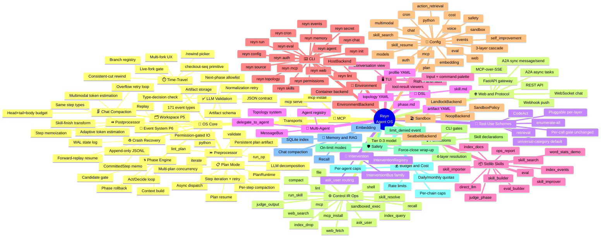

# Reyn Feature Map

Full feature inventory of the Reyn Agent OS, extracted from implementation. Each entry links to its reference or concept documentation.

Per-group **Differentiation vs general agents** callouts position each capability against self-hosted general agents (OpenClaw / Hermes) — Skill is one feature among many, not the headline. Maturity marks: entries are production unless tagged **⚗ experimental / MVP** or noted as an **optional dependency**.

## Visual overview

---

## Feature index

### OS Core

#### Phase Engine
| Feature | Description | Documentation |
|---------|-------------|---------------|
| Act/Decide loop | LLM↔op volleys until the LLM emits a transition/finish/abort decision | [LLM Output Contract](reference/runtime/llm-output-contract.md) · [Principles P3/P4](concepts/architecture/principles.md) |
| Context build | Constructs LLM input from phase instructions, current artifact, candidates, and available ops | [Context Frame](reference/runtime/context-frame.md) |
| Candidate gate | LLM picks next phase only from OS-provided candidates (P4) | [LLM as Decision Engine](concepts/architecture/llm-as-decision-engine.md) |
| Phase rollback | Revert to predecessor phase when downstream output is rejected | [Principles P1/P2](concepts/architecture/principles.md) |

#### LLM Validation
| Feature | Description | Documentation |
|---------|-------------|---------------|
| JSON contract | Enforce `control` / `artifact` / `control_ir` envelope structure | [LLM Output Contract](reference/runtime/llm-output-contract.md) |
| Type-decision consistency | `finish` type requires `decision=finish`, `next_phase=null`, etc. | [LLM Output Contract](reference/runtime/llm-output-contract.md) |
| Next-phase allowlist | Transition target must appear in the skill graph candidates | [LLM Output Contract](reference/runtime/llm-output-contract.md) · [Graph](reference/dsl/graph.md) |
| Artifact schema validation | `data` validated against the target phase's `input_schema` | [Artifact YAML](reference/dsl/artifact-yaml.md) |
| Normalization retry | Minor JSON errors healed before rejecting, up to `llm_max_retries` | [LLM Output Contract](reference/runtime/llm-output-contract.md) |

#### Preprocessor
| Feature | Description | Documentation |
|---------|-------------|---------------|
| `run_op` step | Invoke any Control IR op deterministically before the LLM call | [Preprocessor DSL](reference/dsl/preprocessor.md) |
| `iterate` step | Fan-out `run_op` over array field elements | [Preprocessor DSL](reference/dsl/preprocessor.md) |
| `validate` step | JSON Schema check on artifact data | [Preprocessor DSL](reference/dsl/preprocessor.md) |
| `lint_plan` step | Structural check on plan-shaped artifacts | [Preprocessor DSL](reference/dsl/preprocessor.md) |
| `python` step | User function in sandboxed subprocess (safe/unsafe mode) | [Preprocessor DSL](reference/dsl/preprocessor.md) |

#### Postprocessor
| Feature | Description | Documentation |
|---------|-------------|---------------|
| Skill-finish transform | Convert LLM `final_output` to caller artifact schema | [Postprocessor DSL](reference/dsl/postprocessor.md) · [Concepts: Postprocessor](concepts/skills/postprocessor.md) |
| Same step types | `run_op` / `iterate` / `validate` / `lint_plan` / `python` | [Postprocessor DSL](reference/dsl/postprocessor.md) |
| Step memoization | Skip re-execution on crash resume if step already committed | [Postprocessor DSL](reference/dsl/postprocessor.md) · [Skill Resume](concepts/skills/skill-resume.md) |

#### Workspace (P5)
| Feature | Description | Documentation |
|---------|-------------|---------------|
| Artifact storage | Phase artifacts persisted to `.reyn/artifacts/` | [Concepts: Workspace](concepts/runtime/workspace.md) |
| Permission-gated IO | Paths outside CWD require `file.read` / `file.write` declaration | [Concepts: Workspace](concepts/runtime/workspace.md) · [Permissions](reference/config/permissions.md) |

#### Crash Recovery
| Feature | Description | Documentation |
|---------|-------------|---------------|
| WAL state log | `step_started` / `step_completed` / `step_failed` written to `.reyn/state/wal.jsonl` (`StateLog`); fsync'd per append (synchronous durability for recovery). Truncatable after snapshot. **Not** the audit trail — see Event System (P6). | [Skill Resume](concepts/skills/skill-resume.md) |
| Forward-replay resume | `SkillResumeAnalyzer` reconstructs run state from state log | [Skill Resume](concepts/skills/skill-resume.md) |
| `CommittedStep` memo | Replay recorded op results on resume without re-invoking | [Skill Resume](concepts/skills/skill-resume.md) |
| World-op bypass | Transient ops (web_search, web_fetch) re-execute fresh on resume | [Skill Resume](concepts/skills/skill-resume.md) |

#### Time-Travel / Rewind (Resume)

User-facing point-in-time rewind with branching. Phase 1 and Phase 2 (2a/2b/2c/2d) are production. Concurrent-live-fork (parallel live branches) is owner-rejected out-of-scope. Full design: [ADR-0038](deep-dives/decisions/0038-user-facing-time-travel-rewind.md). Change ledger: #1533.

| Feature | Description | Documentation |
|---------|-------------|---------------|
| `/rewind` picker | Interactive checkpoint timeline (seq / timestamp / kind columns); Esc-Esc double-tap shortcut | [How-to: rewind](guide/for-users/time-travel.md) |
| Per-checkpoint anchor preview | Each picker row shows a rendered scroll-hint anchor (#1547) | [How-to: rewind](guide/for-users/time-travel.md) |
| PITR reconstruct | Point-in-time snapshot + WAL-diff reconstruction to target seq | [Time-Travel concepts](concepts/runtime/time-travel.md) · [Crash Recovery](concepts/skills/skill-resume.md) |
| Consistent-cut rewind | Both substrates (runtime state + workspace shadow-git `as-of-N`) rewound atomically | [Time-Travel concepts](concepts/runtime/time-travel.md) |
| Append-only reset-record | Undo appends a reset-record at seq R; history before R is preserved on the current branch (no destructive rewrite) | [Time-Travel concepts](concepts/runtime/time-travel.md) |
| Retention window + GC | Configurable checkpoint retention window; stale snapshots GC'd automatically | [How-to: rewind](guide/for-users/time-travel.md) |
| Branch registry | Abandoned-interval lineage: each fork receives a registry entry with origin seq | [Time-Travel concepts](concepts/runtime/time-travel.md) |
| `checkout(seq)` unified primitive | Active-branch seq → undo; inactive-branch seq → fork-switch. One primitive for both directions | [Time-Travel concepts](concepts/runtime/time-travel.md) |
| Multi-fork tree UX | Always-tree picker with per-branch anchor labels (#1547 integration) | [How-to: rewind](guide/for-users/time-travel.md) |
| Act-turn runtime-only rewind | Ghost-Replay memo truncate for rewind within an in-flight turn (no substrate round-trip) | [Time-Travel concepts](concepts/runtime/time-travel.md) |
| Container-mode shadow-git | Shadow-git `as-of-N` rewind supported inside the container environment backend | [How-to: rewind](guide/for-users/time-travel.md) |
| Deterministic CI rewind gate | `test_live_rewind_gate.py` — Phase-1 rewind deterministic gate (#1553) | — |
| Deterministic CI live-fork gate | `test_live_fork_gate.py` — Phase-2 fork / checkout deterministic gate (#1564) | — |
| tmux live e2e | P1 undo + P2 fork-switch verified on real terminal (#1533 tui-coder ledger / #1549) | — |
| Phase 2c: fork-then-edit | New branch on edit via `ctrl+t` | [How-to: rewind](guide/for-users/time-travel.md) |
| Phase 2d: web surface | `/rewind` picker over WebSocket / A2A; web edit via `AskUserMessage` UX (original message presented for edit + submit) | [How-to: rewind](guide/for-users/time-travel.md) |

#### Event System (P6)
| Feature | Description | Documentation |
|---------|-------------|---------------|
| 171 event types | Complete taxonomy: workflow / phase / LLM / tool / budget / permission / etc. | [Events reference](reference/runtime/events.md) · [Concepts: Events](concepts/runtime/events.md) |
| Append-only JSONL | `.reyn/events/<run_id>.jsonl` per-run (`EventStore`); audit trail — append-only, rotation-based (not per-append fsync). Separate log and lifecycle from the recovery WAL (`.reyn/state/wal.jsonl`). | [Events reference](reference/runtime/events.md) |
| Replay | `reyn events <path>` streams events for audit and debug | [reyn events CLI](reference/cli/events.md) |

> **Differentiation vs general agents:** the agent loop is an OS-enforced contract — the LLM decides only from OS-provided candidates (P3/P4), every output is schema-validated, every inter-phase value lives in the workspace (P5), and every state change emits an append-only, replayable event (P6). Constrained and auditable by construction, not by developer discipline.

---

### Chat Engine

#### Chat Compaction

| Feature | Description | Documentation |
|---------|-------------|---------------|
| Head+tail+body budget | Keeps the most-recent turns (tail) and earliest context (head) within per-component token budgets; turns between them are replaced by an LLM-generated summary | [Chat Compaction](concepts/data-retrieval/chat-compaction.md) |
| Overflow retry loop | When the compacted context still exceeds the model limit, budgets for head / tail / summary shrink monotonically per iteration until the prompt fits; fails fast with a structured error when no further reduction is possible | [Chat Compaction](concepts/data-retrieval/chat-compaction.md) |
| Adaptive token estimation | Learns a per-model token-count multiplier over time, reducing estimation drift across sessions | [Chat Compaction](concepts/data-retrieval/chat-compaction.md) |
| Multimodal token estimation | Estimates tokens for text and image content; image parts use a fixed per-part cost | [Chat Compaction](concepts/data-retrieval/chat-compaction.md) |
| Compaction lock | Async mutex prevents concurrent turn appends from racing with an in-flight compaction call | [Chat Compaction](concepts/data-retrieval/chat-compaction.md) |

> **Differentiation vs general agents:** instead of naive truncation or an unbounded growing memory, Reyn budgets context as head + tail + LLM summary with a monotonic overflow-shrink retry, adaptive per-model token estimation, and multimodal estimation — predictable context management under a hard model limit.

#### Plan Mode

| Feature | Description | Documentation |
|---------|-------------|---------------|
| LLM plan decomposition | The router LLM decomposes a user goal into an ordered list of named steps with declared dependencies; each step runs in a narrow sub-loop call with a focused prompt and reduced tool catalog | [Plan Mode](concepts/multi-agent/plan-mode.md) |
| Async dispatch | The `plan` tool returns immediately; execution runs as a background task while the user can issue new messages | [Plan Mode](concepts/multi-agent/plan-mode.md) |
| Persistent plan artifact | The decomposed plan is written to the workspace; resume and step replay use the original structure rather than re-decomposing | [Plan Mode](concepts/multi-agent/plan-mode.md) |
| PlanRuntime | Dedicated execution engine for plan-mode, peer to the OS phase runtime | [Plan Mode](concepts/multi-agent/plan-mode.md) |
| Step iteration | Each step runs the router sub-loop up to `step_max_iterations` turns; `retry_limit` caps automatic retries on transient failure with user-approval escalation when the budget is exhausted | [Plan Mode](concepts/multi-agent/plan-mode.md) · [Config: plan block](reference/config/reyn-yaml.md#plan-block) |
| Plan resume | Persisted decomposition and per-step result memos allow a plan to resume after crash; completed steps replay without LLM cost | [Plan Mode](concepts/multi-agent/plan-mode.md) |
| Per-step compaction | Each plan step runs its own context compaction budget, independent of the main session | [Plan Mode](concepts/multi-agent/plan-mode.md) · [Chat Compaction](concepts/data-retrieval/chat-compaction.md) |
| Multi-plan concurrency | Multiple plans can be in flight simultaneously; each has its own `plan_id` with results delivered in completion order | [Plan Mode](concepts/multi-agent/plan-mode.md) |
| Operator slash commands | `/plan list` / `/plan discard` / `/plan resume --from <step>` for plan lifecycle management | [Plan Mode](concepts/multi-agent/plan-mode.md) |

> **Differentiation vs general agents:** plan decomposition is OS-governed — persisted, resumable per-step (completed steps replay without LLM cost), with per-step compaction and multi-plan concurrency — not an ad-hoc in-prompt task loop.

---

### Control IR Ops

All ops are documented in the single reference page: **[Control IR](reference/runtime/control-ir.md)**

The op kinds below mirror `OP_KIND_MODEL_MAP` in `op_runtime/registry.py` (20 kinds — the six `file` sub-ops are grouped into one row).

| Op | Description |
|----|-------------|
| `file` | `read` / `write` / `edit` / `delete` / `glob` / `grep` / `regenerate_index` (six fine-grained registry kinds) |
| `ask_user` | Pause phase, collect user answer, re-run same phase |
| `run_skill` | Invoke sub-skill and return `final_output` artifact |
| `sandboxed_exec` | `argv` under `SandboxPolicy` via platform-selected backend |
| `shell` | Raw shell exec — deprecated; prefer `sandboxed_exec` |
| `web_search` | DuckDuckGo search — Tier 1, default-allow |
| `web_fetch` | URL fetch + text extract — Tier 1, default-allow |
| `mcp` | Call a configured MCP server tool by name |
| `mcp_install` | Install / register an MCP server (registry / package / local source) |
| `lint` | Run DSL linter on a skill directory |
| `index_query` | Vector similarity search over one indexed source |
| `recall` | Macro: embed query → `index_query` per source → merge top-K |
| `index_drop` | Destructive source removal — requires approval |
| `compact` | Summarise / compact context within budget (chat + phase results) |
| `skill_resolve` | Resolve a skill reference to its local / project / stdlib source |
| `judge_output` | LLM scorer with rubric + threshold + `on_fail` policy |

> The `embed` and `index_write` ops were removed in #1303 Stage I — embedding and index-writing now run provider-direct inside `reyn.safe.embed_index` and the `recall` op, not as standalone ops. See [Control IR](reference/runtime/control-ir.md).

---

### Tool-Use Schemes

How tools are presented to the LLM and how its calls are dispatched is a **pluggable scheme**, selectable per layer (`tool_use: {chat, step, phase}` in `reyn.yaml`). The default is `universal-category` — identical to the shipped behaviour — so this is opt-in. All schemes route every tool call through the same OS gate (exclude → permission → dispatch), so the security and validation pipeline is unchanged whichever scheme is active.

| Feature | Description | Documentation |
|---------|-------------|---------------|
| Pluggable scheme protocol | `ToolUseScheme` seam — tool presentation + interpretation + dispatch + feedback behind one interface; schemes are swapped by config, no OS change | [Tool-Use Schemes](concepts/tools-integrations/tool-use-schemes.md) |
| Per-layer selection | Independent scheme per layer — chat / plan-step / OS-phase — via `tool_use` config | [Tool-Use Schemes](concepts/tools-integrations/tool-use-schemes.md) · [`reyn.yaml` § tool_use](reference/config/reyn-yaml.md#tool_use-block) |
| `universal-category` (default) | The universal action catalog — 4 wrappers over every category, qualified-name discover + dispatch | [Tool-Use Schemes](concepts/tools-integrations/tool-use-schemes.md) · [Universal catalog](concepts/tools-integrations/universal-catalog.md) |
| `enumerate-all` | Flat-native-JSON baseline — every usable tool presented flatly, dispatched by name. Best for small tool sets where determinism matters | [Tool-Use Schemes](concepts/tools-integrations/tool-use-schemes.md) |
| `retrieval` | RAG-over-tools — present a search tool, the LLM searches, the OS re-presents matched tools as callable. Best for very large tool sets where full-catalog token cost is prohibitive | [Tool-Use Schemes](concepts/tools-integrations/tool-use-schemes.md) |
| `CodeAct` | Code-as-tools — the LLM writes a Python snippet whose in-code `tool()` calls run in a sandboxed subprocess under the same permission gate as a JSON call. Strongest for weak models | [Tool-Use Schemes](concepts/tools-integrations/tool-use-schemes.md) |

> **Differentiation vs general agents:** the tool-use strategy is a swappable scheme — `enumerate-all` / `retrieval` / `CodeAct` / the default catalog — chosen per layer by config, *without* changing the OS. Because every scheme dispatches through the same exclude → permission → `dispatch_tool` gate (P4/P5), swapping the LLM-facing tool surface never weakens the security or validation pipeline. The presentation is data; the gate is constant.

---

### DSL

| Feature | Description | Documentation |
|---------|-------------|---------------|
| `skill.md` frontmatter | `name` / `entry` / `graph` / `final_output` / `permissions` / `postprocessor` / `search_hints` | [Skill frontmatter](reference/dsl/skill-md.md) |
| `phase.md` frontmatter | `input_schema` / `instructions` / `preprocessor` / `allowed_ops` / `model_class` | [Phase frontmatter](reference/dsl/phase-md.md) |
| Artifact YAML | 45 built-in types, JSON Schema Draft 7 | [Artifact YAML](reference/dsl/artifact-yaml.md) |
| Graph semantics | Phase transition adjacency list and `end` terminal | [Graph](reference/dsl/graph.md) |
| Postprocessor block | Deterministic skill-finish transform declared in `skill.md` | [Postprocessor](reference/dsl/postprocessor.md) |
| Preprocessor block | Deterministic phase-entry enrichment declared in `phase.md` | [Preprocessor](reference/dsl/preprocessor.md) |
| Topology YAML | Multi-agent topology definition | [Topology YAML](reference/dsl/topology-yaml.md) |
| Profile YAML | Agent role profile definition | [Profile YAML](reference/dsl/profile-yaml.md) |

---

### Stdlib Skills

| Skill | Description | Documentation |
|-------|-------------|---------------|
| `direct_llm` | Single-shot LLM fallback for catalogue gaps | [Reference](reference/stdlib/direct_llm.md) |
| `eval` | Evaluate a skill against test cases via `judge_phase` as judge | [Reference](reference/stdlib/eval.md) |
| `eval_builder` | Generate an eval spec with test cases and rubric | [Reference](reference/stdlib/eval_builder.md) |
| `index_docs` | Chunk / embed / index pipeline over file globs | [Reference](reference/stdlib/index_docs.md) |
| `index_events` | Index P6 event log with incremental cursor tracking | [Reference](reference/stdlib/index_events.md) |
| `judge_phase` | Score one phase artifact against quality criteria | [Reference](reference/stdlib/judge_phase.md) |
| `ops_report` | Execution summary from indexed events for a period | [Reference](reference/stdlib/ops_report.md) |
| `skill_builder` | Scaffold a new skill from a natural-language description | [Reference](reference/stdlib/skill_builder.md) |
| `skill_importer` | Find and import an external skill with DSL conversion | [Reference](reference/stdlib/skill_importer.md) |
| `skill_improver` | Iterative skill improvement via eval-plan-apply loop | [Reference](reference/stdlib/skill_improver.md) |
| `skill_search` | Search a public skills registry for skills matching a natural-language capability request | [Reference](reference/stdlib/skill_search.md) |
| `word_stats_demo` | Demo of the `python` preprocessor step pattern | [Reference](reference/stdlib/word_stats_demo.md) |

> **Differentiation vs general agents:** skills are *one* feature here, not the headline. Where agents like Hermes auto-generate procedure docs (emergent), Reyn's skills (DSL above + this stdlib set) are explicit, typed, and OS-validated — a reviewable, versioned phase graph the OS checks at each transition. The bet is predictable over emergent.

---

### CLI

| Command | Description | Documentation |
|---------|-------------|---------------|
| `reyn run` | Execute a skill non-interactively | [Reference](reference/cli/run.md) |
| `reyn chat` | Interactive multi-turn chat with a named agent | [Reference](reference/cli/chat.md) |
| `reyn eval` | Golden dataset eval, result reports, version regression compare | [Reference](reference/cli/eval.md) |
| `reyn skills` | List skills, show details, validate op/permission consistency | [Reference](reference/cli/skills.md) |
| `reyn lint` | DSL linter for a skill directory | [Reference](reference/cli/lint.md) |
| `reyn agent` | Create and manage named persistent agents | [Reference](reference/cli/agent.md) |
| `reyn topology` | Create and manage communication topologies | [Reference](reference/cli/topology.md) |
| `reyn memory` | CRUD + search + export/import for agent memories | [Reference](reference/cli/memory.md) |
| `reyn permissions` | Inspect and revoke saved approval entries | [Reference](reference/cli/permissions.md) |
| `reyn events` | Replay event JSONL files or purge old files by date | [Reference](reference/cli/events.md) |
| `reyn mcp` | Serve, search, install, and manage MCP servers | [Reference](reference/cli/mcp.md) |
| `reyn secret` | Set / list / clear secrets in `~/.reyn/secrets.env` | [Reference](reference/cli/secret.md) |
| `reyn source` | List, describe, and remove indexed RAG sources | [Reference](reference/cli/source.md) |
| `reyn embeddings` | `status` / `rebuild` / `clear` for the action embedding index (`search_actions`) | [Reference](reference/cli/embeddings.md) |
| `reyn config` | Show, query, and set effective configuration | [Reference](reference/cli/config.md) |
| `reyn auth` | Manage OAuth credentials — `login` (RFC 8628 device grant against `auth.providers`) / `list` / `revoke` | [reyn.yaml § auth](reference/config/reyn-yaml.md) |
| `reyn cron` | Manage and run cron-scheduled skill jobs — foreground scheduler / list jobs + next-run / status | [reyn.yaml § cron](reference/config/reyn-yaml.md) |
| `reyn web` | Start FastAPI + WebSocket gateway server | [Reference](reference/cli/web.md) |
| `reyn init` | Scaffold `reyn.yaml` and `.reyn/` in current directory | [Reference](reference/cli/init.md) |

---

### Config

Main reference: **[`reyn.yaml`](reference/config/reyn-yaml.md)**

| Block | Description | Documentation |
|-------|-------------|---------------|
| 3-layer cascade | user-global / project / project-local + CLI flags | [reyn-yaml](reference/config/reyn-yaml.md) |
| `${VAR}` interpolation | Env var expansion in all string fields via `secrets.env` | [reyn-yaml § interpolation](reference/config/reyn-yaml.md#var-interpolation) |
| `safety` | Loop caps / timeout caps / on-limit policy | [reyn-yaml § safety](reference/config/reyn-yaml.md#safety-block) |
| `cost` | Per-agent / per-chain / daily / monthly token+USD caps | [Budget config](reference/config/budget.md) |
| `sandbox` | Backend selection (auto/seatbelt/landlock/noop) + `on_unsupported` | [reyn-yaml § sandbox](reference/config/reyn-yaml.md#sandbox-block) |
| `web` | `web.fetch` SSL `verify_ssl` and `ca_bundle` override | [reyn-yaml § web](reference/config/reyn-yaml.md#web-block) |
| `eval` | Trace exporters: file / langfuse / **otlp** (optional dep `opentelemetry-exporter-otlp-proto-http`) / ietf_audit | [reyn-yaml § eval](reference/config/reyn-yaml.md#eval-block) |
| `plan` | `step_max_iterations` / `retry_limit` per plan step | [reyn-yaml § plan](reference/config/reyn-yaml.md#plan-block) |
| `chat` | Compaction trigger / head+tail retention / section token caps | [Chat Compaction](concepts/data-retrieval/chat-compaction.md) |
| `embedding` | Model classes / batch_size / cost_warn_threshold | [RAG concepts](concepts/data-retrieval/rag.md) |
| `voice` | Whisper model / language / device — optional `reyn[voice]` | [Voice concepts](concepts/tools-integrations/voice.md) |
| `events` | Rotation size/age + cleanup_period_days | [Events reference](reference/runtime/events.md) |
| `skill_search` | BM25 threshold / top_k for skill catalogue routing | [Skill frontmatter](reference/dsl/skill-md.md) |
| `models` | Class → LiteLLM model string with `extends` chain | [reyn-yaml § models](reference/config/reyn-yaml.md#models-block) |
| `permissions` | Project-wide default capability policy | [Permissions config](reference/config/permissions.md) |
| `multi-agent` | Agent and topology defaults | [Multi-agent config](reference/config/multi-agent.md) |
| `state_dir` | Runtime state directory (default `.reyn/`) | [State dir](reference/config/state-dir.md) |
| `auth` | OAuth provider definitions for `reyn auth login` (RFC 8628 device grant) | [reyn-yaml](reference/config/reyn-yaml.md) |
| `mcp` | Configured external MCP server connections (transport + env) | [Concepts: MCP](concepts/tools-integrations/mcp.md) |
| `multimodal` | Media handling caps (`max_bytes`, per-part token cost) | [reyn-yaml](reference/config/reyn-yaml.md) |
| `python` | `python`-step execution policy (safe / unsafe subprocess) | [Preprocessor](reference/dsl/preprocessor.md) |
| `cron` | Cron-scheduled skill job definitions | [reyn-yaml](reference/config/reyn-yaml.md) |
| `self_improvement` | Skill self-improvement (eval-plan-apply) settings | [reyn-yaml](reference/config/reyn-yaml.md) |
| `skill_resume` | Crash-resume behaviour for skill runs | [Skill Resume](concepts/skills/skill-resume.md) |
| `action_retrieval` | Action-catalog `search_actions` retrieval tuning | [Universal catalog](concepts/tools-integrations/universal-catalog.md) |

---

### Permissions

| Feature | Description | Documentation |
|---------|-------------|---------------|
| Tier 0 — always allowed | `run_skill` / `ask_user` / `lint` — no gate | [Permission model](concepts/runtime/permission-model.md) |
| Tier 1 — default-allow | `web_search` / `web_fetch` — deny-only gate | [Permission model](concepts/runtime/permission-model.md) · [Permissions config](reference/config/permissions.md) |
| Tier 2/3 — declaration + 4-layer approval | `shell` / `mcp` / `file` (out-of-zone) / `python` | [Permission model](concepts/runtime/permission-model.md) |
| Layer 1: config pre-approval | `reyn.yaml` hard `allow` / `deny` | [Permissions config](reference/config/permissions.md) |
| Layer 2: saved approvals | `.reyn/approvals.yaml` — persisted per path/server | [reyn permissions CLI](reference/cli/permissions.md) |
| Layer 3: session approvals | In-memory for current invocation only | [Permission model](concepts/runtime/permission-model.md) |
| Layer 4: interactive prompt | Ask user with persist choices (yes / always / just-this-path) | [Permission model](concepts/runtime/permission-model.md) |
| Skill-level declarations | `shell` / `file.read+write` / `http.get` / `secret.write` / `mcp` / `python` / `tool` | [Skill frontmatter](reference/dsl/skill-md.md) |
| CLI gates | `--allow-shell` / `--allow-unsafe-python` required at invocation | [Common flags](reference/cli/common-flags.md) |

> **Differentiation vs general agents:** autonomous agents typically execute tools with minimal gating. Reyn requires per-capability declaration + 4-layer just-in-time approval (config → saved → session → interactive), a `.reyn/` write zone, and per-skill credential scoping (Confused Deputy mitigation).

---

### Safety / limit-handling

Bounded-operation checkpoints that stop the agent gracefully rather than hard-failing. See [Safety framework](concepts/runtime/safety.md).

| Feature | Description | Documentation |
|---------|-------------|---------------|
| On-limit modes | `interactive` (ask) / `auto_extend` (budgeted) / `unattended` (abort) via `safety.on_limit.mode` | [Safety framework](concepts/runtime/safety.md) |
| Force-close wrap-up (#1496) | On a denied limit the LLM gets one final tool-less turn to summarise what was accomplished; delivered as a `kind="agent"` message with `meta.limit_stopped` | [Safety framework](concepts/runtime/safety.md) |
| `limit_denied` event | P6 audit event on every deny path (`max_iterations` / `router_cap`) | [Events reference](reference/runtime/events.md) |
| Decision-enabling fallback | When the wrap-up fails or is empty, a structured error states the limit hit, the config key to change, and partial-data availability | [Safety framework](concepts/runtime/safety.md) |

> **Differentiation vs general agents:** where free-running agents hard-stop or run away at a limit, Reyn's force-close turns a denied limit into a graceful LLM wrap-up plus an operator decision — it reports what it accomplished instead of vanishing or looping unbounded.

---

### Budget & Cost

| Feature | Description | Documentation |
|---------|-------------|---------------|
| Per-agent caps | Token + USD hard limits with `warn_ratio` | [Budget config](reference/config/budget.md) |
| Per-chain caps | Skill spawn count + token total per chain | [Budget config](reference/config/budget.md) |
| Rate limits | Per-model calls-per-minute sliding window | [Budget config](reference/config/budget.md) |
| Daily quotas | Persistent JSONL ledger, resets at local midnight | [Budget config](reference/config/budget.md) |
| Monthly quotas | Persistent JSONL ledger, resets at month boundary | [Budget config](reference/config/budget.md) |
| `ask_on_exceed` | User-approval extension flow on hard cap hit | [Budget config](reference/config/budget.md) |

> **Differentiation vs general agents:** token + USD caps per agent / chain / model with refuse-on-exceed and an `ask_on_exceed` extension flow — runaway spend is structurally bounded, not merely observed after the fact.

---

### Memory & RAG

| Feature | Description | Documentation |
|---------|-------------|---------------|
| LiteLLM embedding backend | Any provider via named model class config | [RAG concepts](concepts/data-retrieval/rag.md) |
| Local embedding backend | sentence-transformers via `pip install 'reyn[local-embed]'` — `local-mini` / `local-e5` classes, credential-free, GPU-optional via `REYN_EMBED_DEVICE` | [RAG concepts § Local embedding backend](concepts/data-retrieval/rag.md#local-embedding-backend-fp-0043) · [Guide](guide/for-users/enable-semantic-search.md) |
| Provider-prefix routing | `sentence-transformers/` → local backend; anything else → LiteLLM | [RAG concepts § Embedding configuration](concepts/data-retrieval/rag.md#embedding-configuration) |
| Batch embed | Configurable `batch_size` with concurrency semaphore | [RAG concepts](concepts/data-retrieval/rag.md) |
| Dimension table | Static lookup for OpenAI / Voyage / Cohere | [RAG concepts](concepts/data-retrieval/rag.md) |
| SQLite index per source | `.reyn/index/<source>/index.db` with WAL mode | [RAG concepts](concepts/data-retrieval/rag.md) |
| Chunk dedup | `content_hash` upsert prevents re-indexing | [RAG concepts](concepts/data-retrieval/rag.md) |
| `recall` op | embed → `index_query` per source → merge top-K globally | [Control IR](reference/runtime/control-ir.md) |
| Action embedding index | `ActionEmbeddingIndex` (SQLite-WAL, class-swap detection, cross-process build lock) — backs the `search_actions` tool the chat LLM uses | [Universal catalog § search_actions](concepts/tools-integrations/universal-catalog.md#what-stays-out-of-phase-1) · [`reyn embeddings`](reference/cli/embeddings.md) |
| Memory CRUD | `list` / `read` / `remember_shared` / `remember_agent` / `forget` | [Memory concepts](concepts/data-retrieval/memory.md) · [reyn memory CLI](reference/cli/memory.md) |

> **Differentiation vs general agents:** beyond chat memory, Reyn ships a RAG *framework* — you declare an indexing strategy as a `skill.md` (LLM-picked chunking + a deterministic embed/write chain) over a pluggable `IndexBackend`, with a credential-free local-embedding option. A foundation to build on, not a fixed memory feature.

---

### MCP

| Feature | Description | Documentation |
|---------|-------------|---------------|
| stdio transport | Subprocess `StdioServerParameters` — implemented | [Concepts: MCP](concepts/tools-integrations/mcp.md) |
| HTTP transport | Streamable HTTP with request headers — implemented | [Concepts: MCP](concepts/tools-integrations/mcp.md) |
| SSE transport | Reserved — raises `NotImplementedError` | [Concepts: MCP](concepts/tools-integrations/mcp.md) |
| `mcp serve` | Expose Reyn agents as an MCP server over stdio JSON-RPC 2.0 | [reyn mcp CLI](reference/cli/mcp.md) |
| `mcp install` | Fetch from registry, gate permissions, write config, store secrets. Three chat verbs: `mcp__install_registry` (official registry), `mcp__install_package` (npm/pypi/docker/github URL), `mcp__install_local` (direct command). CLI: `reyn mcp install <SERVER_ID>` or `--source <SPEC>`. | [Concepts: MCP](concepts/tools-integrations/mcp.md) · [reyn mcp CLI](reference/cli/mcp.md) |
| Secret management | Per-server env vars in `~/.reyn/secrets.env` | [reyn secret CLI](reference/cli/secret.md) |
| Tool dispatch | Lazy-load and cache `MCPClient` per server connection | [Concepts: MCP](concepts/tools-integrations/mcp.md) |

> **Differentiation vs general agents:** Reyn is both an MCP client (consumes external servers) and an MCP server (exposes its own agents) — standard-protocol interop in both directions, with stdio MCP servers subprocess-sandboxed under Seatbelt (#1344).

---

### Web & Protocol

| Feature | Description | Documentation |
|---------|-------------|---------------|
| FastAPI gateway | REST + WebSocket server on `localhost:8080` | [reyn web CLI](reference/cli/web.md) |
| WebSocket chat | `/ws/chat` for interactive browser sessions | [reyn web CLI](reference/cli/web.md) |
| A2A Agent Card | Per-agent `/.well-known/agent-card.json` capability declaration | [reyn web CLI](reference/cli/web.md) |
| A2A `message/send` | Synchronous JSON-RPC 2.0 single-turn endpoint per agent | [reyn web CLI](reference/cli/web.md) |
| A2A agent discovery | `GET /a2a/agents` server-level listing | [reyn web CLI](reference/cli/web.md) |
| A2A async tasks | `async_mode` → `Task` envelope; `GET /a2a/tasks/{run_id}` poll, `…/events` SSE stream, `…/cancel`; mid-run `ask_user` surfaces as `input-required` | [A2A concepts](concepts/multi-agent/a2a.md) |
| Webhook push | Status-transition POSTs to `params.webhook_url` for async tasks (`reyn.web.notifications`) | [A2A concepts](concepts/multi-agent/a2a.md) |
| MCP-over-SSE | `/mcp/sse` + `/mcp/messages` for MCP client connections | [reyn web CLI](reference/cli/web.md) · [reyn mcp CLI](reference/cli/mcp.md) |
| REST API | `/api/*` for agents / skills / runs / topologies / budget / permissions | [reyn web CLI](reference/cli/web.md) |

> **Differentiation vs general agents:** competitors specialise in broad, deep connectivity to the messaging apps you already use. Reyn keeps connectivity to standard protocols — MCP (client + server), A2A (sync + async tasks with webhook push), and a REST / WebSocket gateway — rather than per-app integrations.

---

### TUI

The Textual terminal interface for `reyn chat` (`src/reyn/chat/tui/`).

| Feature | Description | Documentation |
|---------|-------------|---------------|
| Conversation view | Streaming conversation with inline thinking rows and tool-call rendering | — |
| Right Panel tabs | Live side panels: Agents / Cost / Docs / Events / Keys / Memory / Pending | — |
| Tool-result viewers | Content-type-aware result cards — text / image / web-page summary (#1154) | — |
| Input + command palette | Input bar with slash commands (`/plan`, `/compact`, `/find`, `/help`, `/clear`) via a command palette | — |
| Intervention widget | In-TUI `ask_user` prompt rendering | — |
| Chainlit web chat (⚗ PoC) | Alternative browser chat UI sharing the same agent — `reyn chainlit` + `chainlit_app/` (agent picker, settings, uploads, slash routing); coexists with the TUI | — |

> **Differentiation vs general agents:** Reyn's chat surface is a local, inspectable TUI with live audit panels (events / cost / permissions) beside the conversation — the operator sees what the agent is doing and spending in real time.

---

### Intervention

Cross-surface `ask_user` and permission routing — the same prompt reaches the operator over whichever surface is active (`chat/services/intervention_registry.py`).

| Feature | Description | Documentation |
|---------|-------------|---------------|
| InterventionBus family | `ChatInterventionBus` (TUI) / `StdinInterventionBus` (CLI) / `A2AInterventionBus` (web) / `_MCPInterventionBus` (MCP) | [Permission model](concepts/runtime/permission-model.md) |
| InterventionRegistry | Tracks pending interventions and pairs each answer back to the waiting run | — |
| `ask_user` lifecycle | Pause run → surface prompt → resume on answer; async wait works across surfaces | [Control IR — ask_user](reference/runtime/control-ir.md) |

> **Differentiation vs general agents:** human-in-the-loop is a first-class, surface-agnostic primitive — a permission ask or `ask_user` routes to the operator identically whether the agent runs in the TUI, CLI, web / A2A, or MCP.

---

### Multi-Agent

| Feature | Description | Documentation |
|---------|-------------|---------------|
| Agent registry | Named agents with role profiles + `history.jsonl` | [reyn agent CLI](reference/cli/agent.md) |
| `network` topology | Full mesh — any member to any member | [Topology YAML](reference/dsl/topology-yaml.md) · [reyn topology CLI](reference/cli/topology.md) |
| `team` topology | Star around leader — member-to-member forbidden | [Topology YAML](reference/dsl/topology-yaml.md) |
| `pipeline` topology | Ordered — each member sends only to next | [Topology YAML](reference/dsl/topology-yaml.md) |
| `_default` topology | Auto-synthesized full mesh for unassigned agents | [Multi-agent config](reference/config/multi-agent.md) |
| MessageBus | Quiescence-based coordination with `reply_to` correlation | [Multi-agent config](reference/config/multi-agent.md) |
| `delegate_to_agent` | Async-dispatch to peer with topology permission gate | [Concepts: principles P4](concepts/architecture/principles.md) |
| Agent hops cap | Max delegation depth via `safety.loop.max_agent_hops` | [reyn-yaml § safety](reference/config/reyn-yaml.md#safety-block) |
| `chain_id` propagation | Trace multi-hop chains in P6 events | [Events reference](reference/runtime/events.md) |

> **Differentiation vs general agents:** delegation is topology-gated (network / team / pipeline) with a hop-depth cap and `chain_id` audit propagation — multi-agent reach is bounded and traceable, not free-form.

---

### Sandbox

| Feature | Description | Documentation |
|---------|-------------|---------------|
| `SeatbeltBackend` | macOS `sandbox-exec` SBPL profile generation | [Concepts: Sandbox](concepts/runtime/sandbox.md) |
| `LandlockBackend` | Linux 5.13+ Landlock LSM + seccomp-BPF stacking | [Concepts: Sandbox](concepts/runtime/sandbox.md) |
| `NoopBackend` | Fallback audit-only with one-time WARN log | [Concepts: Sandbox](concepts/runtime/sandbox.md) |
| `SandboxPolicy` | `network` / `read_paths` / `write_paths` / `subprocess` / `env_passthrough` / `timeout` | [Control IR — sandboxed_exec](reference/runtime/control-ir.md) |
| Auto-selection | Platform detection + `on_unsupported: warn\|error\|ignore` | [reyn-yaml § sandbox](reference/config/reyn-yaml.md#sandbox-block) · [Concepts: Sandbox](concepts/runtime/sandbox.md) |

> **Differentiation vs general agents:** tool / code execution runs under an OS-level sandbox (Seatbelt / Landlock + seccomp-BPF) with an explicit `SandboxPolicy`, rather than unsandboxed tool calls. Stdio MCP servers are also subprocess-wrapped under Seatbelt (#1344).

---

### Environment — ⚗ Stage 2 (experimental MVP)

Repo-filesystem mechanism abstraction (FP-0008 #1115) decoupling the workspace from where the repo FS lives. The host backend is production; the container backend is an exec-per-op MVP. See `src/reyn/environment/`.

| Feature | Description | Documentation |
|---------|-------------|---------------|
| `EnvironmentBackend` protocol | Abstracts repo-FS read / write / exec away from the OS + permission layer | — |
| `HostBackend` | Default — identity over the local filesystem (production) | — |
| `DockerEnvironmentBackend` | ⚗ Stage 2 MVP — repo FS + exec inside a Docker container (`--container` attach); exec-per-op | — |
| Mount-mode launcher | ⚗ container launch with the repo mounted (#1324) + `devcontainer.json` awareness / build-on-demand (#1341) | — |

> **Differentiation vs general agents:** Reyn adopts the container-exec pattern those agents popularised (e.g. Hermes docker-exec), but keeps the OS + permission + audit layer on the host while only the repo FS lives in the container — sandboxed execution without surrendering governance. (⚗ Stage 2 / experimental.)
