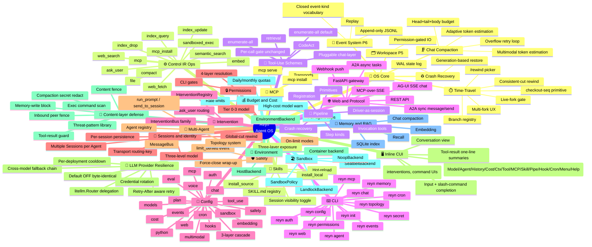

# Reyn Feature Map

Full feature inventory of the Reyn Agent OS, extracted from implementation. Each entry links to its reference or concept documentation.

Per-group **Differentiation vs general agents** callouts position each capability against self-hosted general agents (OpenClaw / Hermes) — Skill is one feature among many, not the headline. Maturity marks: entries are production unless tagged **⚗ experimental / MVP** or noted as an **optional dependency**.

## Visual overview

```mermaid
mindmap
  root((Reyn<br/>Agent OS))
    🧩 OS Core
      🗂️ Workspace P5
        Permission-gated IO
      ♻️ Crash Recovery
        WAL state log
        Generation-based restore
      ⏱️ Time-Travel
        /rewind picker
        Consistent-cut rewind
        Branch registry
        checkout-seq primitive
        Multi-fork UX
        Live-fork gate
      📜 Event System P6
        Closed event-kind vocabulary
        Append-only JSONL
        Replay
      🗜️ Chat Compaction
        Head+tail+body budget
        Overflow retry loop
        Adaptive token estimation
        Multimodal token estimation
    ⚙️ Control IR Ops
      file
      ask_user
      sandboxed_exec
      web_search
      web_fetch
      mcp
      mcp_install
      embed
      index_query
      semantic_search
      index_drop
      index_update
      compact
    🔧 Tool-Use Schemes
      Pluggable chat-layer
      enumerate-all default
      enumerate-all
      retrieval
      CodeAct
      Per-call gate unchanged
    ⌨️ CLI
      reyn chat
      reyn agent
      reyn topology
      reyn memory
      reyn permissions
      reyn events
      reyn mcp
      reyn secret
      reyn config
      reyn auth
      reyn cron
      reyn web
      reyn init
    🔧 Config
      3-layer cascade
      safety
      cost
      sandbox
      web
      eval
      plan
      chat
      embedding
      voice
      events
      models
      auth
      mcp
      multimodal
      python
      cron
      tool_use
      hooks
    🔒 Permissions
      Tier 0-3 model
      4-layer resolution
      CLI gates
    🛡️ Safety
      Force-close wrap-up
      limit_denied event
      On-limit modes
    🔄 LLM Provider Resilience
      litellm.Router delegation
      Cross-model fallback chain
      Retry-After aware retry
      Per-deployment cooldown
      Default OFF byte-identical
      Credential rotation
    🧪 Content-layer defense
      Threat-pattern library
      Content fence
      Tool-result guard
      Memory-write block
      Exec command scan
      Inbound peer fence
      Compaction secret redact
    💰 Budget and Cost
      Per-agent caps
      Rate limits
      Daily/monthly quotas
      High-cost model warn
    🧠 Memory and RAG
      Embedding
      SQLite index
      Recall
      Chat compaction
    🔌 MCP
      Transports
      mcp serve
      mcp install
    📘 Skills
      SKILL.md registry
      Three-layer exposure
      Hot-reload
      Session visibility toggle
      install_local
      install_source
    🔗 Pipeline
      Step kinds
      Primitives
      Invocation tools
      Driver-as-session
      Crash recovery
      Registration
    🌐 Web and Protocol
      FastAPI gateway
      AG-UI SSE chat
      A2A sync message/send
      A2A async tasks
      Webhook push
      MCP-over-SSE
      REST API
    🙋 Intervention
      ask_user routing
      InterventionBus family
      InterventionRegistry
    🧬 Sessions and identity
      Three-level model
      Multiple Sessions per Agent
      Per-session persistence
      Global-cut rewind
      Transport routing-key
    🤝 Multi-Agent
      Agent registry
      Topology system
      MessageBus
      run_prompt / send_to_session
    🖥️ Inline CUI
      Conversation view
      Bottom-chrome drawer (Model/Agent/History/Cost/Ctx/Tool/MCP/Skill/Pipe/Hook/Cron/Menu/Help)
      Tool-result one-line summaries
      Above-input region (interventions, command UIs)
      Input + slash-command completion
    🐳 Environment
      EnvironmentBackend
      HostBackend
      Container backend
    🏖️ Sandbox
      SeatbeltBackend
      LandlockBackend
      NoopBackend
      SandboxPolicy
```

---

## Feature index

### OS Core

#### Workspace (P5)
| Feature | Description | Documentation |
|---------|-------------|---------------|
| Permission-gated IO | `permissions.file.read` / `file.write` **is** the readable / writable path set — one source read by both the runtime gate and the tool advertisement (#3458); unset = the schema default (`<zone-root>` / `<zone-root>/.reyn`), `deny` = empty, a list = that set. Outside it: JIT ask or deny | [Concepts: Workspace](concepts/runtime/workspace.md) · [Permissions](reference/config/permissions.md) |

#### Crash Recovery
| Feature | Description | Documentation |
|---------|-------------|---------------|
| `.reyn/` layout + recovery-core classification | Which `.reyn/` subtrees are recovery-core (`state/` + `config/`) vs persist / audit / cache / outside; the recovery-core write-gate (mutate config via dedicated ops, never raw `file.write`) | [.reyn/ directory layout](reference/runtime/reyn-dir-layout.md) |
| Config recovery (config-as-snapshot) | Config registries (`.reyn/config/`: mcp/cron/hooks/index) reconstruct from truncation-surviving config **generations** (full-state snapshots written by the durability worker, seq-keyed) — replacing the former `config_changed`-WAL-event replay, which a WAL truncation below the floor could silently drop (#2259 PR-1). The `.yaml` IS the durable snapshot, not a derived projection | [.reyn/ directory layout](reference/runtime/reyn-dir-layout.md) |
| WAL state log | `step_started` / `step_completed` / `step_failed` written to `.reyn/state/wal.jsonl` (`StateLog`); fsync'd off the event loop via the shared `DurabilityWorker`. #2259: durable-RECORD writes (snapshots / config / identity) are async fire-and-forget — the task loop never blocks on durability; `step_started` BLOCKS by design (durable-before-side-effect, so a crash-mid-op is detected as ambiguous for non-idempotent ops — #2275). Truncatable after snapshot. **Not** the audit trail — see Event System (P6). | Skill Resume |
| Async-decoupled durability (recover-to-last-durable) | In-memory state mutates immediately on the task loop; the seq-keyed durable record is submitted fire-and-forget to the serial `DurabilityWorker` (the seq is assigned IN the worker). Recovery restores to the last durable record — a consistent prefix; the un-durable tail at crash is lost (relaxed durability). A persistent (§4-exhausted) durable-write failure latches `durability_failed` → the session fail-stops (`DurabilityHaltError` on new ops + run-loop halt) so in-memory cannot race a dead disk (#2259). #2280: the fail-stop also emits a `session_halted` audit-event so an IDLE operator learns the halt proactively — the Textual TUI's always-visible status line and the plain `--cui` renderers' bottom toolbar both show a HALTED banner with the reason, not only the next-op's raised error | [.reyn/ directory layout](reference/runtime/reyn-dir-layout.md), [Session construction](reference/runtime/session-construction.md) |
| Generation-based restore | Config / identity / pipeline state each reconstruct from the latest complete, seq-keyed **generation** on the active WAL branch — no forward-replay. Runtime/agent-state snapshots are the one exception: a generation there is a base, not a complete state, and reconstruction forward-replays WAL entries in `(gen.applied_seq, target]` on top of it. Replaces the phase-graph engine's forward-replay resume, removed with that engine (#2434/#2439) | [.reyn/ directory layout](reference/runtime/reyn-dir-layout.md) |

#### Process identification

| Feature | Description | Documentation |
|---------|-------------|---------------|
| `reyn:<subcommand>` process title | Every `reyn` CLI invocation retitles its own process (`setproctitle`, a CORE dependency, not an optional extra) to `reyn:<subcommand>` — e.g. `reyn:chat` — after argument parsing, so `ps` / Activity Monitor / `top` can identify a reyn process on a machine that's already misbehaving (#3870, motivated by an unidentifiable ~29 GB `python3.12` process forcing two reboots on 2026-08-09). Only the subcommand goes in the title — workspace paths, session ids, and prompts are all things reyn knows at that point and deliberately excluded, since a process title is world-readable through `ps`. A no-op if `setproctitle` is missing (never blocks startup) | `src/reyn/runtime/proctitle.py` |
| CodeAct child self-naming (`reyn:codeact`) | The CodeAct child harness (`python -m reyn.core.kernel._codeact_harness`) independently calls the same module to title itself `reyn:codeact`, since it's a genuinely reyn-authored Python entry point reyn controls — unlike `sandboxed_exec`'s arbitrary third-party argv (`git`/`pytest`/whatever the LLM invokes) or MCP server binaries, whose code reyn does not own and so cannot retitle from the inside (#3869/#3981) | `src/reyn/core/kernel/_codeact_harness.py` |

#### Time-Travel / Rewind (Resume)

User-facing point-in-time rewind with branching. Phase 1 and Phase 2 (2a/2c/2d) are production; 2b's substrate reads (`list_branches`, `list_rewind_points(include_abandoned=True)`) exist but its own tree-layout consumer (`branch_tree.py::build_branch_tree_rows`) has zero production caller — see the two rows below. Concurrent-live-fork (parallel live branches) is owner-rejected out-of-scope. Full design: [ADR-0038](deep-dives/decisions/0038-user-facing-time-travel-rewind.md) (status line carries the #3987 resolution: retention config-wiring dropped, tree UX still owner-pending).

| Feature | Description | Documentation |
|---------|-------------|---------------|
| `/rewind` picker | Interactive current-branch checkpoint picker (seq / timestamp / kind columns) in the Textual TUI; a plain text list over `--connect`. Selecting a row runs the same `/rewind <seq>` checkout a typed one does | [How-to: rewind](guide/for-users/time-travel.md) |
| Per-checkpoint anchor preview | Each picker row shows a rendered scroll-hint anchor | [How-to: rewind](guide/for-users/time-travel.md) |
| PITR reconstruct | Point-in-time snapshot + WAL-diff reconstruction to target seq | [Time-Travel concepts](concepts/runtime/time-travel.md) · Crash Recovery |
| Consistent-cut rewind | Both substrates (runtime state + workspace shadow-git `as-of-N`) rewound atomically | [Time-Travel concepts](concepts/runtime/time-travel.md) |
| Append-only reset-record | Undo appends a reset-record at seq R; history before R is preserved on the current branch (no destructive rewrite) | [Time-Travel concepts](concepts/runtime/time-travel.md) |
| Retention floor clamp (mechanism only — **config-wiring dropped by decision**) | `RetentionPolicy`/`compute_retention_floor` (ADR-0038 D5) correctly clamp the WAL floor given a non-default policy — `AgentRegistry` is always built with `retention_policy=None` (live/no-deeper-retention) since no `reyn.yaml` schema recognizes a `retention:` key. #3987 (2026-08-11) measured that the WAL/generation GC runs correctly at the default live floor regardless (throttled, every chat-turn boundary — no unbounded-growth risk) and decided NOT to wire config for a deeper window nobody had asked for; `RetentionPolicy.from_config` (the would-be config entry point) was removed. Every remaining non-default `RetentionPolicy(...)` construction in the repo is in `tests/` | [How-to: rewind](guide/for-users/time-travel.md) |
| Branch registry | Abandoned-interval lineage: each fork receives a registry entry with origin seq | [Time-Travel concepts](concepts/runtime/time-travel.md) |
| `checkout(seq)` unified primitive | Active-branch seq → undo; inactive-branch seq → fork-switch. One primitive for both directions | [Time-Travel concepts](concepts/runtime/time-travel.md) |
| Multi-fork tree UX (**substrate only — not wired into the picker**) | The 2a substrate (`list_branches`, `list_rewind_points(include_abandoned=True)`) is real and covers the fork-switch/checkout path; the 2b tree-layout function (`branch_tree.py::build_branch_tree_rows`) has a unit test (`tests/interfaces/test_branch_tree_2b.py`) as its only caller anywhere in the repo — `rewind_picker.py` (the actual `/rewind` widget) has no "branch"/"abandoned" logic at all and lists current-branch checkpoints only, matching `time-travel.md`'s own "not yet wired" pending-features entry | [How-to: rewind](guide/for-users/time-travel.md) |
| Container-mode shadow-git | Shadow-git `as-of-N` rewind supported inside the container environment backend | [How-to: rewind](guide/for-users/time-travel.md) |
| Deterministic CI rewind gate | `test_live_rewind_gate.py` — Phase-1 rewind deterministic gate | — |
| Deterministic CI live-fork gate | `test_live_fork_gate.py` — Phase-2 fork / checkout deterministic gate | — |
| tmux live e2e | P1 undo + P2 fork-switch verified on real terminal | — |
| Phase 2c: fork-then-edit | New branch on edit via `ctrl+t` | [How-to: rewind](guide/for-users/time-travel.md) |
| Phase 2d: web surface | `/rewind` picker over AG-UI SSE / A2A; web edit via `AskUserMessage` UX (original message presented for edit + submit) | [How-to: rewind](guide/for-users/time-travel.md) |
| Agent archive-delete (`reyn agent rm`) | Archive by default (soft-delete): data preserved — PITR generations + topology membership kept (agent dormant, not destroyed). `--purge` permanently hard-deletes (topology cascade fires immediately; no rewind possible). WAL-window GC auto-purges archived agents once archival seq leaves the retention window. | [CLI: reyn agent](reference/cli/agent.md) |

#### Event System (P6)
| Feature | Description | Documentation |
|---------|-------------|---------------|
| Closed event-kind vocabulary | Complete taxonomy: workflow / phase / LLM / tool / budget / permission / etc. — the count itself lives in exactly one place, `events.md`'s own CI-checked catalog (`AUDIT_EVENT_KINDS`), not restated here as a number that would drift every time a kind is added | [Events reference](reference/runtime/events.md) · [Concepts: Events](concepts/runtime/events.md) |
| Append-only JSONL | `.reyn/events/<run_id>.jsonl` per-run (`EventStore`); audit trail — append-only, rotation-based (not per-append fsync). Separate log and lifecycle from the recovery WAL (`.reyn/state/wal.jsonl`). | [Events reference](reference/runtime/events.md) |
| Replay | `reyn events <path>` streams events for audit and debug | [reyn events CLI](reference/cli/events.md) |

> **Differentiation vs general agents:** the agent loop is an OS-enforced contract — every side effect the LLM emits is a schema-validated, typed Control IR op (never a free-form string), every op routes through the same exclude → permission → dispatch gate regardless of which tool-use scheme is active, every value the agent produces lives in the workspace (P5), and every state change emits an append-only, replayable event (P6). Constrained and auditable by construction, not by developer discipline.

---

### Chat Engine

#### Chat Compaction

| Feature | Description | Documentation |
|---------|-------------|---------------|
| Head+tail+body budget | Keeps the most-recent turns (tail) and earliest context (head) within per-component token budgets; turns between them are replaced by an LLM-generated summary | [Chat Compaction](concepts/data-retrieval/chat-compaction.md) |
| Overflow retry loop | When the compacted context still exceeds the model limit, head/tail token count shrinks monotonically per iteration; fails fast with a structured error rather than looping forever or silently dropping content — not a guarantee the prompt ultimately fits | [Chat Compaction](concepts/data-retrieval/chat-compaction.md) |
| Adaptive token estimation | Learns a per-model token-count multiplier over time, reducing estimation drift across sessions | [Chat Compaction](concepts/data-retrieval/chat-compaction.md) |
| Multimodal token estimation | Estimates tokens for text and image content; image parts use a fixed per-part cost | [Chat Compaction](concepts/data-retrieval/chat-compaction.md) |
| Compaction lock | Async mutex prevents concurrent turn appends from racing with an in-flight compaction call | [Chat Compaction](concepts/data-retrieval/chat-compaction.md) |

> **Differentiation vs general agents:** instead of naive truncation or an unbounded growing memory, Reyn budgets context as head + tail + LLM summary with a structured-failure overflow-shrink retry (always stops with a defined error instead of looping or silently dropping content), adaptive per-model token estimation, and multimodal estimation — predictable context management under a hard model limit.

#### Router system prompt

| Feature | Description | Documentation |
|---------|-------------|---------------|
| Static / dynamic SP split | The router system prompt separates a stable, cache-prefix-friendly head from per-turn dynamic sections | [LLM invocation surfaces](concepts/architecture/llm-invocation-surfaces.md) |
| Task-completion guidance | Anti-fabrication guidance steering the model to finish and verify rather than claim completion prematurely | [SP-improvements study](deep-dives/research/competitive/sp-improvements-measured-1791.md) |
| Model-family-gated steering | A coarse model-family classifier gates non-Claude operational-steering hygiene — added only when the router model is non-Claude, kept off the Claude path | [SP-improvements study](deep-dives/research/competitive/sp-improvements-measured-1791.md) |
| Memory-quality guidance (gated) | Guidance on what makes a good memory entry, rendered only when memory is in scope | [SP-improvements study](deep-dives/research/competitive/sp-improvements-measured-1791.md) |

> **Differentiation vs general agents:** these SP improvements are adopted by **design-judgment** (sound + low-cost + non-harmful), not gated on a limited-environment A/B — a measured null on one environment cannot prove a universal negative, so structurally-sound guidance is adopted while genuinely measurable wins are verified separately.

#### LLM router resilience

Config-gated `litellm.Router` slot-in for provider-resilience. Default OFF (`llm.router.use: false`) — the direct `litellm.acompletion` path is byte-identical. When enabled the Router owns infra retry, Retry-After handling, cooldown, and cross-model fallback; Reyn does not re-implement any of these.

| Feature | Description | Documentation |
|---------|-------------|---------------|
| litellm.Router delegation | When `llm.router.use: true`, LLM calls route through a `litellm.Router`; Reyn delegates infra-exception retry / Retry-After / cooldown / fallback entirely to the Router | [Config: llm block](reference/config/reyn-yaml.md#llm-block) · [Reliability](concepts/agent-engineering/reliability-engineering.md) |
| Default OFF — byte-identical | `use: false` (default) keeps the direct `litellm.acompletion` path with no routing overhead; the on/off switch is the only code-path change | [Config: llm block](reference/config/reyn-yaml.md#llm-block) |
| Cross-model fallback chain | `llm.router.fallbacks` maps primary deployments to an ordered fallback list; on primary failure the Router tries each fallback model in order | [Config: llm block](reference/config/reyn-yaml.md#llm-block) |
| Retry-After aware retry | `llm.router.num_retries` caps infra retries; the Router natively honours provider `Retry-After` headers (fold of retry-engineering gap) | [Reliability](concepts/agent-engineering/reliability-engineering.md) |
| Per-deployment cooldown | `llm.router.cooldown_time` + `allowed_fails` cools a deployment after repeated failures; subsequent calls route to the fallback chain until recovery | [Config: llm block](reference/config/reyn-yaml.md#llm-block) |
| Accurate cost on fallback | On fallback the actual responding model is recorded from `response.model` so cost attribution reflects which deployment served the call | [Budget config](reference/config/budget.md) |
| Config-fingerprint Router cache | Router is cached per event-loop with a `(model, config-fingerprint)` key; a changed `llm.router.*` rebuilds the Router rather than silently reusing a stale instance | [Config: llm block](reference/config/reyn-yaml.md#llm-block) |

> **Differentiation vs general agents:** provider-resilience is delegated entirely to litellm.Router (Retry-After, jitter, cooldown, cross-model fallback chain, credential rotation) rather than re-implemented — the on/off gate keeps the direct path byte-identical, so replay and cost-recording work unchanged whether or not the Router is active.

#### LLM token streaming

Capability-gated, provider-agnostic token streaming from the LLM call through to the rendered reply (#3288, phases ③a–③d). Streaming is a rendering optimization only — history/persistence and the final reconstructed result are byte-identical to the non-streaming path (stream ≡ whole equivalence).

| Feature | Description | Documentation |
|---------|-------------|---------------|
| Capability-gated streaming loop | `recorded_acompletion` streams only when the resolved provider/model declares streaming capability (a `litellm` inline capability query, never a hardcoded per-provider allow/deny list); usage is chunk-summed and emitted once through the existing single-chokepoint `record_llm`, never per-chunk | [AG-UI transport](reference/runtime/agui-transport.md) |
| `agent_delta` audit-event | Each streamed content-delta chunk rides a `agent_delta` audit-event (correlated by `chain_id` + `round_index`, #3656), never an `OutboxMessage` display kind — the completed reply still persists exactly once via the terminal `kind="agent"` outbox message (L9 whole-persist unchanged) | [AG-UI transport § reyn.event.\<etype\>](reference/runtime/agui-transport.md) |
| AG-UI generic multi-CONTENT | On the AG-UI wire, a streamed reply rides a REAL `TEXT_MESSAGE_START` → N `TEXT_MESSAGE_CONTENT` → `TEXT_MESSAGE_END` sequence (never a re-sent full-text CONTENT at completion, which would double-render on an accumulating generic client); a mid-stream-joining connection is closed by the snapshot/restore path always supplying the authoritative full text, never the deltas | [AG-UI transport § Text lifecycle](reference/runtime/agui-transport.md) |
| Textual TUI streamed-reply coalescing | The Textual TUI's L7 pump coalesces N deltas into ONE `FlowView` entry per LLM ROUND (keyed by `(chain_id, round_index)`, updated in place via `Entry.set_item`), so a turn that calls a tool leaves the text written before the call and the text written after it as separate rows, in that order (#3656); the last round's entry is finalized by the terminal completion frame rather than appended a second time — the plain/repl renderer has no consumer and silently drops `agent_delta` (opt-in draw, no visible-garbage window) | [AG-UI transport § Textual TUI streamed-reply rendering](reference/runtime/agui-transport.md) |
| Visibility-gated streamed-reply updates (#3283 ③) | A streamed reply's live re-render is gated on whether its row is on screen (`FlowView.track_visibility`): off-screen deltas still accumulate in full but issue no `Entry.set_item`, and `on_show` replays the accumulated text in ONE update when the row scrolls back — O(1) model→view updates for a scrolled-away reply instead of O(deltas), with scroll-away-then-back showing the COMPLETE reply. An optimisation only (accumulation is unconditional); distinct from flowview's own off-screen *render* skip, which does not gate the update feed | [AG-UI transport § Textual TUI streamed-reply rendering](reference/runtime/agui-transport.md) |

> **Differentiation vs general agents:** streaming is layered onto the SAME single-chokepoint `recorded_acompletion` call, the SAME `OutboxHub`/audit-event fan-out, and the SAME `FlowView` render model every other frame uses — no parallel streaming-only pipeline, no per-provider hardcoding, and no risk of a streamed reply diverging from its non-streamed reconstruction.

#### Textual TUI: state + timing/token gutters (#3283 ①②④)

Two fixed-width `FlowView` columns per row: the left keeps entry STATE, the
right shows per-entry ELAPSED TIME plus the row's TURN's real prompt/completion
token split. A state chip, the third candidate, stays dropped — it would
duplicate the left gutter. Neither right-gutter figure is ever fabricated: a row
whose turn the runtime holds no figure for renders `—`, never `0`.

| Feature | Description | Documentation |
|---------|-------------|---------------|
| Left gutter — state-coloured glyph (#3273, #3283 ①) | Kind-driven glyph, `EntryState`-driven colour (RUNNING amber / SUCCESS green / ERROR coral / CANCELLED dim); a RUNNING glyph blinks off flowview's native `animation_fps` clock, no app-side timer | [AG-UI transport § Textual TUI gutters](reference/runtime/agui-transport.md#textual-tui-gutters-state-left-elapsed-timeturn-tokens-right-3283-124) |
| Right gutter — addressed-row rail (#3490/#3491/#3493/#3496/#3526) | The ADDRESSED row is marked by a thin `▏` rail in the RIGHT gutter's leading cell — the edge facing the body — spanning the entry's whole post-wrap height, so one entry reads as one marked block. It sat in the LEFT gutter's trailing cell until #3526 moved it on the owner's instruction; both positions cost no body column and both divide the body from a gutter, and what changed is distance from the text, since most lines stop short of the right margin. There is exactly ONE addressed position — the entry cursor (`selectable=` since flowview 0.11.0 unified it with mouse selection, dropping the old keyboard-only `highlight=` name in 0.12.0 / #3624; `highlight=` was flowview 0.7.0's name, `cursor=` before it), which is also what `ctrl+n` search moves rather than holding a selection of its own (#3493). A click now moves *and commits* the same cursor (0.11.0+), so #3624 splits the Enter/Space commit path (keyboard) from the click commit path (mouse, does not copy) at the one call site upstream keeps them apart, `action_activate` (#4697 later split Space itself further — see the keyboard-cursor row below) — see [AG-UI transport § Textual TUI keyboard cursor](reference/runtime/agui-transport.md#textual-tui-keyboard-cursor-3476-3624). The state glyph's own colour is unchanged — being addressed is a POSITION, not an outcome. Gutter CONTENT rather than a `flowview--highlight` component style, because flowview applies a component style as a base beneath each segment's own attributes, which a whole-row background (the user/failure ROW TINT) swallows. That class is left UNDECLARED, which flowview 0.6.1 honours by painting nothing (the row overlay uses the partial component style). Under 0.6.0 an undeclared class resolved to a concrete inherited style that flowview painted, rendering the addressed row near-black (#3496 → fixed upstream as textual-flowview#5, letting reyn drop the subclass that suppressed it). The rail shows only while the pane is being addressed (FlowView focused, or the search bar open); the position persists either way | [AG-UI transport § Textual TUI gutters](reference/runtime/agui-transport.md#textual-tui-gutters-state-left-elapsed-timeturn-tokens-right-3283-124) |
| Right gutter — per-entry elapsed time (#3283 ④) | A tool-call row shows its LIVE elapsed while RUNNING or its captured FINAL elapsed once SETTLED, via flowview's additive `right_decorator`/`right_gutter_width`; every other entry (user/agent/intervention, and any RESTORED row) shows nothing — no placeholder, no `"0s"` | [AG-UI transport § Textual TUI gutters](reference/runtime/agui-transport.md#textual-tui-gutters-state-left-elapsed-timeturn-tokens-right-3283-124) |
| Gutter show/hide (#3352) | Either column can be switched off at runtime — `ctrl+g` (left) / `ctrl+t` (right), both listed in the Help pane — handing its whole width back to the conversation body (an 80-column body goes 66 → 78 with the right gutter hidden, → 80 with both). The two sides are independent, following flowview's own two-flag granularity. Start state is config-backed (`chat.gutters.left` / `chat.gutters.right`); a keypress is session-scoped and never writes back | [AG-UI transport § Hiding a gutter](reference/runtime/agui-transport.md#hiding-a-gutter-3352) · [reyn.yaml § `chat.gutters` fields](reference/config/reyn-yaml.md#chatgutters-fields) |
| Right gutter — per-turn token split (#3283 ④) | Two DIFFERENT figures on two DIFFERENT anchor rows, split apart in #4691 arc item ④ (owner ruling) after an earlier shared-anchor design left the same visual slot answering two different questions depending on a hidden per-frame fact. The `user` row that OPENS a turn shows that turn's real total prompt/completion split (`↑12k ↓1.8k`), read by `chain_id` through `BudgetTracker`'s bounded per-turn buckets (#3339's source-captured attribution) — one figure per turn, never repeated per row, never differenced out of cumulative counters. Each `agent` reply row shows ONLY its own per-call absolute figure straight from that frame's own meta, with no turn-total fallback. A `user` row naming a turn with no held total (no LLM call, evicted bucket, unknown `chain_id`, a remote client where the buckets aren't on the wire, or a restored conversation with no `chain_id` on the frame) renders `—` or an empty cell rather than a substituted number; a turn that really totalled 0 renders `↑0 ↓0`. The turn's USD cost is returned by the lookup but deliberately not drawn in this column | [AG-UI transport § Textual TUI gutters](reference/runtime/agui-transport.md#textual-tui-gutters-state-left-elapsed-timeturn-tokens-right-3283-124) |

> **Unstarted direction (#3283 ⑤, not yet designed or scoped):** a LIVE dashboard surface outside the conversation pane — `reyn events` live replay, a multi-session monitor, a cost dashboard — built on flowview's `dashboard.py`/`compare.py` example patterns. This would be a Reyn-internal live view over the SAME `reyn events` audit-event log the rest of the OS already emits, not the external, queryable-database/time-series/alerting "observability dashboard" [Care boundary § Concrete examples from the landscape (Observability dashboards)](concepts/architecture/care-boundary.md#concrete-examples-from-the-landscape) deliberately keeps out of scope — that boundary is about NOT shipping BI-style cross-run aggregation infrastructure, not about the TUI never rendering a live in-process view of its own events.

#### Textual TUI: conversation-pane interaction (#3476)

| Feature | Description | Documentation |
|---------|-------------|---------------|
| Empty-state welcome hint (#3476 ②) | A fresh session with no history draws a hint (`reyn` / `Type a message to start` / `/ commands · : skills · Help tab for keys`) centered in the viewport instead of a blank composer-topped void. Uses flowview 0.6.0's `empty=`/`empty_align=`, which the library itself clears the instant the first entry lands — the app has no show/hide wiring of its own, so it cannot drift out of sync. Restore hydration was also collapsed to a single `extend` reflow in this same PR | [AG-UI transport § Textual TUI empty state](reference/runtime/agui-transport.md#textual-tui-empty-state-the-fresh-session-hint-3476) |
| Lazy history paging (#3476 ④) | On restore, only the most recent 200 frames are materialised; older prefix pages in one page at a time via `FlowView.ReachedTop` (`reach_threshold=3`, re-arms once you scroll away from the edge) with a single `insert_many(0, …)` per page — flowview holds the scroll position across the reflow, so the row you're reading doesn't move. A paged-in tool frame still carries its restored terminal state (the same transition hydrate uses). Measured cost of hydrating everything instead: small (≈41ms for 40k frames) — this is forward infrastructure by owner decision, not a performance fix | [AG-UI transport § Textual TUI lazy history paging](reference/runtime/agui-transport.md#textual-tui-lazy-history-paging-3476) |
| In-conversation search (#3476 ⑤, #3692 PR-B ③) | `ctrl+n` (moved off `ctrl+f`, which flowview 0.13 claimed for its own `cursor_scroll_page_down`) opens a one-line bar above the composer for case-insensitive incremental substring search over entry text. The cursor moves to the newest match and it is scrolled to center (`scroll_to_entry(align="center")`); `Enter`/`↑` moves to an older match, `Shift+Enter`/`↓` to a newer one, both wrapping; a `n/M` counter shows position; `Esc` closes the bar and returns focus to the composer, KEEPING the cursor on the hit so `Shift+Tab`/`Ctrl+O` resumes navigating from what was found (#3493). Opening the bar fully materialises any lazily-paged-in older history first, so a real match never reads as "not found" | [AG-UI transport § Textual TUI in-conversation search](reference/runtime/agui-transport.md#textual-tui-in-conversation-search-3476-3692-pr-b-3) |
| Keyboard cursor / entry highlight (#3476 ⑥, #3692 PR-B ①) | The conversation pane (reached via `Shift+Tab` or `Ctrl+O`, returned via `Esc`) gets a per-entry highlight (flowview 0.7.0 renamed this from `cursor` to `highlight`, freeing "cursor" for the always-on text cursor below). `Ctrl+O` is a direct focus jump reyn adds because flowview cannot bind a key for "I don't have focus yet" — the ONE boundary point #3692 PR-B added. `↑`/`↓`/`PgUp`/`PgDn`/`Home`/`End` move it (flowview built-in); it auto-arms on the newest entry the moment the pane gains focus (or resumes on the remembered entry, if there is one). `Enter` copies the cursor's entry text straight to the clipboard (any kind, bypassing `/copy`'s ring); `Space` folds/unfolds the highlighted entry's tool detail instead since #4697 (highlight movement no longer auto-expands/folds — #4691 §6), falling through to the same copy as `Enter` only inside the text cursor below; `r` sends a bare `/rewind` over the normal submit seam (not a direct jump to that entry — the conversation log's seq and the WAL seq are different spaces with no correlation between them) | [AG-UI transport § Textual TUI keyboard cursor](reference/runtime/agui-transport.md#textual-tui-keyboard-cursor-3476-3624) |
| Conversation tree — Group nesting (#4691) | Three `FlowView.Entry` levels, one mechanism per level: a `kind="user"` row (opens a turn) is every completion Group of that turn's parent; a `kind="agent"` row that dispatched tools is its own tool rows' parent; tool rows are leaves. Registration is provider-independent (#4777) — gated on reyn's own observed `dispatched_tool_calls`, never a provider's self-reported `finish_reason` string. Opposite defaults by owner ruling: the turn Group defaults OPEN (state SET at promotion, not derived, so it never flickers mid-turn); a completion Group defaults COLLAPSED. `Space` opens/closes any row with children (flowview's own `za`/`zR`/`zM` z-prefix keys reach the same primitive); a collapsed parent shows its child count (`"(2 folded)"`). Parent state is derived from children on every settle (RUNNING wins, else ERROR wins, else SUCCESS); a Group parent's own line recedes (dim) only while expanded, children unchanged | [AG-UI transport § Textual TUI conversation tree](reference/runtime/agui-transport.md#textual-tui-conversation-tree-group-nesting-4691) |
| Text cursor — vim visual mode + yank (#3507, #3692) | `c` (flowview's own key, `toggle_cursor`) shows/hides a per-character text cursor over the rendered content, always live (flowview 0.13 removed the earlier entry-gated version — there is no mode to enter/leave any more), so part of a long reply can be selected and yanked from the keyboard (the entry highlight's finest position is a whole entry). The motions are flowview's own defaults (`hjkl w b e 0 $ ^ gg G v V y zz zt zb Ctrl-E Ctrl-Y Esc`, plus `*`/`n`/`N` to search the selection) and reyn declares NO key binding of its own for any of them, including `c`, so the keymap cannot drift from upstream. `set_current` (flowview 0.13.1) keeps the addressed-row rail still while the text cursor moves | [AG-UI transport § Textual TUI text cursor](reference/runtime/agui-transport.md#textual-tui-text-cursor-3507-3692) |

### Textual TUI: session-switch reset + rehydrate (#3310 N1/N2)

| Feature | Description | Documentation |
|---------|-------------|---------------|
| `session_attached` switch barrier | `AgentRegistry.attach`/`attach_session` emit a `session_attached` `EventFrame` (`{agent, session_id}`) put directly on `repl_outbox` with NO `await` between the attach flip and the put — a stream barrier holding BY CONSTRUCTION (before = old session's frames, after = new session's) | [AG-UI transport § The session-switch barrier](reference/runtime/agui-transport.md) |
| Local client reset + rehydrate on switch | `TextualChatApp` treats the barrier as a reconnect: clears every per-session client state (retained `FlowModel`, running-tool tracking, pending-intervention tabs, sent-queue view/widget + item-meta, in-flight streamed-reply tracking) and rehydrates from the NEW session's `history.jsonl` — never from a client-side cache, which is stale-by-construction while a session is detached (the forwarder drops its frames entirely) | [AG-UI transport § The session-switch barrier](reference/runtime/agui-transport.md) |
| Targeted hydrate seam | `ChatReadModel.conversation_history` accepts an optional `(agent, session_id)` — omitted hydrates the currently attached session (pre-N2 behavior unchanged); given, hydrates that specific session (possibly never attached in this client run) via `AgentRegistry.get_session`, no duplicated `history.jsonl` path literal | [AG-UI transport § The session-switch barrier](reference/runtime/agui-transport.md) |

> **Remote parity landed (N3, #3310, closed via #3322, further ported off the sentinel by #4548):** the AG-UI/SSE remote transport re-emits `session_attached` on the wire on a session switch. `RemoteReadModel.conversation_history` still degrades to empty regardless of a targeted session — by design, not a gap: a remote client holds no session, and the past-turn `ChatMessage` log is deliberately never projected onto the wire (the same frame-sufficiency boundary this arc follows throughout).

---

### Control IR Ops

All ops are documented in the single reference page: **[Control IR](reference/runtime/control-ir.md)**

The op kinds below mirror `OP_KIND_MODEL_MAP` in `schemas/models.py`.

| Op | Description |
|----|-------------|
| `file` | `read` / `write` / `edit` / `delete` / `glob` / `grep` / `regenerate_index` (six fine-grained registry kinds) |
| `ask_user` | Pause the run, collect the user's answer via the intervention bus |
| `present` | Route bulk data + a declarative display template to the user surface without the data passing through LLM output tokens (Tier 0, fire-and-continue) |
| `sandboxed_exec` | `argv` under `SandboxPolicy` via platform-selected backend |
| `web_search` | DuckDuckGo search — Tier 1, default-allow |
| `web_fetch` | URL fetch + text extract — Tier 1, default-allow |
| `mcp` | Call a configured MCP server tool by name |
| `mcp_read_resource` | Read one MCP resource by URI (permission-gated, same axis as `mcp`) |
| `mcp_subscribe_resource` / `mcp_unsubscribe_resource` | Subscribe/unsubscribe to server-pushed `resources/updated` for one URI (requires a persistent connection; push lands as an `mcp_resource_updated` hook-event) |
| `mcp_get_prompt` | Fetch one rendered MCP prompt's messages by name (permission-gated, same axis as `mcp`) |
| `mcp_install` | Install / register an MCP server (registry / package / local source) |
| `embed` | Raw embedding primitive: batch texts → vectors (FP-0057 Phase 1). User-facing (compose with an external MCP vector-DB via pipeline) AND the shared logic internal RAG ops call; default-allow; PRE-embed redaction-egress seam | [Control IR § embed](reference/runtime/control-ir.md#embed) |
| `index_query` | Vector similarity search over one indexed source |
| `semantic_search` | Macro (FP-0057 Phase 2a; renamed from `recall` — clean-break, fixes the recall/search_actions/memory naming collision): per-source-model embed query → `index_query` per source → merge top-K. Multi-model correct: each source's model is auto-adopted from its own recorded index (never caller-supplied); cross-model scores are never directly compared | [Control IR § semantic_search](reference/runtime/control-ir.md#semantic_search) |
| `index_drop` | Destructive source removal — requires approval |
| `index_update` | Incremental/delta-reconcile ingestion into a source's index (FP-0057 Phase 2a): add/update/remove/skip against `content_hash`, source-model-bound, cost-warn surfacing; no full-rebuild mode | [Control IR § index_update](reference/runtime/control-ir.md#index_update) |
| `compact` | Summarise / compact conversation history within budget |
| `describe_session` | Read-only session introspection: write scope as DECLARED by the sandbox policy (never resolved), repo/git/venv/toolchain facts, and auth status for reyn's own OAuth-managed providers only (#5012-A) | [Control IR § describe_session](reference/runtime/control-ir.md#describe_session) |

> `index_write` remains removed. FP-0057 Phase 2b: `semantic_search`'s query embed and `index_update`'s ingestion embed BOTH now dispatch through the shared `embed` op (`execute_op(EmbedIROp(...))`, not provider-direct) — the PRE-embed redaction-egress seam applies to both paths symmetrically. The CodeAct-only ingestion entry `reyn.api.safe.embed_index.embed_and_index` was **retired clean-break** (deleted, no shim) in FP-0057 Phase 2b, replaced by the safe-mode `reyn.api.safe.index_update()` wrapper — which **FP-0066 P1c then also retired clean-break** (alongside the CLI `reyn source` command group): the in-core index is OS-internal only now (populated by internal `index_update` op callers, not a user-facing entry point); user RAG is the FP-0063 plugin. See [Control IR](reference/runtime/control-ir.md).

---

### Present layer

Show bulk data to the user **without the data passing through LLM output tokens** — the agent routes a data ref + a declarative display template to the user surface directly. The LLM sees the data's shape (schema + preview) and binds paths; the renderer joins the template against the full data the LLM never ingested. Declarative + non-executable by construction (a vetted component catalog + JSON-Pointer bindings, no code) — safety from the primitive's shape, not layered policy.

| Feature | Description | Documentation |
|---------|-------------|---------------|
| `present` op | Tier 0 (`ask_user`'s sibling), fire-and-continue; `data_ref` XOR `data_inline`, `template` XOR `blueprint`. `data_ref` read authority == `file.read` | [Present reference](reference/runtime/present.md) · [Concepts: Present layer](concepts/runtime/present.md) |
| v1 component catalog | Display-only read-only components: `text` / `markdown` / `code` / `diff` / `keyvalue` / `table` / `list` / `image`; `$bind` JSON-Pointer (RFC 6901) bindings, row-relative for `table`/`list` | [Present reference § catalog](reference/runtime/present.md) |
| Presentation-guard + renderer discipline | Surface-universal guard strips ESC/control sequences at one seam (every leaf, incl. never-ingested data); Rich-markup safety is structural in the renderer (markup-inert sinks, no escaping) | [Concepts: Present layer § guard vs renderer](concepts/runtime/present.md) |
| 4-stage fallback | Registered template → inline blueprint → default viewer (from data shape) → generic (always renders); degrade-never-fail, drops audited in the ack | [Present reference § fallback](reference/runtime/present.md) |
| `presentations.yaml` registry | Operator-registered named templates (`presentations.entries`), hot-reloaded at the turn boundary; the LLM authors inline blueprints only | [reyn.yaml § presentations](reference/config/reyn-yaml.md#presentations-block) |
| `presented` event (P6) + replay-as-cache | Audit event carries refs + stats, never content bytes; replay/rewind re-renders best-effort from the ref, or an expiry placeholder when it is gone (display-only, no reconstructed state) | [Present reference § replay](reference/runtime/present.md) |

> **Differentiation vs general agents:** general agents reproduce bulk tool data as LLM output tokens (expensive, and lossy when the model summarizes to fit). reyn's present layer routes the data's *handle* + a declarative template to the surface directly — display costs ~0 output tokens, the user sees full fidelity, and blind presentation is *audited* (an OS-computed `ingested` annotation) rather than forbidden. Non-executable by construction sidesteps the UI-spoofing class that sandboxed-iframe UI protocols spend their complexity on.

---

### Tool-Use Schemes

How tools are presented to the LLM and how its calls are dispatched is a **pluggable scheme**, selectable for the chat layer (`tool_use.scheme` x `tool_use.transport` in `reyn.yaml`, FP-0066 P4b #3247). The chat layer defaults to `scheme=enumerate-all` / `transport=tool_calls`. Non-default schemes are opt-in. All schemes route every tool call through the same OS gate (exclude → permission → dispatch), so the security and validation pipeline is unchanged whichever scheme is active.

| Feature | Description | Documentation |
|---------|-------------|---------------|
| Pluggable scheme protocol | `ToolUseScheme` seam — tool presentation + interpretation + dispatch + feedback behind one interface; schemes are swapped by config, no OS change | [Tool-Use Schemes](concepts/tools-integrations/tool-use-schemes.md) |
| Per-layer selection | Independent scheme per layer — chat / step — via `tool_use` config | [Tool-Use Schemes](concepts/tools-integrations/tool-use-schemes.md) · [`reyn.yaml` § tool_use](reference/config/reyn-yaml.md#tool_use-block) |
| `universal-category` (step default) | The universal action catalog — 4 wrappers over every category, discover + dispatch by the action's ONE name (#3429 abolished the second, `<category>__<verb>` spelling). Every category enumerates a FIXED set of verbs, so the catalog *enumeration* is a constant: a resource (memory entry / MCP tool / registered pipeline) is an ARGUMENT to a verb, never an action of its own, and the payload the LLM is sent does not grow with what the operator has accumulated. Where collapsing a resource category removed the only surface NAMING those resources, a constant-count discovery verb replaced it (`list_memory`, `pipeline_list`, `list_mcp_tools`); FP-0066 P1b retired the `rag_operation` category (and its `list_sources` discovery verb) outright, along with the rest of the layer-1 agent-facing RAG tools | [Tool-Use Schemes](concepts/tools-integrations/tool-use-schemes.md) · [Universal catalog](concepts/tools-integrations/universal-catalog.md) |
| `enumerate-all` (chat default) | Flat-native-JSON baseline — every usable tool presented flatly, dispatched by name. Best for small tool sets where determinism matters | [Tool-Use Schemes](concepts/tools-integrations/tool-use-schemes.md) |
| `retrieval` | RAG-over-tools — present a search tool, the LLM searches, the OS re-presents matched tools as callable. Supported opt-in for very large tool sets where full-catalog token cost is prohibitive; requires `embedding.enabled: true` (the FP-0066 P1a provider/cost gate, default off) AND `embedding.index.actions: true` (#4156, default **on** — a separate per-workload switch split out from `enabled`, so an operator who never touches it sees no behavior change) | [Tool-Use Schemes](concepts/tools-integrations/tool-use-schemes.md) |
| `CodeAct` | Code-as-tools — the LLM writes a Python snippet whose in-code `tool()` calls run in a sandboxed subprocess under the same permission gate as a JSON call. Strongest for weak models | [Tool-Use Schemes](concepts/tools-integrations/tool-use-schemes.md) |
| `category` x `content_fence` | The two axes composed — code-as-tools over the *wrapper* surface instead of the flat catalog, so the code-API stays constant as the catalog grows. For a weak model on a large catalog, where CodeAct's full enumeration costs too much | [Tool-Use Schemes](concepts/tools-integrations/tool-use-schemes.md) · [`reyn.yaml` § tool_use](reference/config/reyn-yaml.md#tool_use-block) |
| `retrieval` x `content_fence` | The search-first code-API: `search_actions` / `describe_action` / `invoke_action` and no `list_actions` — discovery is a search, not a listing. Costs one round trip less than the `tool_calls` retrieval cell, because the search result is a value inside the snippet rather than a re-presented `tools=` payload; requires `embedding.enabled: true` + `embedding.index.actions: true` (#4156, the latter defaults on), and falls back to the flat catalog when the index is not ready | [Tool-Use Schemes](concepts/tools-integrations/tool-use-schemes.md) · [`reyn.yaml` § tool_use](reference/config/reyn-yaml.md#tool_use-block) |

> **Differentiation vs general agents:** the tool-use strategy is a swappable scheme — `enumerate-all` / `retrieval` / `CodeAct` / the default catalog — chosen per layer by config, *without* changing the OS. Because every scheme dispatches through the same exclude → permission → `dispatch_tool` gate, swapping the LLM-facing tool surface never weakens the security or validation pipeline. The presentation is data; the gate is constant.

---

### CLI

| Command | Description | Documentation |
|---------|-------------|---------------|
| `reyn chat` | Interactive multi-turn chat with a named agent | [Reference](reference/cli/chat.md) |
| `reyn run-once` | Non-interactive batch counterpart to `reyn chat` — reads the whole of stdin as one user message, drives the agent to completion (any number of tool-call iterations, one final stop), prints the final reply, exits. The SWE-bench runner and other automation pipe a whole task in this way | [Reference](reference/cli/run-once.md) |
| `reyn agent` | Create and manage named persistent agents | [Reference](reference/cli/agent.md) |
| `reyn topology` | Create and manage communication topologies | [Reference](reference/cli/topology.md) |
| `reyn memory` | CRUD + search + export/import for agent memories | [Reference](reference/cli/memory.md) |
| `reyn permissions` | Inspect and revoke saved approval entries | [Reference](reference/cli/permissions.md) |
| `reyn events` | Replay event JSONL files or purge old files by date | [Reference](reference/cli/events.md) |
| `reyn support-bundle` | Assembles a **redacted** diagnostic zip (#1833) — collects the three observability artifacts reyn already writes (LLM payload trace, WAL, event logs), filters by `--session`/`--since`, redacts every line through the existing secret-redaction layer. No new redaction logic, no provider calls — assembly + redaction-at-the-exit, not a new diagnostic mechanism | [Reference](reference/cli/support-bundle.md) |
| `reyn mcp` | Serve, search, install, and manage MCP servers | [Reference](reference/cli/mcp.md) |
| `reyn secret` | Set / list / clear secrets in `~/.reyn/secrets.env` | [Reference](reference/cli/secret.md) |
| `reyn embeddings` | `status` / `rebuild` / `clear` for the action embedding index (`search_actions`) | [Reference](reference/cli/embeddings.md) |
| `reyn config` | Show, query, and set effective configuration | [Reference](reference/cli/config.md) |
| `reyn auth` | Manage OAuth credentials — `login` (RFC 8628 device grant against `auth.providers`) / `list` / `revoke` | [reyn.yaml § auth](reference/config/reyn-yaml.md) |
| `reyn cron` | Manage and run cron-scheduled skill jobs — foreground scheduler / list jobs + next-run / status | [reyn.yaml § cron](reference/config/reyn-yaml.md) |
| `reyn web` | Start FastAPI gateway server (HTTP + SSE) | [Reference](reference/cli/web.md) |
| `reyn init` | Scaffold `reyn.yaml` and `.reyn/` in current directory | [Reference](reference/cli/init.md) |
| `reyn storage` | Read-only inspection of Reyn-managed on-disk storage: `.reyn/media/` + `.reyn/tool-results/` file/byte counts, plus file/byte/turn counts summed across every `history.jsonl` under `.reyn/agents/` — measurement only, no TTL/max-N/retention eviction policy yet (#4478/#4476 Phase 1; the visibility half of #4480's owner ruling, `reyn doctor`'s own disk-usage checks reuse the same `storage_stats()`/`aggregate_history_stats()` functions) | [Reference](reference/cli/storage.md) |
| `reyn doctor` | Reports **measured** health, never declared — every line comes from actually reading a live effect (disk stat, a real audit-event, a real backend resolution), never restating a config value back. Read-only: never deletes, writes, or repairs anything (report-only by design, not merely by omission), and discloses what it did NOT measure alongside what it did — a coverage line (`N config leaves total, M measurable, N-M uncovered`) naming the measurability criterion itself, printed before any check result, so a reader sees the scope claim before the findings (D-2/D-3). Checks span disk usage, hook launch probes (C-1, a differential probe against a known-good control binary — never the hook's real configured args), external-event producer/consumer pairing (C-2), MCP negotiated version/capabilities (C-3(b), audit-log evidence, never a live connect), model/`api_base` reachability (C-4, a 0-token `GET /v1/models`, never a real completion call), declared-vs-resolved sandbox posture (C-5), and the reyn process registry (#5226 — how many reyn CLI processes are alive on this machine and whose, a live read of `process_registry.live_processes()`, never a `ps`/`lsof` reconstruction; report-only, no kill/TTL) | [Reference](reference/cli/doctor.md) |

---

### Config

Main reference: **[`reyn.yaml`](reference/config/reyn-yaml.md)**

| Block | Description | Documentation |
|-------|-------------|---------------|
| 3-layer cascade | user-global / project / project-local + CLI flags | [reyn-yaml](reference/config/reyn-yaml.md) |
| `${VAR}` interpolation | Env var expansion in all string fields via `secrets.env` | [reyn-yaml § interpolation](reference/config/reyn-yaml.md#var-interpolation) |
| `safety` | Loop caps / timeout caps / on-limit policy | [reyn-yaml § safety](reference/config/reyn-yaml.md#safety-block) |
| `cost` | Per-agent / daily / monthly token+USD caps | [Budget config](reference/config/budget.md) |
| `sandbox` | Backend selection (auto/seatbelt/landlock/noop) + `on_unsupported` | [reyn-yaml § sandbox](reference/config/reyn-yaml.md#sandbox-block) |
| `web_fetch` | SSL `verify_ssl` and `ca_bundle` override | [reyn-yaml § web_fetch](reference/config/reyn-yaml.md#web_fetch-block) |
| `chat` | Compaction trigger / head+tail retention / section token caps | [Chat Compaction](concepts/data-retrieval/chat-compaction.md) |
| `embedding` | Model classes / batch_size / cost_warn_threshold | [RAG concepts](concepts/data-retrieval/rag.md) |
| `voice` | Whisper model / language / device config for the inline CUI's F2 dictation binding — revived (#4187/#4249) after the original binding was deleted along with the retired Textual TUI it was built for | [Voice concepts](concepts/tools-integrations/voice.md) |
| `events` | Rotation size/age + cleanup_period_days | [Events reference](reference/runtime/events.md) |
| `models` | Class → LiteLLM model string with `extends` chain | [reyn-yaml § llm.models](reference/config/reyn-yaml.md#llmmodels-block) |
| `permissions` | Project-wide default capability policy | [Permissions config](reference/config/permissions.md) |
| `multi-agent` | Agent and topology defaults | [Multi-agent config](reference/config/multi-agent.md) |
| `state_dir` | Runtime state directory (default `.reyn/`) | [State dir](reference/config/state-dir.md) |
| `observability` | OTLP endpoint / headers / service name / content-capture toggle for the opt-in OpenTelemetry exporter | [reyn-yaml § observability](reference/config/reyn-yaml.md#observability-block) · [Observability reference](reference/runtime/observability.md) |
| `auth` | OAuth provider definitions for `reyn auth login` (RFC 8628 device grant) | [reyn-yaml](reference/config/reyn-yaml.md) |
| `mcp` | Configured external MCP server connections (transport + env) | [Concepts: MCP](concepts/tools-integrations/mcp.md) |
| `multimodal` | Media handling caps (`max_bytes`, per-part token cost) | [reyn-yaml](reference/config/reyn-yaml.md) |
| `python` | `python`-step execution policy (safe / unsafe subprocess) | Preprocessor |
| `cron` | Cron-scheduled skill job definitions | [reyn-yaml](reference/config/reyn-yaml.md) |
| `tool_use` | Per-layer `tool_use` presentation scheme (`scheme`/`transport`) + `universal_wrappers_enabled` (#4552 PR-3+4 — moved here from the now-deleted `action_retrieval:` block, whose only other fields, `mode`/hot-list, were separately retired) | [Tool-Use Schemes](concepts/tools-integrations/tool-use-schemes.md) · [Universal catalog](concepts/tools-integrations/universal-catalog.md) |
| `hooks` | Agent-lifecycle push/shell/pipeline hooks at 4 lifecycle points (`turn_start/end`, `session_start/end`) plus 4 external-event points fired outside the session's own run-loop: `mcp_resource_updated`, `file_changed`, `cron_fired`, `webhook_received` (the latter two non-blocking relative to their own ingress — dispatch never delays cron delivery or the webhook's HTTP response; `webhook_received`'s vars carry only routing metadata, never the raw request body). `push` mode: `wake:false` passive context ride-along, or `wake:true` self-continuation bounded by `safety.loop.max_hook_driven_turns`. `exec` (renamed from `shell_exec` in #3226 Phase 4 — naming honesty, argv-list-only payload): sandbox-gated side-effect, output ignored. `pipeline_launch`: async/detached launch of a registered pipeline, input Jinja2-rendered from the firing hook-event's template vars. `matcher`: optional per-field filter (exact match, except `uri`/`path` which glob) narrowing which hook-events fire a hook. Cross-session push routes to another session's inbox via the `session` field. Shell-hook consent routes through the intervention bus → an above-input closed-set intervention in the inline CUI (`[A]lways` / `[y]es` / `[n]o`; `Always` persists to `~/.reyn/shell-hooks-allowlist.json`); falls back to stdin on non-interactive surfaces. All exec runs emit `hook_shell_executed` P6 event ("tool" group; prefix `exec:` or `exec_capture:` — renamed from `shell_exec:`/`shell_push:` in #3226 Phase 4). Hooks emit attributed `[hook:name]` messages — history is never silently mutated. | [reyn-yaml § hooks](reference/config/reyn-yaml.md#hooks-block) · [Concepts: hooks](concepts/runtime/hooks.md) |
| `fs_watch` | Operator-declared filesystem watch paths (`paths`, `debounce_seconds`) firing the `file_changed` external-event hook on create/modify/delete. Restart-only (OUT-set) — no op/tool verb lets an agent register or widen a watch. Requires the `watchdog` extra; degrades to a no-op warning without it. | [reyn-yaml § fs_watch](reference/config/reyn-yaml.md#fs_watch-block) · [Concepts: hooks](concepts/runtime/hooks.md#file_changed) |
| Hook-Event Bus + Composer (Phase 4a/4b/5, proposal 0059) | Per-Session pub/sub `HookBus` (broadcast, no consume; independent of Sync hook dispatch) plus a `Composer` (`reyn.hooks.composer`) that correlates multiple bus-observed hook-events into one `composed:<name>` event via 8 ops (`all`/`any`/`seq`/`window`/`debounce`/`correlate_by`/`count`/`deadline`), config-parsed with a load-time cycle-check (DAG). **`deadline` (issue #3166)** is the dead-man op — the only one that fires on ABSENCE: it arms on an `on` pattern and fires if its `until` pattern does not arrive within `ttl` for that key, reusing the same per-key `PendingStore`/TTL-sweep/`QueuePolicy`/`correlate_by` machinery (the sweep's discard branch becomes a fire branch, no new mechanism); **crash-durable by default (#3180)**: `ComposerDef.durable` defaults to True for `deadline` alone, routing its pending set to `DurablePendingStore` (`<per-session state dir>/composer_pending.json` — a full-state snapshot file, never WAL-derived, so it survives WAL truncation structurally; carries the CLAUDE.md truncate-falsify witness) so an armed monitor comes back after a restart **with its original arm instant**; an explicit `durable: false` is allowed but re-arms the load-time `UserWarning`. Every other op keeps best-effort/crash-non-durable pending state (`InMemoryPendingStore` — losing a debounce buffer costs one notification, not the monitoring itself); overflow (`drop_oldest`/`drop_newest`/`reject`) and ttl-eviction always emit a metadata-only `composer_dropped` P6 event (payload content never recorded); a fire emits `composer_fired`. **Composers are startup-only** — a `composers:` config change takes effect on the next session start, not via the hooks hot-reload seam (a live Composer's in-flight `PendingStore` correlation state has no reload-time reconciliation yet; known limitation, originally recorded only in closed #2881, tracked here per #2890 F8). **Phase 4+ hardening (#2886/#2890):** a `HookBus` subscriber-queue drop is fail-visible — a per-subscriber drop counter (`snapshot_drop_counts()`) plus a metadata-only `bus_subscriber_dropped` P6 event on first-drop/every-Nth (never per-drop, `publish` stays a sync/never-raises hot path); `policy.max_events_per_key` bounds a single correlation key's buffered-events list length (drop-oldest + `composer_dropped(reason=per_key_event_cap)`) so an external-event storm hammering one key cannot grow it unboundedly during the ttl window; `emit_hook_event`'s `event_name` is now pattern/length-constrained (`^[A-Za-z0-9_.-]*$`, `max_length=200`) so control characters/newlines/unbounded length can never reach the constructed `kind`. **Full reachability path wired (Phase 5 part 1, #2881, closed):** a Session reads `composers:` from the same 4-layer additive combine as `hooks:` and auto-starts every configured Composer (`start_composers`, called from `run()`); `composed:<name>` is now a loadable Sync `on:` target (an open namespace, prefix-accepted in `reyn.hooks.loader`, not enumerated in the fixed `ALLOWED_HOOK_POINTS`); a dedicated bridge (`reyn.hooks.composed_consumer.ComposedEventConsumer`) subscribes to the Bus and runs any Sync-registered hook matching an observed `composed:*` event via `HookDispatcher.dispatch_bus_event` — without re-publishing to the bus (Composer itself still never calls `HookDispatcher` directly, keeping the Bus-only invariant true). A composed→wake chain is bounded by the existing `max_hook_driven_turns` loop-valve with zero new bounding logic (every wake traverses inbox `kind="hook"`) — pinned by a flip-witness Tier-2 test (a self-stimulating, naturally-unbounded composed→wake→turn_end→composed loop force-closes at the cap; falsified by raising the cap and observing the trip disappear). **`emit_hook_event` (LLM-emit, Phase 5 part 2, #2885, delivered):** a Control-IR op letting the LLM publish an `llm:<session_id>:<event_name>` event onto its own session's Bus — the first LLM-reachable producer in the pipeline, gated by a static kind allowlist (own-session `llm:*` only; `builtin:*`/`composed:*`/`webhook:*`/`mcp:*`/another session's `llm:*` all rejected) enforced before `HookBus.publish`. Reaches Sync dispatch only via a Composer correlating it into a `composed:*` event (no direct `llm:*` → `hooks:` path). Remaining out of scope: valve-persist (a recovery-gated follow-up). | [Concepts: hooks § Async Bus and Composer](concepts/runtime/hooks.md#async-bus-and-composer-event-correlation) · [Reference: control-ir.md § emit_hook_event](reference/runtime/control-ir.md#emit_hook_event) |
| Config hot-reload | Runtime re-read of the IN-set (`.reyn/config/mcp.yaml` / `cron.yaml` / `hooks.yaml`) at the turn boundary without a process restart. OUT-set (`reyn.yaml`: security / budget / loop valve) is restart-only — the file-split is the structural write-gate. Two triggers: operator `/reload` and agent `hooks_add` LLM-op — session-local (#4215①, superseding #2088's scope-aware write): every session, named agent or default, writes ONLY its OWN `<session_state_dir>/hooks.yaml` layer, never a layer shared with another session or agent, additive (never overriding) with the global + startup + per-agent layers. Validate-before-apply + per-layer boot resilience + sandbox/loop-valve = safe-by-construction. | [Concepts: Config hot-reload](concepts/runtime/config-hot-reload.md) |

---

### Permissions

| Feature | Description | Documentation |
|---------|-------------|---------------|
| Tier 0 — always allowed | `ask_user` — no gate | [Permission model](concepts/runtime/permission-model.md) |
| Tier 1 — default-allow | `web_search` / `web_fetch` — deny-only gate | [Permission model](concepts/runtime/permission-model.md) · [Permissions config](reference/config/permissions.md) |
| Tier 2/3 — declaration + 4-layer approval | `exec` (renamed from `shell` #3226 Phase 3) / `mcp` / `file` (out-of-zone) / `python` | [Permission model](concepts/runtime/permission-model.md) |
| Layer 1: config pre-approval | `reyn.yaml` hard `allow` / `deny` | [Permissions config](reference/config/permissions.md) |
| Layer 2: saved approvals | `.reyn/approvals.jsonl` — append-only ledger, persisted per path/server | [reyn permissions CLI](reference/cli/permissions.md) |
| Layer 3: session approvals | In-memory for current invocation only | [Permission model](concepts/runtime/permission-model.md) |
| Layer 4: interactive prompt | Ask user with persist choices (yes / always / just-this-path) | [Permission model](concepts/runtime/permission-model.md) |
| Capability profile | Per-agent MCP / tool / category capability restriction (ProfileLayer in the ∩ model); agent can self-edit `.reyn/agents/<name>/profile.yaml` within the default write zone. A narrowed tool is withheld from the LLM's `tools=` catalog AND rejected if called anyway — both derived from the same resolved narrowing, re-derived when it changes mid-turn, so the model is never offered a capability the gate will refuse (#3378) | [Concepts: Capability profile](concepts/runtime/capability-profile.md) · Reference: profile.yaml |
| Delegation policy | Config-selectable default-deny for delegated agents: `delegation.capability_default=deny` narrows any unbound delegate with the restrictive `_delegate` floor (same deny taxonomy as `_untrusted`). Binding replaces the floor (= the re-grant). Recursive: no laundering via re-granted coordinators. `reyn audit` (`gateway:delegation-unsafe`) flags re-grants with OPT-A reachability precision (HIGH exit on re-delegation/exec). | [Concepts: Delegation policy](concepts/runtime/delegation-policy.md) · [Concepts: Capability profile](concepts/runtime/capability-profile.md) |

> **Differentiation vs general agents:** autonomous agents typically execute tools with minimal gating. Reyn requires per-capability declaration + 4-layer just-in-time approval (config → saved → session → interactive), a `.reyn/` write zone, and per-skill credential scoping (Confused Deputy mitigation).

---

### Safety / limit-handling

Bounded-operation checkpoints that stop the agent gracefully rather than hard-failing. See [Safety framework](concepts/runtime/safety.md).

| Feature | Description | Documentation |
|---------|-------------|---------------|
| `handle_limit_exceeded` unified checkpoint | Single shared function `runtime/limits/limit_handler.py` that all seven loop / timeout / budget checkpoints call; owns the 3-mode dispatch, bus interaction, extension bookkeeping, and audit-event emission — callers only decide what limit fired | [Safety framework](concepts/runtime/safety.md) |
| On-limit modes (`OnLimitConfig`) | `interactive` (ask) / `auto_extend` (budgeted N times) / `unattended` (abort) via `safety.on_limit.mode`; applies uniformly to loop caps, timeout caps, and budget exceed paths | [Safety framework](concepts/runtime/safety.md) · [reyn.yaml § safety](reference/config/reyn-yaml.md#safety-block) |
| Force-close wrap-up | On a denied limit the LLM gets one final tool-less turn to summarise what was accomplished; delivered as a `kind="agent"` message with `meta.limit_stopped` | [Safety framework](concepts/runtime/safety.md) |
| `limit_denied` event | P6 audit event on every deny path (`max_iterations` / `router_cap`) | [Events reference](reference/runtime/events.md) |
| Decision-enabling fallback | When the wrap-up fails or is empty, a structured error states the limit hit, the config key to change, and partial-data availability | [Safety framework](concepts/runtime/safety.md) |

> **Differentiation vs general agents:** where free-running agents hard-stop or run away at a limit, Reyn's force-close turns a denied limit into a graceful LLM wrap-up plus an operator decision — it reports what it accomplished instead of vanishing or looping unbounded.

---

### Content-layer defense

Scanning untrusted content (memory, tool results, context files, inbound peer messages) for
prompt-injection / exfiltration / role-hijack patterns at the seams where it
enters the prompt — a security transform at a content boundary, not OS decision
logic. Design: [content-threat scan proposal](deep-dives/proposals/0050-content-threat-scan.md).

| Feature | Description | Documentation |
|---------|-------------|---------------|
| Threat-pattern library ✅ | Security-domain regexes (injection / exfiltration / role-hijack / exec) applied to untrusted content across all scopes — `security/threat_patterns.py` | [Design](deep-dives/proposals/0050-content-threat-scan.md) |
| Content fence ✅ | Wraps untrusted content in explicit delimiters so model-visible boundaries are unambiguous — `security/content_fence.py` | [Design](deep-dives/proposals/0050-content-threat-scan.md) |
| Unified tool-result guard ✅ | One seam scans + fences tool-result content before it reaches the prompt — `security/content_guard.py` | [Design](deep-dives/proposals/0050-content-threat-scan.md) |
| Memory-write BLOCK ✅ | Memory writes that match threat patterns are blocked before reaching the agent's memory store — `runtime/router_loop.py` | [Design](deep-dives/proposals/0050-content-threat-scan.md) |
| Pre-exec command scan ✅ | `sandboxed_exec` scans the full joined argv against exec-scope threat patterns before any shell is launched; blocked commands emit `exec_threat_blocked` — `core/op_runtime/sandboxed_exec.py` | [Design](deep-dives/proposals/0050-content-threat-scan.md) |
| Context-file scan ✅ | Operator-editable context files (REYN.md/AGENTS.md) are scanned (detection telemetry) when threaded into the system prompt. Not fenced — #4830: the random per-call fence marker broke prompt-cache reuse across turns; this content is the same operator/agent-editable trust class as Claude Code's CLAUDE.md, backstopped by the file-write permission gate rather than a per-turn marker — `router_host_adapter.py` (EP3) | [Design](deep-dives/proposals/0050-content-threat-scan.md) |
| A2A-inbound peer-message fence ✅ | Untrusted inbound A2A peer messages are fenced + scanned on arrival — `inter_agent_messaging.py` (S4b, EP5) | [Design](deep-dives/proposals/0050-content-threat-scan.md) |
| Compaction secret redaction ✅ | Secret-looking content is stripped from compaction input before summaries are persisted — `security/secret_redaction.py` | [Design](deep-dives/proposals/0050-content-threat-scan.md) |
| Untrusted capability narrowing (opt-in) ✅ | The CAPABILITY half of the same defense: while `external_source`-tagged content is live, apply the `_untrusted` profile. **Default off** (`safety.threat_scan.capability_narrowing: off | turn | iteration`) — a narrowing that takes capabilities away mid-session is opted into, not imposed. When it fires, the deny the MODEL receives names which narrowing fired, why, and what lifts it (#3501) — `security/permissions/capability_profile.py` / `security/permissions/effective.py` | [Concepts: Capability profile § Context-auto untrusted narrowing](concepts/runtime/capability-profile.md#context-auto-untrusted-narrowing-opt-in-default-off) |

> **Differentiation vs general agents:** Reyn places content-layer scanning at the OS seams — the same content boundaries where secret interpolation already sits — as a security-domain transform that keeps OS decision logic free of skill strings (P7). Structural redundancy means checks already enforced by the sandbox / permission layer (e.g. absolute-path or pipe-to-shell writes) are not re-implemented as ad-hoc per-call scans.

---

### Budget & Cost

| Feature | Description | Documentation |
|---------|-------------|---------------|
| Per-agent caps | Token + USD hard limits with `warn_ratio` | [Budget config](reference/config/budget.md) |
| Rate limits | Per-model calls-per-minute sliding window | [Budget config](reference/config/budget.md) |
| Daily quotas | Persistent JSONL ledger, resets at local midnight | [Budget config](reference/config/budget.md) |
| Monthly quotas | Persistent JSONL ledger, resets at month boundary | [Budget config](reference/config/budget.md) |
| Per-turn token/cost attribution | Each LLM call is keyed with the turn's `chain_id` (ambient turn scope + ledger field), so a turn's tokens/USD is the real sum of that turn's own calls — tool-loop iterations included — never a difference of cumulative counters. A sub-agent's turn is billed to its own chain_id, not the parent's; a call with no turn in scope at all is attributed to no turn | [Budget config § Per-turn attribution](reference/config/budget.md#per-turn-attribution) |
| Token-count provenance | Every recorded token count says where it came from — `provider` (the provider reported it) vs `estimated` (LiteLLM's local tokenizer filled it because the stream carried no usage) vs `unknown` (not stated; how pre-existing records read). The estimate is kept, not suppressed; the origin rides the same ledger record, the same `llm_response_received` audit-event, and the same per-turn figure as the number itself, so an estimated turn is identifiable after the fact and a cap decision is auditable. A turn reads `estimated` if any one of its calls was | [Budget config § Token-count provenance](reference/config/budget.md#token-count-provenance) · [Events reference](reference/runtime/events.md) |
| Crash-durable cap counters | Every cap counter (daily / monthly / per-agent token+USD) is reconstructed on startup from the fsync-per-append ledger — a crash inside the throttled `budget_state.json` save window cannot under-count a cap and re-allow over-budget calls. The state file is a best-effort cache; the ledger wins on recovery. (A pre-existing ledger may also hold legacy per-chain skill-spawn records from before that subsystem was removed — #2448 — no longer written, skipped on read.) | [Budget config](reference/config/budget.md) · [state-dir](reference/config/state-dir.md) |
| High-cost model warn (`cost_warn`) | `cost_warn.enabled` (default `true`) emits a `model_cost_warn` audit-event + inline conv-pane marker when the resolved model's input cost per 1M tokens exceeds `model_threshold_per_1m_input_usd` (default `5.0`); fires at `/model` switch and session startup, de-duped once per model per session | [reyn.yaml § cost_warn](reference/config/reyn-yaml.md#cost_warn-block) |

> **Differentiation vs general agents:** token + USD caps per agent / model with refuse-on-exceed, plus a pre-selection high-cost model warning — runaway spend is structurally bounded, not merely observed after the fact. (#4522: an earlier per-dimension ask-for-extension flow, `cost.*.extension_calls`, was removed — its only real implementation was a since-removed subsystem, #2448 — hitting a hard cap refuses outright.)

---

### Memory & RAG

| Feature | Description | Documentation |
|---------|-------------|---------------|
| LiteLLM embedding backend | Any provider via named model class config | [RAG concepts](concepts/data-retrieval/rag.md) |
| Local / offline embedding models | No in-process backend — reyn depends on litellm exclusively for embeddings (#3128 removed the in-process sentence-transformers backend, `local-mini` / `local-e5`, and the `reyn[local-embed]` extras). A local/offline setup runs a model server (Ollama / TEI / infinity) behind an operator-run litellm proxy and reaches it via a custom `embedding.classes` entry + `LITELLM_API_BASE` | [RAG concepts § Local and offline embedding models](concepts/data-retrieval/rag.md#local-and-offline-embedding-models) · [Guide: enable semantic search § Case B](guide/for-users/enable-semantic-search.md#case-b-no-embedding-api-contract-litellm-proxy-a-local-model) |
| Batch embed | Configurable `batch_size` with concurrency semaphore | [RAG concepts](concepts/data-retrieval/rag.md) |
| SQLite index per source | `.reyn/index/<source>/index.db` with WAL mode | [RAG concepts](concepts/data-retrieval/rag.md) |
| Chunk dedup | `content_hash` upsert prevents re-indexing | [RAG concepts](concepts/data-retrieval/rag.md) |
| **Builtin user RAG** (proposal 0063, now the builtin `rag` PLUGIN — ADR 0064 P5) | Turnkey RAG over the operator's **own** documents, into an **external sqlite vector store they name** — distinct from the in-core `IndexBackend` rows above, which is OS-internal only as of FP-0066 P1b (FP-0057 C2: reyn hosts no user store; this plugin is the agent-callable way to search your own documents). Two pipelines (`rag_ingest.ingest` / `rag_query.query`) + two MCP servers + one skill (`build-and-query-rag-corpus`: routing/install in its router SKILL.md, with embedding-provider setup, the pipeline calls, and schema/tuning/backend-swap bundled as `references/` files — #3162 consolidated the original five-skill split, itself #3162 part 1's fix for the original single skill exceeding the default `read_file` inline cap, back into the standard one-skill-plus-bundled-references shape), all shipped together as `src/reyn/builtin/plugins/rag/` and installed in one call — `install_plugin(source={"kind": "builtin", "name": "rag"})`. reyn contributes exactly one thing to the chain — `embed` (C1: reyn is the sole embedder, so the per-chunk `embedding_model` column can never disagree with the vectors, C4) — and runs **no python of its own**: every other step is an MCP call or a reyn op (#2972). Ingest is incremental by `content_hash` (add/update/remove, C5) and reports metered spend (`tokens_embedded`/`cost_usd`/`priced`) plus an estimated dedup saving. **Ships uninstalled** — nothing registers until the operator/LLM explicitly installs the plugin (preserving #2932's trusted-by-configuration premise); until then ingest returns a decision-enabling pre-flight message (X1, the `require_mcp` shape) before any embedding spend. **Discoverable before install** (#3202 symptom 3): `list_plugins` enumerates every `BUILTIN_PLUGINS`-advertised name (an explicit-dict allowlist, no directory auto-scan) with its manifest's own `description` and its `capabilities` derived live from directory/file existence (`capability_kinds_present` — #4570 conversion B removed the manifest's own `capabilities` field entirely) — so an LLM learns `"rag"` exists from the ordinary tool-call flow, not from an install-time error message | [Guide: Build a RAG corpus](guide/for-users/build-a-rag-corpus.md) · [Cookbook config](cookbook/configs/with-builtin-rag-mcp.yaml) · [Proposal 0064 §3.9a](deep-dives/proposals/0064-plugin-model.md#39a-discovery--list_plugins-3202-symptom-3) |
| Builtin `rag` plugin MCP servers (ADR 0064 P5, formerly proposal 0063 P2) | `vector_store_server` (sqlite-vec via apsw: `upsert`/`query`/`list_metadata`/`delete`, items↔vectors paired by index server-side; metadata filtering is an allowlisted plain-SQL `WHERE`, values parameterized) and `chunker_server` (chonkie; `size`/`overlap_ratio` are real tool parameters, never baked-in constants — R2/R4). Neither imports an embedding library — **C1 holds structurally, not by comment**. Shipped as self-contained scripts in `src/reyn/builtin/plugins/rag/scripts/`; `install_plugin` **registers** them only (ADR 0064 §3.11b, #3209 — install never provisions runtime deps). The operator/LLM creates the plugin's OWN venv (`pip install -r` its `requirements.txt` — chonkie/apsw/sqlite-vec/fastmcp) per the installing skill's SETUP steps, and points the registered spawn `command` at that venv's own interpreter — no console scripts, no `pip install "reyn[builtin-rag]"` into reyn's own env (that extra survives only for this repo's own dev/test direct-import coverage). An incomplete venv fails fast at spawn (#3060 preserved), never a runtime fetch | [Guide: Build a RAG corpus § Setup](guide/for-users/build-a-rag-corpus.md#setup) |
| `semantic_search` op | per-source-model embed → `index_query` per source → merge top-K globally (FP-0057 Phase 2a; renamed from `recall`). OS-internal as of FP-0066 P1b — no agent-facing tool wraps it | [Control IR](reference/runtime/control-ir.md) |
| `index_update` op | incremental/delta-reconcile ingestion (add/update/remove/skip), source-model-bound, cost-warn surfacing (FP-0057 Phase 2a). OS-internal as of FP-0066 P1b — no agent-facing tool wraps it | [Control IR](reference/runtime/control-ir.md) |
| Action embedding index | `ActionEmbeddingIndex` (class-swap detection, cross-process build lock) — backs the `search_actions` tool the chat LLM uses. FP-0057 Phase 0: a thin domain adapter over the same pluggable `IndexBackend` doc-RAG uses (unified cosine + advisory-lock + storage; was a separately-implemented SQLite-WAL index pre-consolidation) | [Universal catalog § search_actions](concepts/tools-integrations/universal-catalog.md#what-stays-out-of-phase-1) · [`reyn embeddings`](reference/cli/embeddings.md) |
| Memory CRUD | `list` / `read` / `remember_shared` / `remember_agent` / `forget` | [Memory concepts](concepts/data-retrieval/memory.md) · [reyn memory CLI](reference/cli/memory.md) |

> **Differentiation vs general agents:** beyond chat memory, Reyn ships a RAG *framework* — the `index_update` op (add/update/remove/skip reconcile) over a pluggable `IndexBackend`, now OS-internal only (FP-0066 P1c retired the user-facing safe-mode `index_update()` entry point and the CLI `reyn source` command group; the in-core store is populated by internal callers, not a user-facing surface). A foundation the OS builds on, not a fixed memory feature. Embedding is litellm-delegated (a provider's own API, or a local model behind an operator-run litellm proxy), so a credential-free / offline setup is a proxy-configuration choice, not a bundled backend. **User RAG is, separately, a turnkey path** (proposal 0063): builtin pipelines that ingest a document folder into a sqlite store *the operator owns* — where reyn's contribution is deliberately just `embed`, and the pipeline you copy is the extension mechanism.

---

### MCP

| Feature | Description | Documentation |
|---------|-------------|---------------|
| stdio transport | Subprocess `StdioServerParameters` — implemented | [Concepts: MCP](concepts/tools-integrations/mcp.md) |
| HTTP transport | Streamable HTTP with request headers — implemented | [Concepts: MCP](concepts/tools-integrations/mcp.md) |
| SSE transport | The official `mcp` SDK's `sse_client` — implemented (#2597 S1; migrated off FastMCP's `SSETransport` at #4283/#4298/#4299) | [Concepts: MCP](concepts/tools-integrations/mcp.md) |
| `mcp serve` | Expose Reyn agents as an MCP server over stdio JSON-RPC 2.0 | [reyn mcp CLI](reference/cli/mcp.md) |
| `mcp install` | Fetch from registry, gate permissions, write config, store secrets. Three chat verbs: `mcp_install_registry` (official registry), `mcp_install_package` (npm/pypi/docker/github URL), `mcp_install_local` (direct command). CLI: `reyn mcp install <SERVER_ID>` or `--source <SPEC>`. | [Concepts: MCP](concepts/tools-integrations/mcp.md) · [reyn mcp CLI](reference/cli/mcp.md) |
| Secret management | Per-server env vars in `~/.reyn/secrets.env` | [reyn secret CLI](reference/cli/secret.md) |
| Tool dispatch | Lazy-load and cache `MCPClient` per server connection | [Concepts: MCP](concepts/tools-integrations/mcp.md) |
| Resources consumption | List/read MCP resources + resource templates (`list_mcp_resources` / `read_mcp_resource` / `list_mcp_resource_templates`), gated by the negotiated `resources` capability | [Concepts: MCP](concepts/tools-integrations/mcp.md) · [Control IR: `mcp_read_resource`](reference/runtime/control-ir.md) |
| Resource subscriptions | Subscribe/unsubscribe to server-pushed `resources/updated` (`subscribe_mcp_resource` / `unsubscribe_mcp_resource`), gated by the negotiated `resources.subscribe` sub-capability; runtime-only subscribed-URI set survives a transport-death reconnect (re-subscribed, with a synthetic `resync` firing per re-subscribed URI); push lands as an `mcp_resource_updated` EventLog event and is also wired into the hook dispatcher as an external-event hook-point | [Concepts: MCP](concepts/tools-integrations/mcp.md) · [Concepts: hooks](concepts/runtime/hooks.md#mcp_resource_updated) · [Control IR: `mcp_subscribe_resource`](reference/runtime/control-ir.md) |
| Subscription visibility (#4686) | `list_mcp_subscriptions()` — per-connection subscription state (requested URIs, unhonored subset, Legacy/Listen mode), never aggregated; the SAME `MCPConnectionService.subscription_summary()` also feeds the inline TUI's `mcp` menu pane (indented URI rows, `· subscribed` / `· unconfirmed` / `· not honored`), so operator and LLM read identical state | [Concepts: MCP](concepts/tools-integrations/mcp.md#resource-subscriptions-the-async-push-event-source) · [Control IR: `list_mcp_subscriptions`](reference/runtime/control-ir.md) |
| Prompts consumption | List/get MCP prompts (`list_mcp_prompts` / `get_mcp_prompt`), gated by the negotiated `prompts` capability; no subscribe concept | [Concepts: MCP](concepts/tools-integrations/mcp.md) · [Control IR: `mcp_get_prompt`](reference/runtime/control-ir.md) |
| Elicitation | Server→client structured-input requests (`elicitation/create`) surfaced through reyn's own consent path — server-attributed prompt text, extra warning + no-autofill guarantee on sensitive-named fields, per-server `elicitation: prompt\|auto_decline` + `elicitation_timeout_seconds` config; timeout/decline/headless all resolve to a clean `cancel`/`decline` response, never a hang; audit records field key names only, never values | [Concepts: MCP](concepts/tools-integrations/mcp.md#elicitation-structured-input-requests-from-a-server) · [reyn-yaml § MCP servers](reference/config/reyn-yaml.md#mcp-servers) |
| OAuth 2.1 | Per-server `auth: oauth` (or `{type: oauth, scopes, client_id, client_secret}`) config, Streamable HTTP only (`stdio`/`sse` reject it); first auth is interactive (browser + localhost callback); tokens cached in `~/.reyn/oauth_tokens.json` (outside bucket, mode 0600, per-server, never rewound — reuses the existing RFC-8628 device-grant store); headless with no cached token fails clearly instead of hanging; static bearer via `headers` unaffected | [Concepts: MCP](concepts/tools-integrations/mcp.md#oauth) · [reyn-yaml § MCP servers](reference/config/reyn-yaml.md#mcp-servers) |

> **Differentiation vs general agents:** Reyn is both an MCP client (consumes external servers) and an MCP server (exposes its own agents) — standard-protocol interop in both directions, with stdio MCP servers subprocess-sandboxed under Seatbelt.

---

### Skills

| Feature | Description | Documentation |
|---------|-------------|---------------|
| `SKILL.md` registry | Explicit `skills.entries` declarations (no directory scan) — same registration model as `mcp.servers` | [Concepts: Skills](concepts/tools-integrations/skills.md) |
| Three-layer exposure | L1 system-prompt `## Skills` menu (`name — description [path]`) → L2 on-demand `SKILL.md` load (the dedicated `load_skill` op, FP-0066 P0/#3247) → L3 bundled-asset file-read (ordinary `file` read op) | [Concepts: Skills](concepts/tools-integrations/skills.md) |
| Config cascade | `~/.reyn/config.yaml` ⊕ `reyn.yaml` ⊕ `reyn.local.yaml` ⊕ dynamic `.reyn/config/skills.yaml`, later tier wins on name collision | [Reference: `reyn.yaml`](reference/config/reyn-yaml.md) |
| Hot-reload | `.reyn/config/skills.yaml` edits apply at the next turn boundary via the `"skills"` reload seam | [Concepts: Config hot-reload](concepts/runtime/config-hot-reload.md) |
| Session visibility toggle | `set_capability_visible("skill", name, visible)` — restrict-only, cannot re-grant beyond the registered set | [Concepts: Skills](concepts/tools-integrations/skills.md) |
| `skill_install_local` | Register a local skill directory into `.reyn/config/skills.yaml`; threat-scanned, permission-gated, config-generation recorded for crash-recovery | [Concepts: Skills](concepts/tools-integrations/skills.md) |
| `skill_install_source` | Fetch + shallow-clone a skill from a git/GitHub URL into `.reyn/skills/<name>/`; same threat-scan/gate/recovery pipeline, plus path-traversal-hardened name sanitization and containment checks | [Concepts: Skills](concepts/tools-integrations/skills.md) |
| Builtin tier (`reyn.builtin`, proposal 0060) | A code-shipped, package-data-packaged config tier merged BELOW every operator config file (`build_builtin_config`, F3a) — populated with the `reyn-cheat-sheet` skill (F3b): the reyn-specific usage guide (mechanism decision tree, `present`/self-review-via-`agent`+`schema` essentials, a worked flagship-pipeline example, a hook-example) named by the SP's mechanism-routing frame and existence-gated (D5e), and the `draft-judge-revise` workflow skill (the Evaluation-lens draft → schema-validated self-review → revise loop). (The RAG skill is NOT in this map — proposal 0063's `build-and-query-rag-corpus` moved out under ADR 0064 P5 into the `rag` plugin's own install-time registration, see the "Builtin user RAG" row above.) Every builtin skill ships `provenance="builtin"`, `visibility="on_demand"` (#2971: out of the L1 menu, reachable via the `skill_list` tool → load the returned `path` with the dedicated `load_skill` op, FP-0066 P0/#3247) | [Concepts: Skills](concepts/tools-integrations/skills.md) · [Reference: Control IR](reference/runtime/control-ir.md) |
| Operator-explicit `:skill` invocation (#3100) | A `:` namespace separate from `/` slash commands — `:name [:name2 ...] [trailing]` (stacked up to 6, one LLM wake) calls the SAME shared skill-load primitives the dedicated `load_skill` op wraps, directly (no `skill__<name>` op, and never routed through `file.read` either before or after FP-0066 P0/#3247). `$ARGUMENTS`/`$0`/`$1`/`$name` substitution (frontmatter `arguments:`), a same-name-across-config-tiers collision fires a `skill_invoke_collision` audit-event + operator-visible warning (never a silent shadow), an unknown `:name` errors with a suggestion, `:list`/bare `:` lists every `menu`/`on_demand` skill. TUI `:` completion mirrors the existing `/` completer. | [Concepts: Skills § Operator-explicit invocation](concepts/tools-integrations/skills.md#operator-explicit-invocation-the-skill-namespace-3100) |

> **Differentiation vs general agents:** skills are instructions the model chooses to read, not programs the OS executes — the same layered-disclosure shape (menu → on-demand load) as MCP tool discovery, applied to task-specific technique instead of external APIs.

---

### Pipeline

| Feature | Description | Documentation |
|---------|-------------|---------------|
| Step kinds | `transform` (pure R1 expression), `tool` (dispatches any registered tool, e.g. `sandboxed_exec` for argv-only sandboxed exec with optional pipe-data→STDIN JSON threading; `!expr` YAML tag marks an expression arg vs a literal), `agent` (LLM leaf-worker, capability-narrowed to ⊆ the invoker) | [Reference: Pipeline DSL](reference/runtime/pipeline-dsl.md) |
| Compositional primitives | `call` (sub-pipeline), `match` (runtime-value-selected sub-pipeline), `fold` (sequential accumulator), `for_each` (concurrent fan-out over a list + collect, S5-bounded), `parallel` (concurrent heterogeneous named branches + collect) — the full Appendix-B primitive set | [Reference: Pipeline DSL](reference/runtime/pipeline-dsl.md) |
| R1 expression language | Field refs, comparisons, `map`/`filter`/`all`/`any`/`count`/`join`, lambdas in combinator slots — the total expression language `transform.value` / `tool.args` (`!expr`) / `match.on` resolve against | [Reference: Pipeline DSL](reference/runtime/pipeline-dsl.md) |
| Nested schemas + `verify: schema` | `SchemaRegistry`-backed schema documents a `tool`/`agent` step's result is validated against | [Reference: Pipeline DSL](reference/runtime/pipeline-dsl.md) |
| Registration | Explicit `pipelines.entries.<key>: {path, description?, enabled?}` declarations (no directory scan) — same registration model as `skills.entries` / `mcp.servers`; auto-loaded + registered at session start, launched by fully-qualified name via `run_pipeline` (a `pipeline__<name>` catalog verb also resolved before #3429; dead since). Declared `pipeline:` name is authoritative — the entry key must match it exactly, or session start fails loudly | [Concepts: Pipeline registration](concepts/runtime/pipeline-registration.md) |
| Config cascade | `~/.reyn/config.yaml` ⊕ `reyn.yaml` ⊕ `reyn.local.yaml` ⊕ dynamic `.reyn/config/pipelines.yaml`, later tier wins on name collision | [Reference: `reyn.yaml`](reference/config/reyn-yaml.md) |
| Hot-reload | `.reyn/config/pipelines.yaml` edits apply at the next turn boundary via the `"pipelines"` reload seam | [Concepts: Config hot-reload](concepts/runtime/config-hot-reload.md) |
| `pipeline_install_local` | Register a local pipeline DSL file into `.reyn/config/pipelines.yaml`; threat-scanned, permission-gated, config-generation recorded for crash-recovery | [Concepts: Pipeline registration](concepts/runtime/pipeline-registration.md) |
| `pipeline_install_source` | Fetch + shallow-clone a pipeline from a git/GitHub URL into `.reyn/pipelines/<name>/`; same threat-scan/gate/recovery pipeline, plus path-traversal-hardened name sanitization and containment checks | [Concepts: Pipeline registration](concepts/runtime/pipeline-registration.md) |
| `run_pipeline` (proposal 0067 P7 unified 4 launch verbs into this 1, 0 aliases kept) | Launch a pipeline — `name=` (registered, by name) xor `definition=` (ad-hoc, agent-generated DSL string, parsed and passed through a static-analysis gate: schema refs resolve, tool names resolve, no nested pipeline/delegate launch, agent steps run only under the invoker's own identity, before anything spawns) — and `collect="attached"` (default: sync, blocks, live step-progress audit-events, Ctrl-C cancel) or `collect="async"` (detached, result delivered later per `on_settle=`: `"deliver"` default / a pipeline name / `"drop"`) | [Reference: Pipeline DSL](reference/runtime/pipeline-dsl.md) |
| Driver-as-session architecture | A pipeline run executes inside a spawned `PipelineExecutorDriver` session — reuses the ordinary session's run-loop, inbox, and WAL/crash-restore substrate rather than a bespoke execution path | [Concepts: Pipelines](concepts/runtime/pipelines.md) |
| Crash recovery | Per-run work-order (`invocation.json`) persisted before step 0; step-boundary generation snapshots give exactly-once, truncation-surviving resume (including mid-`call`/`fold`/`for_each` state) | [Concepts: Pipelines](concepts/runtime/pipelines.md) |
| S5 spawn bounds | `safety.spawn.max_pipeline_fan_out_depth` (`for_each` nesting depth, default 5) and `safety.spawn.max_pipeline_spawns` (ephemeral sessions per run, default 100) — both `0` = unlimited (operator opt-out) | [Reference: Pipeline DSL](reference/runtime/pipeline-dsl.md) |
| Security floor | Launching a pipeline (any `run_pipeline` `name=`/`definition=`/`collect=` combination) sits on the same `HIGH`-severity spawn-adjacent floor as `spawn_session`/`spawn_agent`/`create_topology` (`delegate_to_agent`, the original citation here, retired in proposal 0067 P6); the 2 install tools sit on the same floor as `skill_install_local` / `skill_install_source` — an `_untrusted`- or `_delegate`-narrowed context cannot launch or register one | [Concepts: Pipeline registration § Security](concepts/runtime/pipeline-registration.md) |
| Flagship builtin pipeline (`flagship.research_and_report`, proposal 0060 F3b) | The through-chain composition-thesis exemplar: `web_search` (input) → `agent` summarize (workflow) → `agent` self-review, schema-validated (workflow) → `present` (output), ships builtin + inert (invoke-by-name only). Self-review composes from the `agent` + `schema` primitives, with the threshold comparison done by a plain `transform` step | [Reference: Pipeline DSL § AgentStep](reference/runtime/pipeline-dsl.md) |
| Builtin RAG pipelines (`rag_ingest.ingest` / `rag_query.query`, proposal 0063 P3) | The turnkey user-RAG chain, and the DSL's most substantial worked example: `glob_files` → per-file `for_each` fan-out (markitdown convert → chunker) → `fold` flatten → `content_hash` diff → `embed` only the new/changed → MCP `upsert`/`delete`. Ships builtin + inert (invoke-by-name). **This file IS the extension mechanism (R2)** — every backend is a `*_server` input with a default, so swapping vector-DB/chunker/parser means copying the YAML and re-pointing it, not patching reyn. Every tunable (`chunk_size`/`chunk_overlap_ratio`/`file_extensions`/`max_files`) is an input with a default, never a step constant | [Guide: Build a RAG corpus](guide/for-users/build-a-rag-corpus.md) · [Reference: Pipeline DSL](reference/runtime/pipeline-dsl.md) |

> **Differentiation vs general agents:** a pipeline is a deterministic, Turing-incomplete control-plane DSL, not another agent loop — the composition primitives are structurally closed (no nested launch, no arbitrary recursion), so safety and crash-recovery come from the DSL's shape rather than runtime policy layered on top of an unbounded execution graph.

---

### Web & Protocol

| Feature | Description | Documentation |
|---------|-------------|---------------|
| FastAPI gateway | REST + SSE server on `localhost:8080` | [reyn web CLI](reference/cli/web.md) |
| Surface opt-in/opt-out (FP-0058 P2) | A `SurfaceSpec` registry resolves each hosted surface's mount decision (CLI `--enable`/`--disable` > `gateway.surfaces` config > secure-default), unifying core surfaces onto the same conditional-mount seam the FP-0041 webhook plugin loader already used. Secure-default ON: AG-UI, the web UI, `/health`, REST `/api`, resources. Secure-default OFF (opt-in): A2A, MCP (broad machine-integration ports) | [reyn web CLI](reference/cli/web.md) · [reyn-yaml § gateway.surfaces](reference/config/reyn-yaml.md#gatewaysurfaces-per-surface-opt-inopt-out-fp-0058-p2) · [How-to: choosing which surfaces are hosted](guide/for-users/chat-and-web-ui.md#choosing-which-surfaces-are-hosted-enable-disable) |
| AG-UI browser chat | The openui browser streams the session over the AG-UI SSE endpoint (`/agui/chat/<name>/events`) and submits turns / HITL answers via POST — the same single UI transport as the local CUI and the remote thin client | [Reference: AG-UI transport](reference/runtime/agui-transport.md) |
| AG-UI remote chat (`reyn chat --connect`) | Attach a thin CUI client to a single-writer server over AG-UI/SSE: display + turn submit + human-in-the-loop answering (answer by id), an active-driver token with symmetric seize, and fail-close with a grace window when the last operator surface is lost. Renders the SAME inline CUI as local on an interactive TTY (renderer selection + input/output loop are one shared driver; the main status bar — agent / model / cost / ctx% / working indicator — streams over `STATE_*` via a client-side read-model), degrading session-local dropdowns / pickers to empty/0/text on the wire. With 2+ clients attached (local + `--connect`, or several `--connect`), a submitted turn and a resolved HITL answer broadcast to every OTHER attached client too (same `OutboxHub` fan-out as agent output), carrying optional `auth_user_id` / `auth_connection_id` attribution — not just the agent's replies | [Reference: AG-UI transport](reference/runtime/agui-transport.md) |
| A2A Agent Card | Per-agent `/.well-known/agent-card.json` capability declaration | [reyn web CLI](reference/cli/web.md) |
| A2A `message/send` | Synchronous JSON-RPC 2.0 single-turn endpoint per agent | [reyn web CLI](reference/cli/web.md) |
| A2A agent discovery | `GET /a2a/agents` server-level listing | [reyn web CLI](reference/cli/web.md) |
| A2A async tasks | `async_mode` → `Task` envelope; `GET /a2a/tasks/{run_id}` poll, `…/events` SSE stream, `…/cancel`; mid-run `ask_user` surfaces as `input-required` | [A2A concepts](concepts/multi-agent/a2a.md) |
| Webhook push | Status-transition POSTs to `params.webhook_url` for async tasks (`reyn.web.notifications`) | [A2A concepts](concepts/multi-agent/a2a.md) |
| MCP-over-SSE | `/mcp/sse` + `/mcp/messages` for MCP client connections | [reyn web CLI](reference/cli/web.md) · [reyn mcp CLI](reference/cli/mcp.md) |
| REST API | `/api/*` for agents / skills / runs / topologies / budget / permissions | [reyn web CLI](reference/cli/web.md) |
| OpenTelemetry (OTLP) export | Opt-in, fail-open subscriber on the P6 audit-event log — maps events to OTLP spans/metrics/log records (GenAI semantic conventions, pinned version), off unless an endpoint is configured, content-capture off by default. Never a recovery source: `.reyn/events` + the WAL are unaffected and unchanged whether or not it is attached | [Reference: Observability](reference/runtime/observability.md) |

> **Differentiation vs general agents:** competitors specialise in broad, deep connectivity to the messaging apps you already use. Reyn keeps connectivity to standard protocols — MCP (client + server), A2A (sync + async tasks with webhook push), and a REST / AG-UI SSE gateway — rather than per-app integrations.

---

### Inline CUI

The default interactive `reyn chat` interface for a TTY: a Claude Code-style inline
renderer (`src/reyn/interfaces/inline/`, `InlineChatRenderer`) that streams the
conversation into the terminal's own scrollback rather than a full-screen app.
Replaced the earlier Textual-based TUI (with its full-screen Right Panel tabs and
a pluggable tool-result viewer registry) in full; `--cui` / non-TTY invocations
still use the plain `ConsoleChatRenderer`.

| Feature | Description | Documentation |
|---------|-------------|---------------|
| Conversation view | Streaming conversation in scrollback with terracotta-accented `●`/`⎿` markers per message kind (agent/status/error/intervention/trace) | — |
| Bottom-chrome drawer | Below the input: a live `model │ agent │ cost │ ctx` status line — before the session finishes attaching, it instead reads `connecting… │ agent <name>` or, on a genuine attach failure, `attach failed (see log) │ agent <name>` (never rendered as ordinary placeholder values like `$0.0000`/`—`, which could be misread as confirmed data). Pressing Enter during this window doesn't submit — the typed text is kept, and a status line explains why (`still connecting — your message will send once ready` / `attach failed (see log) — your message was kept; retry once resolved`), reading the same `has_session()`/`attach_failed()` state the header does (#3671 P3) — plus a focusable tab row that expands a drawer downward — Model / Agent (with the session tree beneath each agent) / History / Cost / Ctx / Tool / MCP / Skill / Pipe / Hook / Cron / Menu / Help. Cost shows a Session/Agent/Project × Total/Input/Output/Saved/Saved% breakdown (component cells marked `~` under >200k tiered pricing, `—` when the breakdown is unavailable — never conflated) plus the cumulative cache-hit rate; Ctx shows current context size vs the model's context window as a Claude Code-style %, the window source (litellm catalog vs fallback), free headroom, the last call's cache-hit rate, and the compaction subsystem's own separate estimate. Both cache-hit lines read `not reported on this connection` rather than a fabricated `0%` when the attached read model doesn't report cache-usage accounting at all (`ChatReadModelCapabilities.cache_usage_reported`, #5009/#5015) — a remote AG-UI connection today, since cache-hit accounting is session-local and never projected onto the wire — distinct from a genuinely reported `0%` on a session that simply hasn't had a cache hit yet. The same #5009 closing pass extended this convention to three more fields whose remote-degraded value happened to render byte-identical to a real empty/zero state rather than an obviously-missing one: the Cost tab's cumulative token line drops its `prompt {n} · completion {n}` split to `prompt — · completion —` (the `total` figure keeps rendering unconditionally) when `usage_breakdown_reported` is unset; the Ctx tab's compaction estimate and the Cron tab's job list each fall back to `not reported on this connection` (gated by `ctx_compaction_reported` / `cron_jobs_reported`) instead of a fabricated `0% to trigger` or an empty-cron-config-indistinguishable `(none)`. #5034 found the Hook and Pipe tabs shared the same unreported-vs-genuinely-empty conflation (both fell back to a bare `(none)`, byte-identical to a real empty local hook/pipeline config) via a mechanical re-derivation of every literal field in the remote snapshot builder, not a second hand count — gated by `hooks_reported` / `pipelines_reported`, same `not reported on this connection` fallback. Selecting a row dispatches its slash (`/model`, `/attach`, `/session switch`, `/visibility`, `/hook`). The Tool / MCP / Skill panes distinguish the three reasons a capability is unavailable — `[off]` = you turned it off with `/visibility` (flippable, so the row still dispatches), `[--] · denied by capability profile` = your envelope denies it durably (not flippable, so no slash), `[--] · denied while untrusted content is in context` = the ephemeral `_untrusted` narrowing, re-derived from the live conversation at read time and gone as soon as that entry compacts out (#3380) — and an empty pane says whether nothing is narrowed or the frame carries no visibility state at all (#3378). Status line and the open pane both refresh on every frame — **except** the Cron/MCP/Hook/Skill panes' `cron_jobs`/`mcp_servers`/`hooks`/`skills` fields (#5279: memoized once per `config` object, since each is a pure function of a reference the session never reassigns — the RENDERED value is provably identical to what per-frame recomputation would have shown, so this is invisible; the CACHED fields themselves still won't reflect a hot-reload on their own — but #5278 found (and fixed for `cron_jobs`, the one genuinely-affected case) that the PANEL as a whole is not actually stuck: `mcp_servers`/`hooks`/`skills` were already routed through a live sibling (`visibility_items`/`hook_items`, invalidated at the exact hot-reload mutation site — see the `hook_items`/`visibility_items` paragraph just below) with the cached field only ever a fallback for a connection that doesn't wire the live one at all; only `cron_jobs` had no live sibling, closed by `cron_items` (reads the actual running `CronScheduler` fresh every call — no cache, no invalidation needed)) and the MCP pane's subscription state (`mcp_subscriptions`: event-driven off 7 specific audit-event kinds rather than recomputed every frame — #5280 found and closed one genuinely NEW narrow staleness window this opened: a dropped server whose reconnect attempt itself fails silently, none of the original 6 kinds firing since `mcp_initialized` only fires on a SUCCESSFUL reopen; a dedicated `mcp_reconnect_failed` kind, emitted from the one call path (`MCPConnectionService._reconnect`) both the reactive and proactive reconnect callers funnel through, closes it). `hook_items` (#5284) and `visibility_items` (#5285) also stopped recomputing every frame, but NEITHER uses the event-subscriber shape above — both were found, mid-implementation, to need SYNCHRONOUS invalidation at their own mutation sites instead: an `EventLog` subscriber's dispatch is queued behind the running event loop (#4966), so a synchronous toggle-then-immediate-read caller (e.g. `/hook` itself) could read a stale cache before a queued invalidation ever ran — a hazard neither `cron_jobs`/etc. (config never mutates in-session) nor `mcp_subscriptions` (every real trigger crosses a network round-trip first, so a queued invalidation always beats a plausible read) actually has. `hook_items` invalidates at its 3 real mutation sites (a toggle that actually changed `_disabled_hooks`, the hooks hot-reload seam, and toggle-restore at construction/spawn). `visibility_items` only memoizes its expensive HALF — the envelope-derived catalog census (`_cached_envelope_census`, invalidated at the MCP/skill hot-reload seams, the only things that change WHICH capabilities exist to classify mid-session) — the cheap turn_context/ephemeral-narrowing overlay stays uncached and live on every read, since #3378/#3380 require it self-clear the instant a tainted history entry compacts out; caching it would silently reintroduce that exact staleness. The tab row shows WHERE the keyboard is: it dims while the composer holds focus, and the active tab inverts (`text-style: reverse`) once focus arrives, so entering the menu adds a marker rather than only removing the composer's cursor (#3528). Both cues are `text-style` rather than colour — under the `ansi-dark` theme the `$text-muted`/`$text` step this replaced resolved to one value and painted nothing. The read-only readout panes (Help / Cost / Ctx) render as a plain `Static` under the drawer's `max-height: 12` cap — content past that cap is scrollable, not deleted, via `PgUp`/`PgDn` once the drawer holds focus (`↑`/`↓` keep their existing meaning — back-to-composer / row-navigation — so the readout scroll uses different keys, #3703) | — |
| Working indicator states | The spinner row names WHAT the turn is currently blocked on, not just "something is happening": `Thinking… Ns` (waiting on the model), `Running <tool>… Ns` (a tool is executing — sequential, one at a time), `Waiting for you… Ns` (a static amber line — any of ask_user / a permission confirm / cost-warn / a safety-limit checkpoint / an MCP install confirm / a hook confirm is pending). The elapsed seconds shown reset on each state change (time-in-this-state, not turn-total) — e.g. `Running grep_files… 45s` means this specific tool call has been running 45s, not that the whole turn has | — |
| Tool-result summaries | `summarize_tool_result` renders a best-effort one-line, per-tool summary (e.g. `Read 42 lines`, `3 matches`); always degrades gracefully to a truncated repr, never a full content preview | — |
| Live-turn row + sent-message queue | Directly above the composer: a `▶ <state> [MM:SS]` line, right-padded with a `Ctrl+C cancel` hint when it fits, while a turn is running — gone the instant it settles/completes/cancels. Owner call (2026-08-07): the row's earlier literal `NOW` label reads as unstylish and is gone; `<state>` carries a travelling `reverse`-highlighted 2-character band ("shine", design "A" of three put to the owner) at 6fps, driven by the same single timer that advances the elapsed clock (paused/resumed with the row itself, never ticking while hidden), confined to `<state>`'s own span — never the leading `▶` glyph, the clock, or the hint. `<state>` only ever names what the client actually observed — `WORKING` (turn active, nothing more specific known — also what a client that attached mid-turn shows, since it never saw a start), `RESPONDING` (content deltas arriving), or `TOOL <label>` (a labelled tool call; an unlabelled one stays `WORKING` rather than inventing a name). The elapsed clock is shown only when a real start instant was observed — a mid-turn-attached client prints no clock rather than timing from when it happened to connect. `Ctrl+C cancel` is printed whole or dropped entirely, never clipped to `Ctrl+C` (a different, misleading instruction) — the binding itself works either way. Not focusable; the row exists to be read, not navigated. Below it, the sent-message queue renders one `▷ <text>` row per undispatched item, oldest first (a second owner call, #3777, same day: the earlier `NEXT` label singling out the head row is gone entirely — option ①, no special-case for the head row) — `▷` (queue) and `▶` (now-running) are the same glyph shape, hollow and filled, deliberately, so a queued item's promotion into the flow reads as its own marker filling in rather than as one icon swapping for an unrelated one | — |
| Above-input region | Closed-set interventions (confirm/select/grant-deny) and command UIs (e.g. the `/rewind` checkpoint picker) render as a selectable row list above the input, rather than a modal | [Permission model](concepts/runtime/permission-model.md) |
| Input + slash-command completion | Input bar with `/`-prefixed command autocomplete (`/rewind`, `/compact`, `/model`, `/help`, `/clear-history`, …) and `:`-prefixed skill completion. Once the command name is settled by a space the menu switches to that command's arguments — its `CompleterFn`'s candidates where one exists (5 commands), otherwise the command's registered `usage` line as a non-selectable `↳ usage:` hint row (20 of 25 non-hidden commands declare one). A hint-only popup claims no keys, so `↑`/`Tab`/`Esc` keep their normal meanings while it is up | [TUI keyboard shortcuts](guide/for-users/chat-and-web-ui.md) |

> **Differentiation vs general agents:** Reyn's chat surface is a local, inspectable CLI with a live audit drawer (agents / cost / context / permissions) beneath the conversation — the operator sees what the agent is doing and spending in real time.

---

### Intervention

Cross-surface `ask_user` and permission routing — the same prompt reaches the operator over whichever surface is active (`chat/services/intervention_registry.py`).

| Feature | Description | Documentation |
|---------|-------------|---------------|
| InterventionBus family | `ChatInterventionBus` (inline CUI) / `StdinInterventionBus` (CLI) / `A2AInterventionBus` (web) / `_MCPInterventionBus` (MCP) | [Permission model](concepts/runtime/permission-model.md) |
| InterventionRegistry | Tracks pending interventions and pairs each answer back to the waiting run | — |
| `ask_user` lifecycle | Pause run → surface prompt → resume on answer; async wait works across surfaces | [Control IR — ask_user](reference/runtime/control-ir.md) |

> **Differentiation vs general agents:** human-in-the-loop is a first-class, surface-agnostic primitive — a permission ask or `ask_user` routes to the operator identically whether the agent runs in the inline CUI, CLI, web / A2A, or MCP.

---

### Sessions and identity

| Feature | Description | Documentation |
|---------|-------------|---------------|
| Two-level model | `Agent` (identity) → `Session` (conversation) | [Concepts: Sessions](concepts/multi-agent/sessions.md) |
| Multiple Sessions per Agent | One identity, many parallel conversations; `AgentRegistry` maps name → {sid → Session} with a shared `Agent` identity | [Concepts: Sessions](concepts/multi-agent/sessions.md#multiple-sessions-vs-multiple-agents) |
| Identity vs conversation scope | Memory / permissions / workspace / peer-addressing live on the Agent; history / inbox-outbox / current task stay per-Session | [Concepts: Sessions](concepts/multi-agent/sessions.md#what-a-session-owns) |
| Per-session persistence | Each Session is snapshotted and restored independently (WAL-backed; snapshot re-keyed per Session) | [Concepts: Sessions](concepts/multi-agent/sessions.md#what-a-session-owns) |
| Global-cut time-travel | `/rewind` moves *every* Session and Agent to the target checkpoint atomically (one global single-seq WAL) — per-Session granularity is in persistence, not the rewind | [Concepts: time-travel](concepts/runtime/time-travel.md) |
| Multi-session crash recovery | On restart the full name → {sid → Session} structure is reconstructed from the WAL + snapshots, not just one conversation. In `reyn chat`, only the agent being attached to is built and run immediately — attach() doesn't wait on the rest; once it completes, every other in-flight agent from the prior run resumes in the background (`AgentRegistry.resume_deferred_agents()`, target-first, then the remainder, one `asyncio.sleep(0)` yield between each so the sweep doesn't compete with the client's first paint/input). All agents still resume — none is skipped or deferred indefinitely — only the ORDER and blocking behavior changed (owner ruling, #3671 P4 C-1 v2). `--once` runs skip the background sweep entirely (the process exits right after; unresumed agent state stays on disk, restorable on the next run) | [Concepts: time-travel](concepts/runtime/time-travel.md) |
| Transport routing-key | Default: native conversation-id → Session (namespaced, auto-spawn/resume). Explicit: join an existing Session by id (non-existent = error). Scoped within one Agent | [Concepts: Sessions](concepts/multi-agent/sessions.md#transports-route-to-sessions) |

> **Differentiation vs general agents:** the Agent / Session / runtime split is the mainstream agent-platform shape (cf. Assistant / Thread / Run); Reyn's distinction is what sits *beneath* it — every Session is WAL-event-sourced, permission-gated, and independently persisted, so one identity can hold many isolated conversations, with a single global consistent-cut rewind across them all.

---

### Multi-Agent

| Feature | Description | Documentation |
|---------|-------------|---------------|
| Agent registry | Named agents with role profiles + `history.jsonl` | [reyn agent CLI](reference/cli/agent.md) |
| `network` topology | Full mesh — any member to any member | [reyn topology CLI](reference/cli/topology.md) |
| `team` topology | Star around leader — member-to-member forbidden | — |
| `pipeline` topology | Ordered — each member sends only to next | — |
| `_default` topology | Auto-synthesized full mesh for unassigned agents | [Multi-agent config](reference/config/multi-agent.md) |
| MessageBus | Quiescence-based coordination with `reply_to` correlation | [Multi-agent config](reference/config/multi-agent.md) |
| `run_prompt` | Ask a peer agent's already-live session to run a prompt — `collect="attached"` waits for the reply inline; `collect="async"` dispatches and returns a `task_id` immediately, the reply arriving later via `task_settled` — the successor to `delegate_to_agent`, retired in proposal 0067 P6 | [Multi-agent concepts](concepts/multi-agent/multi-agent.md) |
| `send_to_session` | Fire-and-forget delivery to a specific `(agent, session)` — no reply is collected; `wake=True` starts a turn on it now, `wake=False` (default) queues it as context for the target's next turn | [Multi-agent concepts](concepts/multi-agent/multi-agent.md) |
| `describe_task` / `list_tasks` / `cancel_task` | Read/act against the settle-path task handle (`ChainManager`) — `describe_task` returns `{task_id, kind, status, session, requester}`, `list_tasks` lists running handles by kind, `cancel_task` never reports a fabricated success on a crash-recovered handle whose live callable is gone | [Multi-agent concepts](concepts/multi-agent/multi-agent.md) |
| Agent hops cap | Max delegation depth via `safety.loop.max_agent_hops` | [reyn-yaml § safety](reference/config/reyn-yaml.md#safety-block) |
| `chain_id` propagation | Trace multi-hop chains in P6 events | [Events reference](reference/runtime/events.md) |

> **Differentiation vs general agents:** delegation is topology-gated (network / team / pipeline) with a hop-depth cap and `chain_id` audit propagation — multi-agent reach is bounded and traceable, not free-form.

> **In progress, landing incrementally:** [ADR-0040](deep-dives/decisions/0040-task-as-os-concept.md) +
> [proposal 0067](deep-dives/proposals/0067-task-model-and-arbiter.md) (accepted 2026-08-10, tracking
> #3978) unify `run_pipeline_async`, `delegate_to_agent`, `spawn_session` (renamed from
> `session_spawn` by #4004/#4017), and the A2A async run under one `task` concept (one execution
> and a handle) with a single collection surface, retiring
> `delegate_to_agent` and the three `run_pipeline_*` async variants in favor of `run_prompt` /
> `run_pipeline(collect=…)`. `send_to_session` (P5), `describe_task` / `list_tasks` /
> `cancel_task` (P4), `run_prompt(collect="attached")` (P4d), the `run_pipeline`
> launch-verb unification (P7, 0 aliases kept — see the row above), and
> `delegate_to_agent`'s retirement (P6, no fold — see ADR-0040/proposal 0067
> for why a nested-delegation chain-settle fold never happens for this specific
> tool), `session_inbox_depth` + `task_settle_undelivered` (P9), and
> `run_prompt(collect="async")` (P4e, the reply-routing producer + settle
> branch) have all landed. Only P8 (ttl expiry) is still pending.

---

### LLM org-design (runtime spawn primitives)

Three router-only tools the LLM uses to build a live organisation at runtime — distinct from the operator CLI / Topology YAML surface (which defines structure up front in configuration).

| Feature | Description | Documentation |
|---------|-------------|---------------|
| `spawn_agent` | Create a new agent (name + role) under the calling agent's authority; capabilities capped at ⊆ the spawner's by construction; spawn lineage is OS-set / identity-keyed (forge-guarded) | [Concepts: LLM org-design tools](concepts/multi-agent/org-design.md) |
| `spawn_session` | Start a fresh-context sub-session under the calling agent to run a task in isolation; `mode=ephemeral` auto-vanishes after the task, `mode=persistent` stays; optional `narrowing` (restrict-only) at spawn time | [Concepts: LLM org-design tools](concepts/multi-agent/org-design.md) |
| `create_topology` | Wire agents in the caller's spawn subtree into a named topology (`network` / `team` / `pipeline`) and optionally bind members to capability profiles (narrowing within the ⊆-parent envelope); subtree-restriction gate enforced by OS | [Concepts: LLM org-design tools](concepts/multi-agent/org-design.md) |
| ⊆-parent capability model | Spawned agent effective capability = parent's live effective ∩ assigned profile; recursive no-escalation-via-spawn; closed across four stale-lineage axes (live, rewind-drop, absent-parent, name-reuse) | [Concepts: permission model § LLM spawn](concepts/runtime/permission-model.md#llm-spawn-capability-model) |
| Operator spawn-tree bounds | `safety.spawn.max_depth` (chain depth) + `safety.spawn.max_children` (fan-out + topology member count) — DoS guard; exceeding either fires the `safety.on_limit` checkpoint (interactive=operator-prompt / unattended=reject / auto_extend); depth and children carry separate per-spawner extension keys; LLM cannot self-raise the base limit | [reyn-yaml § safety.spawn](reference/config/reyn-yaml.md#safetyspawn-fields) |

> **Differentiation vs general agents:** the LLM designs the org structure at runtime — not free-form (every spawned agent is capability-capped at ⊆ the spawner, recursively), not pre-wired (the org emerges from the task), and fully rewind-safe (lineage is WAL-tracked; spawn and topology WAL-events survive crash recovery).

---

### Sandbox

| Feature | Description | Documentation |
|---------|-------------|---------------|
| `SeatbeltBackend` | macOS `sandbox-exec` SBPL profile generation | [Concepts: Sandbox](concepts/runtime/sandbox.md) |
| `LandlockBackend` | Linux 5.13+ Landlock LSM + seccomp-BPF stacking | [Concepts: Sandbox](concepts/runtime/sandbox.md) |
| `NoopBackend` | Fallback audit-only with one-time WARN log | [Concepts: Sandbox](concepts/runtime/sandbox.md) |
| `SandboxedExecIROp` fields | `argv` / `stdin` — no policy fields and no `timeout_seconds` (`#3907` deleted the 5 policy fields it used to carry — `network`/`read_paths`/`write_paths`/`allow_subprocess`/`env_passthrough` — measured to have zero real producers; `#3962` deleted `timeout_seconds` for the same reason, one issue later, since it wasn't one of the 5 #3907 scoped to); the policy that governs a run — including its timeout — is never settable via the op, always the agent-level `sandbox.policy` or the operator's compat/strict default | [Control IR — sandboxed_exec](reference/runtime/control-ir.md) |
| `SandboxPolicy` fields (internal) | `network` / `write_paths` / `read_deny_paths` / `write_deny_paths` / `deny_subprocess` / `allow_env_names` / `env_deny_names` / `timeout_seconds` — the dataclass backends actually receive; every field but `write_paths` defaults to full compat (#3901 owner ruling B). Distinct from the operator-facing `sandbox.policy` config vocabulary (`#3823`: `allow_write_paths`/`deny_read_paths`/`deny_write_paths`/`subprocess`/`allow_env_names`/`deny_env_names`), translated into these internal names before construction | [Concepts: Sandbox § field reference](concepts/runtime/sandbox.md#sandboxpolicy-field-reference) · [reyn-yaml § sandbox.policy](reference/config/reyn-yaml.md#sandbox-block) |
| Auto-selection | Platform detection + enforcement self-test (below) + `on_unsupported: warn\|error\|ignore` — the policy applies both when a backend is ABSENT and when one is present but does not enforce | [reyn-yaml § sandbox](reference/config/reyn-yaml.md#sandbox-block) · [Concepts: Sandbox](concepts/runtime/sandbox.md) |
| Enforcement self-test | A backend is selected only after it FIRES a real deny on this host, on every axis it claims: at resolution, subprocesses launched through the backend's own `wrap_command` attempt a write outside `write_paths`, and a process spawn under `deny_subprocess: true`, and both must be refused (a positive control on a granted action runs first in each, so "nothing happened" is never read as "denied"). Two probes, not one, because the axes need contradictory policies and fail independently — the write boundary is Landlock's alone, so a never-loading seccomp filter passes a write-only check. A backend that does not deny is treated exactly as an absent one, so `on_unsupported` — including the fail-closed `error` — fires on a present-but-inert backend. Cached per process on the backend name; paid only by a run that resolves a real backend, never at chat startup. `NoopBackend` is exempt (it claims no enforcement and is the fallback target). Witnesses the write + spawn axes — not network, not `read_deny_paths`, not the `run()` preexec path, not container backends | [Concepts: Sandbox § enforcement self-test](concepts/runtime/sandbox.md) · [Guide: configure-sandbox](guide/for-users/configure-sandbox.md) |
| Launcher-shim argv0 resolution | A bare command resolving to a version-manager shim (pyenv/rbenv) is rewritten to the real binary by reading the manager's on-disk `versions/<v>/bin` layout — filesystem-only, no subprocess, strict version-token validation — so it runs directly under `(deny process-fork)` instead of dying on the shim's own launch fork. Fails open (asdf/mise, unknown shims) leaving the denial legible | [Events reference — sandboxed_exec](reference/runtime/events.md) |
| Launcher-fork denial classification | A `(deny process-fork)` failure at a PATH launcher/shim is classified `denial_class=fork_denied`, rendered to the model as an explicit "environment/config, not tool-availability" note, and recorded with `argv0_resolved` on the `sandboxed_exec` audit-events | [Events reference](reference/runtime/events.md) |
| Per-server MCP subprocess/network | Stdio MCP servers carry operator-declared `subprocess:` (default `true` — fork-based `npx`/`uvx` launchers can start) and `network:` sandbox knobs, same operator-ownership model (the model cannot set them) | [reyn-yaml § MCP servers](reference/config/reyn-yaml.md#mcp-servers) |
| Per-hook shell sandbox triad | A shell hook's sandbox is scoped per-hook by operator-declared `subprocess:` / `network:` / `write_paths:` keys — each omitted key keeps its floor (no fork / no network / no writes), and only an explicit value moves that axis. Same operator-ownership model as the MCP triad: `hooks_add` (the model's only hook-authoring surface) can create `template_push` hooks only. Declaring a key on a non-shell scheme, or ill-typed, is a load-time `HookConfigError` rather than a silently-ignored security field | [reyn-yaml § hooks](reference/config/reyn-yaml.md#hooks-block) · [Concepts: hooks § Sandbox](concepts/runtime/hooks.md#sandbox) |
| Hook-scope policy legibility | The agent-level `sandbox.policy` is op-scoped and does not reach a hook shell (a hook's floor must not move because a run's *ops* are unsandboxed). That scoping is never silent: an axis the operator declared there and the hook did not re-declare emits a `sandbox_policy_not_applied` audit-event + a WARNING naming the per-hook key that reaches it, so their expressed will is applied or refused, never dropped. An explicit per-hook value is a decision and reports nothing | [reyn-yaml § sandbox](reference/config/reyn-yaml.md#sandbox-block) · [Concepts: hooks § Sandbox](concepts/runtime/hooks.md#sandbox) |
| MCP unsandboxed-fallback legibility | A stdio MCP server whose sandbox wrap could not be resolved still launches — unwrapped, so the server keeps working — but that degradation is recorded, not only warned: it emits the same `sandbox_policy_not_applied` audit-event the hook path uses, carrying `scope="mcp_stdio"` plus the server, the command and the failure reason. `scope` is what tells a subscriber which of the kind's two producers it is holding, rather than leaving it to infer that from an absent `policy_field`. The audit-event needs a sink and only the held-connection path has one; the ephemeral per-call pool path stays WARNING-only, so the warning is the guarantee on every path and the audit trail is the guarantee where a session is holding the connection | [Events reference](reference/runtime/events.md) · [reyn-yaml § MCP servers](reference/config/reyn-yaml.md#mcp-servers) |
| MCP write-denial diagnosis | A sandbox write denial names itself and the `write_paths` knob instead of surfacing as an opaque OS/library error — on both channels a denial can take: the *launch* path (denied launcher cache → the hint rides the init error, ahead of the stderr dump so fault-summary truncation cannot eat it) and the *tool-call* path (server running, a caller-passed path outside its scope → the denial returns as JSON-RPC tool-error content, never stderr, so the same predicate is applied to the error payload and the hint is appended as a content block the LLM and operator both read). Both remedies are named — the zero-config one (a path inside the server's working directory) first, the grant second. Diagnosability is only as good as the signature the denial carries: `apsw` reports a denied open as a marker-free `unable to open database file`, so the builtin vector store restores the OS errno on the failure path rather than let the sandbox denial read as a typo | [reyn-yaml § MCP servers](reference/config/reyn-yaml.md#mcp-servers) |
| Named-service capability declaration | `CapabilityDeclaration` (#4935) — a SEPARATE, narrower registry from `AxisEnforcementDeclaration`, for a class of production failure with no `SandboxPolicy` axis to attach to: a named Mach/IPC service (e.g. `com.apple.SecurityServer`, needed by `gh`/`security`) silently unreachable under a backend's narrower default, with no error anywhere. One boolean per backend, per capability CLASS ("has a grant mechanism", never "every service is granted") — registry has exactly one member today, `ipc_named_service`, deliberately not widened past what's production-measured. Seatbelt `SUPPORTED` (proven, #4937's own `com.apple.SecurityServer` grant); Landlock `NOT_SUPPORTED` (structural — restrict-only, no grant concept exists); Noop `SUPPORTED` (nothing restricted); Docker `NOT_SUPPORTED` (macOS-only concept). Opt-in only via `sandbox.require_capabilities` (default empty, no run affected unless named), reusing the existing `on_unsupported` 3-way — no new vocabulary. Declaration ≠ guarantee: `SUPPORTED` means the mechanism exists, not that every named service is already granted (only `com.apple.SecurityServer` is today). No CI-runnable witness for the Seatbelt claim (0 macOS CI runners) — verified once, by a human, on a real Mac | [Concepts: Sandbox § Named-service capability declaration](concepts/runtime/sandbox.md#named-service-capability-declaration-4935-a-separate-registry-from-the-axis-contract) · [reyn-yaml § sandbox](reference/config/reyn-yaml.md#sandbox-block) |

> **Differentiation vs general agents:** tool / code execution runs under an OS-level sandbox (Seatbelt / Landlock + seccomp-BPF) with an explicit `SandboxPolicy`, rather than unsandboxed tool calls. Stdio MCP servers are also subprocess-wrapped — under Seatbelt on macOS, and on Linux through the `landlock_exec` re-exec shim, which restricts itself and then execs the server.

---

### Environment — ⚗ Stage 2 (experimental MVP)

Repo-filesystem mechanism abstraction decoupling the workspace from where the repo FS lives. The host backend is production; the container backend is an exec-per-op MVP. See `src/reyn/environment/`.

| Feature | Description | Documentation |
|---------|-------------|---------------|
| `EnvironmentBackend` protocol | Abstracts repo-FS read / write / exec away from the OS + permission layer | — |
| `HostBackend` | Default — identity over the local filesystem (production) | — |
| `DockerEnvironmentBackend` | ⚗ Stage 2 MVP — repo FS + exec inside a Docker container (`--container` attach); exec-per-op | — |
| Mount-mode launcher | ⚗ container launch with the repo mounted + `devcontainer.json` awareness / build-on-demand | — |

> **Differentiation vs general agents:** Reyn adopts the container-exec pattern those agents popularised (e.g. Hermes docker-exec), but keeps the OS + permission + audit layer on the host while only the repo FS lives in the container — sandboxed execution without surrendering governance. (⚗ Stage 2 / experimental.)
