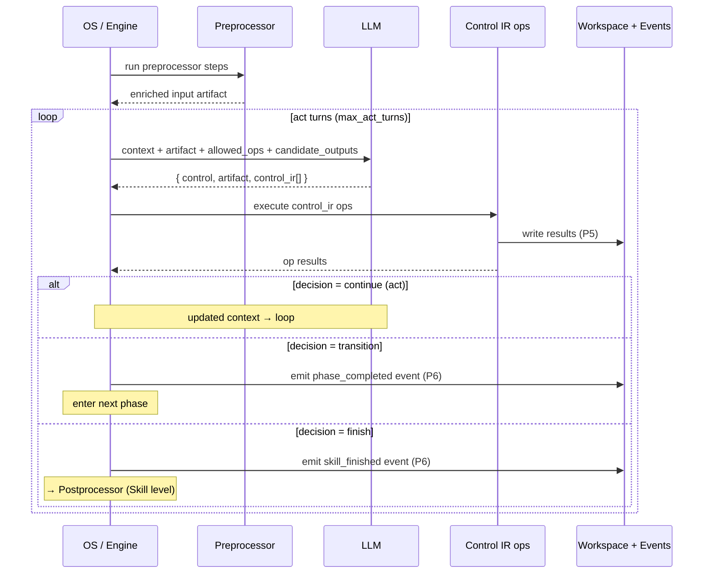
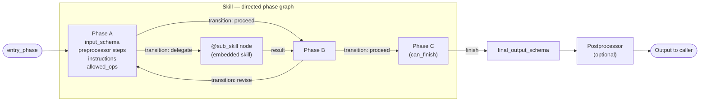
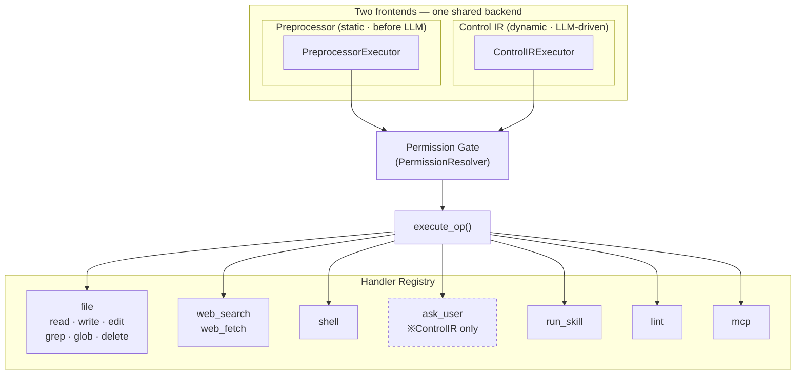
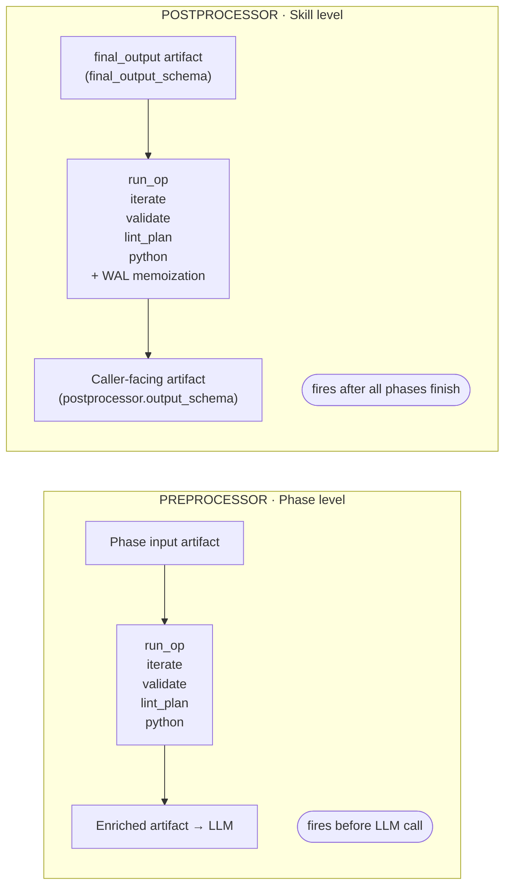
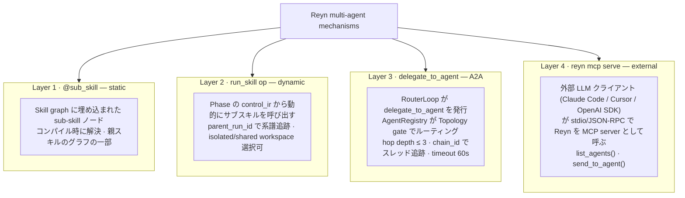
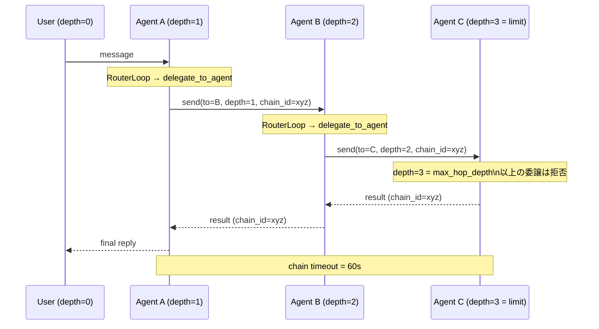
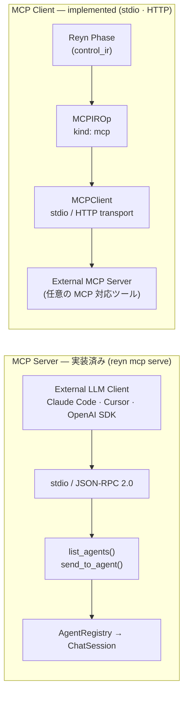
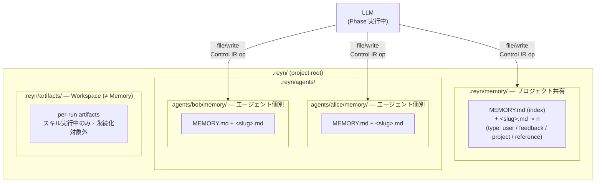
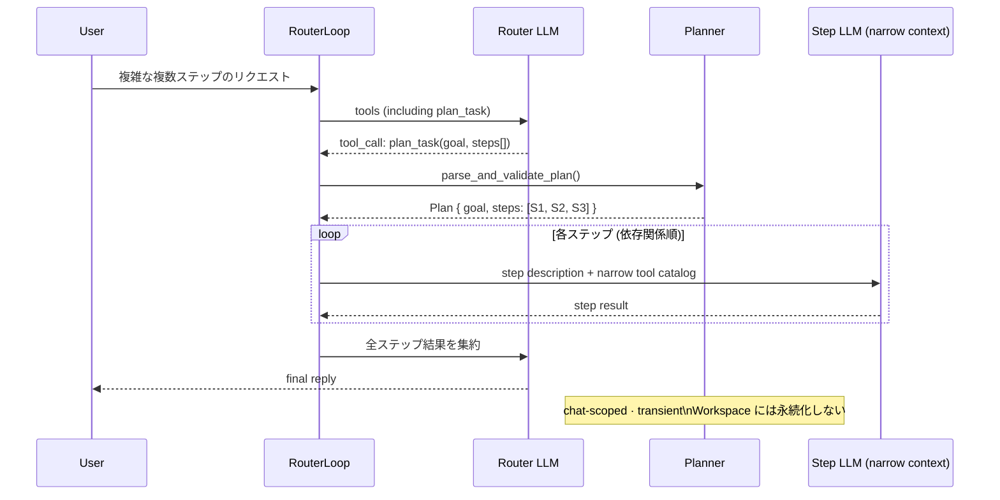

# Reyn Architecture Diagrams

全図 Mermaid。mkdocs-material でそのまま埋め込み可。

---

## 1. 全体レイヤー構造

```mermaid
flowchart TB
    U(["User / External System"])

    subgraph I01["01 · Interface"]
        direction LR
        CLI["CLI"] & TUI["TUI\n(Textual)"] & WEB["Web UI\n(FastAPI + WebSocket)"]
    end

    subgraph I02["02 · Agent Registry"]
        direction LR
        AM["manages named agents"] & TG["Topology gate\nnetwork · team · pipeline"]
    end

    subgraph I03["03 · Agent  =  ChatSession"]
        direction LR
        RL["RouterLoop\n(LLM-driven dispatch)"] & PL["Planner\n(optional · plan mode)"]
        MEM["memory scope · skill allowlist"]
    end

    subgraph I04["04 · OS — the constant"]
        direction LR
        CB["Context\nBuild"] & LC["LLM\nCall"] & VA["Output\nValidation"] & EE["Event\nEmit"]
    end

    subgraph I05["05 · Skill"]
        direction LR
        PG["Phase Graph\n+ Transitions"] & FO["final_output_schema"] & PP["Postprocessor"]
    end

    subgraph I06["06 · Phase"]
        direction LR
        PRE["Preprocessor"] & LO["LLM + Control IR ops"] & LP["↺ loops until\ntransition / finish"]
    end

    subgraph I07["07 · Persistence"]
        direction LR
        WS["Workspace\n(artifacts · files)"] & EV["Events\n(append-only log)"]
    end

    U --> I01 --> I02 --> I03 --> I04 --> I05 --> I06 --> I07
```

---

## 2. Phase 実行シーケンス

---

## 3. Skill グラフ構造

---

## 4. Control IR ops フロー

---

## 5. Preprocessor / Postprocessor 対称図

---

## 6. マルチエージェント 4 層構造

---

## 7. A2A 委譲チェーン

---

## 8. MCP server / client 対称図

---

## 9. Memory スコープ

---

## 10. Planner フロー

